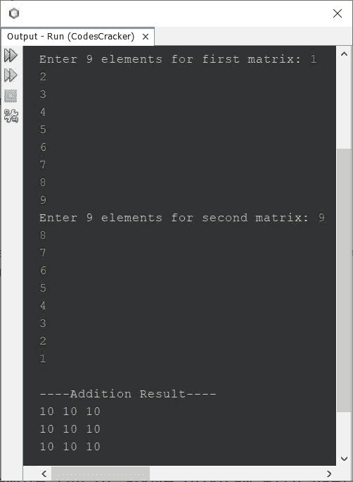
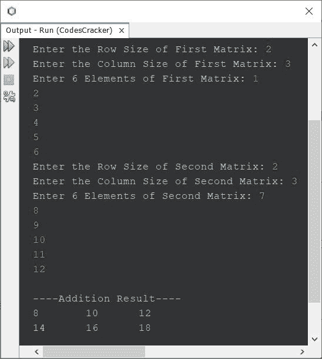

# Java 程序：相加两个矩阵

> 原文：<https://codescracker.com/java/program/java-program-add-two-matrices.htm>

本文介绍了一个 Java 程序，它可以查找并打印用户在程序运行时输入的任意两个给定矩阵的加法结果。第一个程序是基于 3*3 矩阵创建的，而第三个程序是基于 m*n 矩阵创建的。

如果你不知道矩阵加法是如何执行的？
然后参考 [矩阵加法规则](/nonprog/matrix-addition.htm)。现在让我们继续，用 Java 创建一个程序来添加两个 矩阵。

## 用 2D 数组在 Java 中相加两个矩阵

问题是，*写一个 Java 程序，进行两个 3*3 矩阵的加法。两个矩阵的元素都必须是用户在运行时收到的 。*下面给出的程序就是它的答案。这个程序使用 2D 数组来完成这项工作。

```
import java.util.Scanner;

public class CodesCracker
{
   public static void main(String[] args)
   {
      int i, j;
      int[][] a = new int[3][3];
      int[][] b = new int[3][3];
      int[][] c = new int[3][3];

      Scanner s = new Scanner(System.in);

      System.out.print("Enter 9 elements for first matrix: ");
      for(i=0; i<3; i++)
      {
         for(j=0; j<3; j++)
         {
            a[i][j] = s.nextInt();
         }
      }

      System.out.print("Enter 9 elements for second matrix: ");
      for(i=0; i<3; i++)
      {
         for(j=0; j<3; j++)
         {
            b[i][j] = s.nextInt();
         }
      }

      for(i=0; i<3; i++)
      {
         for(j=0; j<3; j++)
         {
            c[i][j] = a[i][j] + b[i][j];
         }
      }

      System.out.println("\n----Addition Result----");
      for(i=0; i<3; i++)
      {
         for(j=0; j<3; j++)
         {
            System.out.print(c[i][j]+ " ");
         }
         System.out.print("\n");
      }
   }
}
```

用户输入 **1，2，3，4，5，6，7，8，9** 作为第一个矩阵的九个元素，而 **9，8，7，6，5，4，3，2，1** 作为第二个矩阵的九个元素，上面程序的示例运行如下面给出的快照所示:



上面的程序，也可以这样创建:

```
import java.util.Scanner;

public class CodesCracker
{
   public static void main(String[] args)
   {
      int i, j;
      int[][] a = new int[3][3];
      int[][] b = new int[3][3];
      int[][] c = new int[3][3];

      Scanner s = new Scanner(System.in);

      System.out.print("Enter 9 elements for first matrix: ");
      for(i=0; i<3; i++)
      {
         for(j=0; j<3; j++)
            a[i][j] = s.nextInt();
      }

      System.out.print("Enter 9 elements for second matrix: ");
      for(i=0; i<3; i++)
      {
         for(j=0; j<3; j++)
         {
            b[i][j] = s.nextInt();
            c[i][j] = a[i][j] + b[i][j];
         }
      }

      System.out.println("\n----Addition Result----");
      for(i=0; i<3; i++)
      {
         for(j=0; j<3; j++)
            System.out.print(c[i][j]+ " ");
         System.out.print("\n");
      }
   }
}
```

## Java 中两个指定阶矩阵的加法

因为前面的程序仅限于 9 个元素的矩阵。因此，我修改并创建了一个新的，允许用户定义两个矩阵的大小，以及它们的元素。

```
import java.util.Scanner;

public class CodesCracker
{
   public static void main(String[] args)
   {      
      Scanner s = new Scanner(System.in);

      System.out.print("Enter the Row Size of First Matrix: ");
      int rowOne = s.nextInt();
      System.out.print("Enter the Column Size of First Matrix: ");
      int colOne = s.nextInt();
      int[][] matrixOne = new int[rowOne][colOne];

      System.out.print("Enter " +rowOne*colOne+ " Elements of First Matrix: ");
      for(int i=0; i<rowOne; i++)
      {
         for(int j=0; j<colOne; j++)
            matrixOne[i][j] = s.nextInt();
      }

      System.out.print("Enter the Row Size of Second Matrix: ");
      int rowTwo = s.nextInt();
      System.out.print("Enter the Column Size of Second Matrix: ");
      int colTwo = s.nextInt();

      if(rowOne==rowTwo && colOne==colTwo)
      {
         int[][] matrixTwo = new int[rowTwo][colTwo];
         int[][] matrixThree = new int[rowTwo][colTwo];

         System.out.print("Enter " +rowTwo*colTwo+ " Elements of Second Matrix: ");
         for(int i=0; i<rowTwo; i++)
         {
            for(int j=0; j<colTwo; j++)
            {
               matrixTwo[i][j] = s.nextInt();
               matrixThree[i][j] = matrixOne[i][j] + matrixTwo[i][j];
            }
         }

         System.out.println("\n----Addition Result----");
         for(int i=0; i<rowTwo; i++)
         {
            for(int j=0; j<colTwo; j++)
               System.out.print(matrixThree[i][j]+ "\t");
            System.out.print("\n");
         }
      }
      else
         System.out.println("\nOrder Mismatched!\nAddition not possible.");
   }
}
```

下面是用户输入的运行示例， **2** 和 **3** 作为行和列的大小， **1，2，3，4，5，6** 和 作为第一个矩阵的六个元素。 **2** 和 **3** 为行列尺寸， **7，8，9，10，11，12** 为 第二矩阵的六个元素:



#### 其他语言的相同程序

*   [C 相加两个矩阵](/c/program/c-program-add-two-matrices.htm)
*   [C++ 相加两个矩阵](/cpp/program/cpp-program-add-two-matrices.htm)
*   [Python 相加两个矩阵](/python/program/python-program-add-two-matrices.htm)

[Java 在线测试](/exam/showtest.php?subid=1)

* * *

* * *