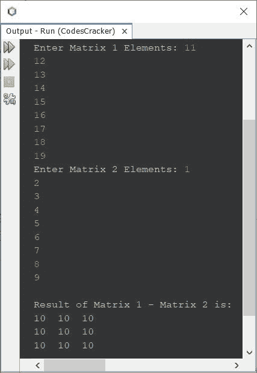
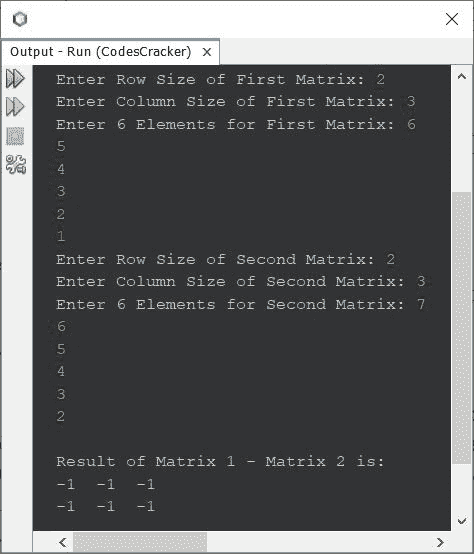

# Java 程序：减去两个矩阵

> 原文：<https://codescracker.com/java/program/java-program-subtract-matrices.htm>

本文介绍了一个用 Java 编写的执行矩阵减法的程序。本文包含两个程序，一个用于对 3*3 矩阵执行减法，另一个用于根据给定的顺序和元素执行减法。

如果你不知道矩阵减法是如何执行的？
再参考[矩阵减法](/nonprog/matrix-subtraction.htm)。现在让我们创建程序。

## 在 Java 中减去两个 3*3 矩阵

问题是，*写一个 Java 程序把两个 3*3 矩阵相减。两个矩阵的元素必须由 用户在程序运行时接收。*下面给出的程序是它的答案:

```
import java.util.Scanner;

public class CodesCracker
{
   public static void main(String[] args)
   {
      int i, j;
      int[][] mat1 = new int[3][3];
      int[][] mat2 = new int[3][3];
      int[][] mat3 = new int[3][3];
      Scanner scan = new Scanner(System.in);

      System.out.print("Enter Matrix 1 Elements: ");
      for(i=0; i<3; i++)
      {
         for(j=0; j<3; j++)
         {
            mat1[i][j] = scan.nextInt();
         }
      }
      System.out.print("Enter Matrix 2 Elements: ");
      for(i=0; i<3; i++)
      {
         for(j=0; j<3; j++)
         {
            mat2[i][j] = scan.nextInt();
         }
      }

      // subtracting matrices
      for(i=0; i<3; i++)
      {
         for(j=0; j<3; j++)
         {
            mat3[i][j] = mat1[i][j] - mat2[i][j];
         }
      }

      System.out.println("\nResult of Matrix 1 - Matrix 2 is:");
      for(i=0; i<3; i++)
      {
         for(j=0; j<3; j++)
         {
            System.out.print(mat3[i][j]+ "  ");
         }
         System.out.print("\n");
      }
   }
}
```

下面给出的快照显示了上述程序的示例运行，用户输入 **11、12、13、14、15、16、17、18、19** 作为矩阵 1 的元素，而 **1、2、3、4、5、6、7、8、9** 作为矩阵 2 的元素:



也就是说，

```
11  12  13       1  2  3       10  10  10
14  15  16   -   4  5  6   =   10  10  10
17  18  19       7  8  9       10  10  10
```

## 在 Java 中减去两个给定顺序的矩阵

这是前一个程序的修改版本。这个程序允许用户定义两个矩阵的顺序，以及它的元素，从第一个矩阵中减去第二个矩阵。

```
import java.util.Scanner;

public class CodesCracker
{
   public static void main(String[] args)
   {
      int i, j;
      Scanner scan = new Scanner(System.in);

      System.out.print("Enter Row Size of First Matrix: ");
      int rOne = scan.nextInt();
      System.out.print("Enter Column Size of First Matrix: ");
      int cOne = scan.nextInt();
      int[][] mat1 = new int[rOne][cOne];
      System.out.print("Enter " +(rOne*cOne)+ " Elements for First Matrix: ");
      for(i=0; i<rOne; i++)
      {
         for(j=0; j<cOne; j++)
            mat1[i][j] = scan.nextInt();
      }
      System.out.print("Enter Row Size of Second Matrix: ");
      int rTwo = scan.nextInt();
      System.out.print("Enter Column Size of Second Matrix: ");
      int cTwo = scan.nextInt();
      int[][] mat2 = new int[rTwo][cTwo];
      System.out.print("Enter " +(rTwo*cTwo)+ " Elements for Second Matrix: ");
      for(i=0; i<rTwo; i++)
      {
         for(j=0; j<cTwo; j++)
            mat2[i][j] = scan.nextInt();
      }

      if(rOne==rTwo && cOne==cTwo)
      {
         int[][] mat3 = new int[rOne][cOne];
         for(i=0; i<rOne; i++)
         {
            for(j=0; j<cOne; j++)
               mat3[i][j] = mat1[i][j] - mat2[i][j];
         }

         System.out.println("\nResult of Matrix 1 - Matrix 2 is:");
         for(i=0; i<rOne; i++)
         {
            for(j=0; j<cOne; j++)
               System.out.print(mat3[i][j]+ "  ");
            System.out.print("\n");
         }
      }
      else
         System.out.println("\nOrder Mismatched!");
   }
}
```

上面程序的示例运行使用用户输入 **2** 作为两个矩阵的行大小， **3** 作为列大小， **6，5，4，3，2，1** 作为第一个矩阵的六个元素， **7，6，5，4，3，2** 作为第二个矩阵的六个元素， 显示在下面给出的快照中:



#### 其他语言的相同程序

*   [C 减去矩阵](/c/program/c-program-subtract-matrices.htm)
*   [C++ 减法矩阵](/cpp/program/cpp-program-subtract-matrices.htm)
*   [Python 减法矩阵](/python/program/python-program-subtract-two-matrices.htm)

[Java 在线测试](/exam/showtest.php?subid=1)

* * *

* * *