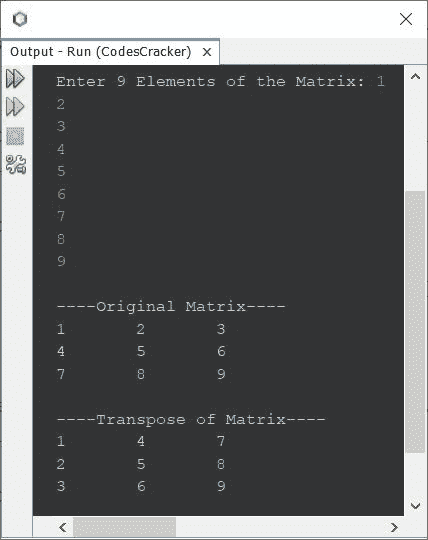

# Java 程序：寻找矩阵转置

> 原文：<https://codescracker.com/java/program/java-program-transpose-matrix.htm>

这篇文章介绍了一个用 Java 编写的程序，它可以找到并打印一个给定矩阵的转置。程序创建时使用和不使用第二矩阵。

矩阵的转置可以通过用列元素交换行元素或者用行元素交换列元素来计算。例如，转置以下矩阵:

```
1   2
3   4
```

将会是:

```
1   3
2   4
```

## 在 Java 中寻找矩阵的转置

问题是，*写一个 Java 程序，求一个矩阵的转置。矩阵的元素必须在程序运行时由用户接收 。*下面给出的程序是它的答案:

```
import java.util.Scanner;

public class CodesCracker
{
   public static void main(String[] args)
   {
      int i, j;
      int[][] matOrig = new int[3][3];
      int[][] matTran = new int[3][3];
      Scanner scan = new Scanner(System.in);

      System.out.print("Enter 9 Elements of the Matrix: ");
      for(i=0; i<3; i++)
      {
         for(j=0; j<3; j++)
         {
            matOrig[i][j] = scan.nextInt();
         }
      }

      System.out.println("\n----Original Matrix----");
      for(i=0; i<3; i++)
      {
         for(j=0; j<3; j++)
         {
            System.out.print(matOrig[i][j]+ "\t");
         }
         System.out.print("\n");
      }

      // copying the transpose of matOrig to matTran
      for(i=0; i<3; i++)
      {
         for(j=0; j<3; j++)
         {
            matTran[j][i] = matOrig[i][j];
         }
      }

      System.out.println("\n----Transpose of Matrix----");
      for(i=0; i<3; i++)
      {
         for(j=0; j<3; j++)
         {
            System.out.print(matTran[i][j]+ "\t");
         }
         System.out.print("\n");
      }
   }
}
```

下面给出的快照显示了上述程序的示例运行，用户输入 **1，2，3，4，5，6，7，8，9** 作为矩阵的 九个元素:



## Java 中不使用第二个矩阵的矩阵转置

这个程序和前面的类似，但是创建的方式是转置矩阵而不使用第二个矩阵:

```
import java.util.Scanner;

public class CodesCracker
{
   public static void main(String[] args)
   {
      int i, j, x;
      int[][] matrix = new int[3][3];
      Scanner scan = new Scanner(System.in);

      System.out.print("Enter 9 Elements of the Matrix: ");
      for(i=0; i<3; i++)
      {
         for(j=0; j<3; j++)
            matrix[i][j] = scan.nextInt();
      }

      System.out.println("\n----Original Matrix----");
      for(i=0; i<3; i++)
      {
         for(j=0; j<3; j++)
            System.out.print(matrix[i][j]+ "\t");
         System.out.println();
      }

      // finding the transpose of given matrix
      for(i=0; i<3; i++)
      {
         for(j=0; j<i; j++)
         {
            x = matrix[i][j];
            matrix[i][j] = matrix[j][i];
            matrix[j][i] = x;
         }
      }

      System.out.println("\n----Transpose of Matrix----");
      for(i=0; i<3; i++)
      {
         for(j=0; j<3; j++)
            System.out.print(matrix[i][j]+ "\t");
         System.out.println();
      }
   }
}
```

#### 其他语言的相同程序

*   [C 转置矩阵](/c/program/c-program-transpose-matrix.htm)
*   [C++转置矩阵](/cpp/program/cpp-program-transpose-matrix.htm)
*   [Python 转置矩阵](/python/program/python-program-transpose-matrix.htm)

[Java 在线测试](/exam/showtest.php?subid=1)

* * *

* * *