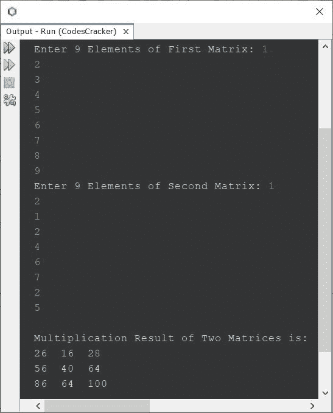
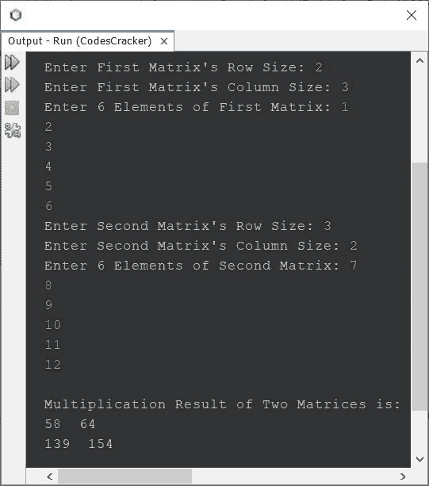

# Java 程序：两个矩阵相乘

> 原文：<https://codescracker.com/java/program/java-program-multiply-two-matrices.htm>

这篇文章介绍了一个用 Java 编写的程序，它可以查找并打印用户在程序运行时输入的任意两个矩阵的乘法结果。该程序通过以下两种方式创建:

*   将两个 3*3 给定矩阵相乘
*   给定阶数和元素的两个矩阵相乘

## 用 Java 将两个 3*3 给定矩阵相乘

问题是，*写一个 Java 程序，根据用户输入执行矩阵乘法。*下面给出的节目是 它的回答:

```
import java.util.Scanner;

public class CodesCracker
{
   public static void main(String[] args)
   {
      int i, j, k, sum=0;
      int[][] matrixOne = new int[3][3];
      int[][] matrixTwo = new int[3][3];
      int[][] matrixThree = new int[3][3];
      Scanner scan = new Scanner(System.in);

      System.out.print("Enter 9 Elements of First Matrix: ");
      for(i=0; i<3; i++)
      {
         for(j=0; j<3; j++)
         {
            matrixOne[i][j] = scan.nextInt();
         }
      }
      System.out.print("Enter 9 Elements of Second Matrix: ");
      for(i=0; i<3; i++)
      {
         for(j=0; j<3; j++)
         {
            matrixTwo[i][j] = scan.nextInt();
         }
      }

      // multiplying the two matrices
      for(i=0; i<3; i++)
      {
         for(j=0; j<3; j++)
         {
            sum = 0;
            for(k=0; k<3; k++)
            {
               sum = sum + (matrixOne[i][k] * matrixTwo[k][j]);
            }
            matrixThree[i][j] = sum;
         }
      }

      System.out.println("\nMultiplication Result of Two Matrices is:");
      for(i=0; i<3; i++)
      {
         for(j=0; j<3; j++)
         {
            System.out.print(matrixThree[i][j]+ "  ");
         }
         System.out.print("\n");
      }
   }
}
```

下面给出的快照显示了上述程序的示例运行，其中用户输入 **1，2，3，4，5，6，7，8，9** 作为第一个矩阵的九个 元素，而 **1，2，1，2，4，6，7，2，5** 作为第二个矩阵的九个元素:



## 用 Java 将两个给定阶数和元素的矩阵相乘

这个程序基本上是前一个程序的修改版本。由于该程序用于乘以 **3*3** 矩阵 以及用户在运行时输入的任意阶的任何其他矩阵:

```
import java.util.Scanner;

public class CodesCracker
{
   public static void main(String[] args)
   {
      int i, j, k, sum=0, rOne, cOne, rTwo, cTwo;
      Scanner scan = new Scanner(System.in);

      System.out.print("Enter First Matrix's Row Size: ");
      rOne = scan.nextInt();
      System.out.print("Enter First Matrix's Column Size: ");
      cOne = scan.nextInt();
      int[][] matrixOne = new int[rOne][cOne];
      System.out.print("Enter " +(rOne*cOne)+" Elements of First Matrix: ");
      for(i=0; i<rOne; i++)
      {
         for(j=0; j<cOne; j++)
            matrixOne[i][j] = scan.nextInt();
      }
      System.out.print("Enter Second Matrix's Row Size: ");
      rTwo = scan.nextInt();
      if(cOne != rTwo)
      {
         System.out.println("\nMultiplication not possible!");
         return;
      }
      System.out.print("Enter Second Matrix's Column Size: ");
      cTwo = scan.nextInt();
      int[][] matrixTwo = new int[rTwo][cTwo];
      System.out.print("Enter " +(rTwo*cTwo)+" Elements of Second Matrix: ");
      for(i=0; i<rTwo; i++)
      {
         for(j=0; j<cTwo; j++)
            matrixTwo[i][j] = scan.nextInt();
      }

      int[][] matrixThree = new int[rOne][cTwo];

      // multiplying the two matrices
      for(i=0; i<rOne; i++)
      {
         for(j=0; j<cTwo; j++)
         {
            sum = 0;
            for(k=0; k<cOne; k++)
               sum = sum + (matrixOne[i][k] * matrixTwo[k][j]);
            matrixThree[i][j] = sum;
         }
      }

      System.out.println("\nMultiplication Result of Two Matrices is:");
      for(i=0; i<rOne; i++)
      {
         for(j=0; j<cTwo; j++)
            System.out.print(matrixThree[i][j]+ "  ");
         System.out.println();
      }
   }
}
```

上述 Java 程序的示例运行，在给定顺序和元素的两个矩阵相乘时，显示在下面给出的快照中:



#### 其他语言的相同程序

*   [C 乘两个矩阵](/c/program/c-program-multiply-two-matrices.htm)
*   [C++将两个矩阵相乘](/cpp/program/cpp-program-multiply-two-matrices.htm)
*   [Python 乘两个矩阵](/python/program/python-program-matrix-multiplication.htm)

[Java 在线测试](/exam/showtest.php?subid=1)

* * *

* * *