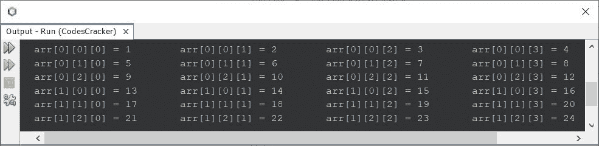
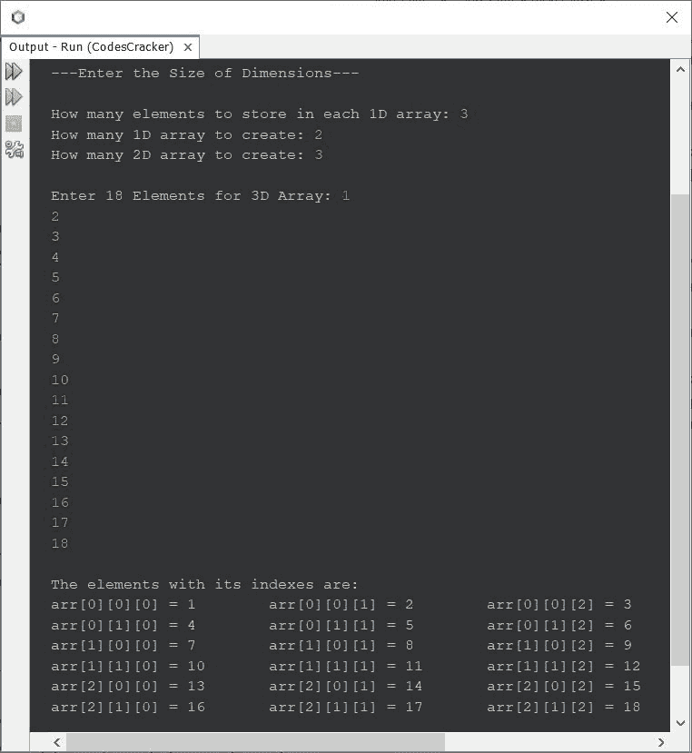

# Java 三维数组程序

> 原文：<https://codescracker.com/java/program/java-program-three-dimensional-array.htm>

本文旨在介绍一个基于三维数组的 Java 程序。

三维数组可以说是数组的数组。例如:

```
arr[2][3][4]
```

是一个三维数组，其中有两个[二维数组](/java/program/java-program-two-dimensional-array.htm)，每个二维数组包含 三个一维数组，其中每个 [一维数组](/java/program/java-program-one-dimensional-array.htm)中有 4 个元素。

换句话说，我们可以说数组 **arr** 包含 2 数组的 3 数组的 4 个元素。总共有 **2*3*4** 个元素，也就是 **24 个**个元素。这里有一个例子:

```
public class CodesCracker
{
   public static void main(String[] args)
   {
      int[][][] arr = {
         {
            {1, 2, 3, 4},{5, 6, 7, 8},{9, 10, 11, 12}
         },
         {
            {13, 14, 15, 16},{17, 18, 19, 20},{21, 22, 23, 24}
         }};

      for(int i=0; i<2; i++)
      {
         for(int j=0; j<3; j++)
         {
            for(int k=0; k<4; k++)
            {
               System.out.print("arr["+i+"]["+j+"]["+k+"] = " +arr[i][j][k]+"\t");
            }
            System.out.print("\n");
         }
      }
   }
}
```

下面给出的快照显示了上述程序在 Java 中的三维数组上生成的示例输出:



从上面的程序及其示例输出中可以清楚地看到，有两个 2D 数组，其中每个 2D 数组是 3 个 1D 数组，每个 1D 数组是 4 个元素。

三维数组是编程中的一个小复杂概念，它包含三个循环。所以要打印或初始化一个三维数组的元素，你需要使用三个循环。其中最里面的循环生成一维数组，第二个最里面的循环生成二维数组，而最外面的循环最终生成三维数组。

这是另一个程序，允许用户定义三维数组的维度大小及其元素:

```
import java.util.Scanner;

public class CodesCracker
{
   public static void main(String[] args)
   {
      int one, two, three, i, j, k;
      Scanner scan = new Scanner(System.in);

      System.out.println("---Enter the Size of Dimensions---\n");
      System.out.print("How many elements to store in each 1D array: ");
      one = scan.nextInt();
      System.out.print("How many 1D array to create: ");
      two = scan.nextInt();
      System.out.print("How many 2D array to create: ");
      three = scan.nextInt();

      int[][][] arr = new int[three][two][one];

      System.out.print("\nEnter " +(one*two*three)+ " Elements for 3D Array: ");
      for(i=0; i<three; i++)
      {
         for(j=0; j<two; j++)
         {
            for(k=0; k<one; k++)
               arr[i][j][k] = scan.nextInt();
         }
      }

      System.out.println("\nThe elements with its indexes are: ");
      for(i=0; i<three; i++)
      {
         for(j=0; j<two; j++)
         {
            for(k=0; k<one; k++)
               System.out.print("arr["+i+"]["+j+"]["+k+"] = " +arr[i][j][k]+"\t");
            System.out.print("\n");
         }
      }
   }
}
```

下面是它的示例运行，用户输入 **3** 作为要存储在每个一维数组中的元素数，**2**T8】作为要创建的一维数组数， **3** 作为要创建的二维数组数， T6】1，2，3，4，5，6，7，8，9，10，11，12，13，14，15，16，17，18 作为三维数组的 18 个元素:



#### 其他语言的相同程序

*   [C 3D 数组程序](/c/program/c-program-three-dimensional-array.htm)
*   [C++ 3D 数组程序](/cpp/program/cpp-program-three-dimensional-array.htm)

[Java 在线测试](/exam/showtest.php?subid=1)

* * *

* * *