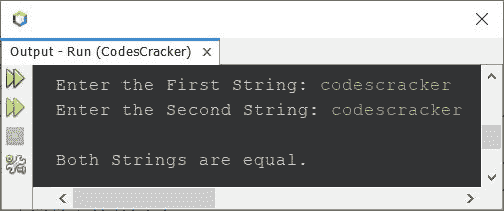
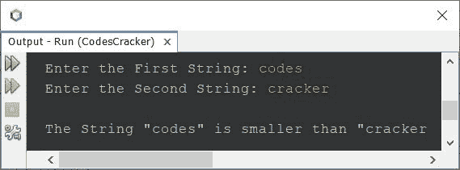
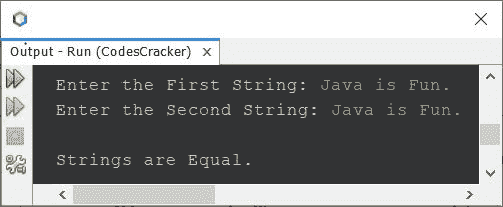

# Java 程序：比较两个字符串

> 原文：<https://codescracker.com/java/program/java-program-compare-two-string.htm>

本文介绍了一个 Java 程序，它比较用户在程序运行时输入的两个字符串。下面是本文涉及的程序列表:

*   使用 **equals()** 比较两个字符串
*   使用 **compareTo()** 比较两个字符串
*   逐字符比较两个字符串，不使用 **equals()** 和 **compareTo()**

## 使用 equals()比较 Java 中的两个字符串

问题是，*写一个比较两个给定字符串的 Java 程序。该字符串必须由用户在运行时接收。* 下面给出的程序是它的答案:

```
import java.util.Scanner;

public class CodesCracker
{
   public static void main(String[] args)
   {
      String strOne, strTwo;
      Scanner scan = new Scanner(System.in);

      System.out.print("Enter the First String: ");
      strOne = scan.nextLine();
      System.out.print("Enter the Second String: ");
      strTwo = scan.nextLine();

      if(strOne.equals(strTwo))
         System.out.println("\nBoth Strings are equal.");
      else
         System.out.println("\nBoth Strings are not equal.");
   }
}
```

下面给出的快照显示了上述程序的示例运行，其中用户输入 **codescracker** 为两个字符串:



## 使用 compareTo()比较 Java 中的两个字符串

要使用 **compareTo()** 方法比较两个字符串，只需替换 **if** 语句的条件。也就是， 替换下面的代码，来自上面的程序:

```
if(strOne.equals(strTwo))
```

使用下面给出的代码:

```
if(strOne.compareTo(strTwo)==0)
```

现在让我们修改程序来提供更多关于比较两个字符串的信息。

```
import java.util.Scanner;

public class CodesCracker
{
   public static void main(String[] args)
   {
      Scanner scan = new Scanner(System.in);

      System.out.print("Enter the First String: ");
      String strOne = scan.nextLine();
      System.out.print("Enter the Second String: ");
      String strTwo = scan.nextLine();

      if(strOne.compareTo(strTwo) > 0)
         System.out.println("\nThe String \"" +strOne+ "\" is larger than \"" +strTwo);
      else if(strOne.compareTo(strTwo) < 0)
         System.out.println("\nThe String \"" +strOne+ "\" is smaller than \"" +strTwo);
      else
         System.out.println("\nStrings are equal to each other.");
   }
}
```

下面是它的示例运行，用户输入的代码**作为第一个字符串**，T2 破解程序作为第二个字符串。



## 比较 Java 中的两个字符串——逐字符比较

这个程序以逐个字符的方式比较两个字符串。此外，这个程序没有使用 **equals()** 和 **compareTo()** 方法来完成这项工作。

```
import java.util.Scanner;

public class CodesCracker
{
   public static void main(String[] args)
   {
      int k=0;
      Scanner scan = new Scanner(System.in);

      System.out.print("Enter the First String: ");
      String strOne = scan.nextLine();
      System.out.print("Enter the Second String: ");
      String strTwo = scan.nextLine();

      int strOneLen = strOne.length();
      int strTwoLen = strTwo.length();

      if(strOneLen == strTwoLen)
      {
         for(int i=0; i<strOneLen; i++)
         {
            if(strOne.charAt(i)==strTwo.charAt(i))
               k++;
            else
            {
               System.out.println("\nStrings are Unequal.");
               break;
            }
         }
      }
      else
         System.out.println("\nStrings are of Unequal size/length.");
      if(k==strOneLen)
         System.out.println("\nStrings are Equal.");
   }
}
```

这是它在用户输入下的运行示例。作为两个字符串:



#### 其他语言的相同程序

*   [C 比较两个字符串](/c/program/c-program-compare-two-string.htm)
*   [C++ 比较两个字符串](/cpp/program/cpp-program-compare-two-string.htm)
*   [Python 比较两个字符串](/python/program/python-program-compare-two-strings.htm)

[Java 在线测试](/exam/showtest.php?subid=1)

* * *

* * *