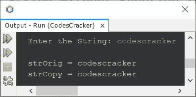

# Java 程序：复制字符串

> 原文：<https://codescracker.com/java/program/java-program-copy-string.htm>

本文介绍了 Java 中多个将一个字符串复制到另一个字符串的程序。以下是本文中包含的程序列表:

*   在 Java 中不使用函数复制字符串
*   使用 Java 中的 **StringBuffer** 类复制字符串
*   在 Java 中使用 **valueOf()** 方法复制字符串
*   在 Java 中使用 **copyValueOf()** 方法复制字符串

## 在 Java 中不使用函数复制字符串

问题是，*写一个 Java 程序复制字符串。要复制的字符串，必须由用户在 程序运行时接收。*下面给出的程序是它的答案:

```
import java.util.Scanner;

public class CodesCracker
{
   public static void main(String[] args)
   {
      String strOrig, strCopy;
      Scanner scan = new Scanner(System.in);

      System.out.print("Enter the String: ");
      strOrig = scan.nextLine();

      strCopy = strOrig;

      System.out.println("\nstrOrig = " +strOrig);
      System.out.println("strCopy = " +strCopy);
   }
}
```

下面给出的快照显示了带有用户输入 **codescracker** 的上述程序的示例运行:



## 在 Java 中使用 StringBuffer 类复制字符串

要使用 **StringBuffer** 类复制字符串，只需替换上面程序中的以下语句:

```
strCopy = strOrig;
```

下面给出了声明:

```
StringBuffer strCopy = new StringBuffer(strOrig);
```

同样来自声明:

```
String strOrig, strCopy;
```

移除 **strCopy** 变量，因为该变量是使用前面的语句声明和初始化的。

## 在 Java 中使用 valueOf()方法复制字符串

这个程序使用 **valueOf()** 方法来做同样的工作，即将输入的字符串复制到另一个 变量中。

```
import java.util.Scanner;

public class CodesCracker
{
   public static void main(String[] args)
   {
      Scanner scan = new Scanner(System.in);

      System.out.print("Enter the String: ");
      String strOrig = scan.nextLine();

      String strCopy = String.valueOf(strOrig);

      System.out.println("\nstrOrig = " +strOrig);
      System.out.println("strCopy = " +strCopy);
   }
}
```

还有上面程序中的以下语句:

```
String strCopy = String.valueOf(strOrig);
```

也可以替换为下面给出的语句:

```
String strCopy = String.valueOf(strOrig.toCharArray(), 0, strOrig.length());
```

## 在 Java 中使用 copyValueOf()方法复制字符串

要使用 **copyValueOf()** 方法复制字符串，则只需替换前面程序中的以下语句:

```
String strCopy = String.valueOf(strOrig);
```

使用:

```
String strCopy = String.copyValueOf(strOrig.toCharArray());
```

或者

```
String strCopy = String.copyValueOf(strOrig.toCharArray(), 0, strOrig.length());
```

#### 其他语言的相同程序

*   [C 复制字符串](/c/program/c-program-copy-string.htm)
*   [C++复制字符串](/cpp/program/cpp-program-copy-string.htm)
*   [Python 复制字符串](/python/program/python-program-copy-string.htm)

[Java 在线测试](/exam/showtest.php?subid=1)

* * *

* * *