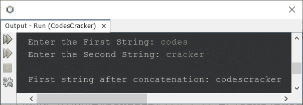
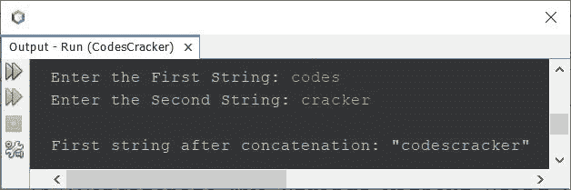

# Java 程序：连接两个字符串

> 原文：<https://codescracker.com/java/program/java-program-concatenate-string.htm>

本文介绍了一个 Java 程序，它连接了用户在程序运行时输入的两个字符串。下面是本文涉及的程序列表:

*   使用 **concat()** 连接两个字符串
*   使用 **+** 运算符连接两个字符串
*   不使用库函数连接两个字符串。这个程序以逐字符的方式执行字符串连接

## 使用 concat()在 Java 中连接两个字符串

问题是，*编写一个 Java 程序将第二个字符串连接或追加到第一个字符串中。这两个字符串都必须是用户在运行时收到的 。*下面给出的程序是它的答案:

```
import java.util.Scanner;

public class CodesCracker
{
   public static void main(String[] args)
   {
      String a, b;
      Scanner scan = new Scanner(System.in);

      System.out.print("Enter the First String: ");
      a = scan.nextLine();
      System.out.print("Enter the Second String: ");
      b = scan.nextLine();

      a = a.concat(b);
      System.out.println("\nFirst string after concatenation: " +a);
   }
}
```

下面给出的快照显示了上述 Java 程序在字符串连接上的示例运行，用户输入的**代码** 作为第一个字符串，**破解程序**作为第二个字符串:



## 在 Java 中使用+运算符连接两个字符串

要在 Java 中使用 **+** 运算符连接两个字符串，只需替换上面程序中的以下语句:

```
a = a.concat(b);
```

下面给出了声明:

```
a = a + b;
```

## 在 Java 中不使用库函数连接两个字符串

现在让我们创建另一个程序来做同样的工作，即字符串连接，但不使用库函数。这个程序以逐个字符的方式连接两个字符串。

```
import java.util.Scanner;

public class CodesCracker
{
   public static void main(String[] args)
   {
      Scanner scan = new Scanner(System.in);

      System.out.print("Enter the First String: ");
      String a = scan.nextLine();
      System.out.print("Enter the Second String: ");
      String b = scan.nextLine();

      int len = b.length();
      for(int i=0; i<len; i++)
         a = a + b.charAt(i);

      System.out.println("\nFirst string after concatenation: \"" +a+ "\"");
   }
}
```

下面的快照显示了与上一个程序具有相同用户输入的上述程序的运行示例:



#### 其他语言的相同程序

*   [C 连接字符串](/c/program/c-program-concatenate-string.htm)
*   [C++ 连接字符串](/cpp/program/cpp-program-concatenate-string.htm)
*   [Python 串联字符串](/python/program/python-program-concatenate-string.htm)

[Java 在线测试](/exam/showtest.php?subid=1)

* * *

* * *