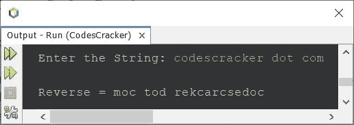
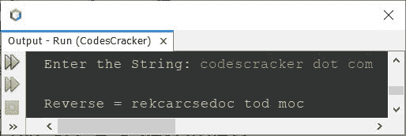
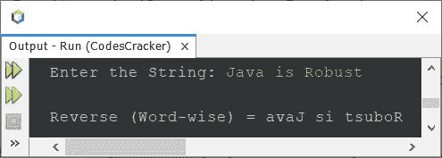

# Java 程序：反转字符串

> 原文：<https://codescracker.com/java/program/java-program-reverse-string.htm>

这篇文章是为了覆盖 Java 中一个著名的程序而创建的，它可以在程序运行时反转用户输入的字符串。下面是本文涉及的程序列表:

*   对循环使用**反转字符串**
*   在循环时使用**反转字符串**
*   使用 **reverse()** 方法反转字符串
*   使用字符数组反转字符串
*   逐词反转字符串

## 使用`for`循环反转 Java 中的字符串

问题是，*写一个 Java 程序，对给定的字符串进行倒序。该字符串必须由用户在运行时接收。*下面给出的 节目就是它的答案:

```
import java.util.Scanner;

public class CodesCracker
{
   public static void main(String[] args)
   {
      String str, strReverse="";
      int len, i;
      char ch;
      Scanner s = new Scanner(System.in);

      System.out.print("Enter the String: ");
      str = s.nextLine();

      len = str.length();
      for(i=(len-1); i>=0; i--)
      {
         ch = str.charAt(i);
         strReverse = strReverse + ch;
      }

      System.out.println("\nReverse = " +strReverse);
   }
}
```

下面给出的快照显示了上述 Java 程序在反转给定字符串时的示例运行，其中用户输入**codescracker . com**作为要反转的字符串:



保留空格的位置，字符串反转。

## 使用`while`循环反转 Java 中的字符串

该程序与前一个程序做同样的工作，但是使用 **while** 循环创建，而不是用**代替**。

```
import java.util.Scanner;

public class CodesCracker
{
   public static void main(String[] args)
   {
      String str, strReverse="";
      int len, i;
      char ch;
      Scanner s = new Scanner(System.in);

      System.out.print("Enter the String: ");
      str = s.nextLine();

      len = str.length();
      i = (len-1);
      while(i>=0)
      {
         ch = str.charAt(i);
         strReverse = strReverse + ch;
         i--;
      }

      System.out.println("\nReverse = " +strReverse);
   }
}
```

您将获得与上一个程序相同的输出。上面的程序也可以这样创建:

```
import java.util.Scanner;

public class CodesCracker
{
   public static void main(String[] args)
   {
      String strReverse="";
      Scanner s = new Scanner(System.in);

      System.out.print("Enter the String: ");
      String str = s.nextLine();

      int len = str.length();
      int i = (len-1);
      while(i>=0)
         strReverse += str.charAt(i--);

      System.out.println("\nReverse = " +strReverse);
   }
}
```

尽管如此，您将获得相同的输出。

## 使用 StringBuilder 和 Reverse()函数反转字符串

这个程序使用 **StringBuilder** 类及其名为 **reverse()** 的方法来反转一个字符串。

```
import java.util.Scanner;

public class CodesCracker
{
   public static void main(String[] args)
   {
      Scanner s = new Scanner(System.in);

      System.out.print("Enter the String: ");
      String str = s.nextLine();

      StringBuilder sb = new StringBuilder(str);
      sb.reverse();
      String strReverse = sb.toString();

      System.out.println("\nReverse = " +strReverse);
   }
}
```

## 使用字符数组反转 Java 中的字符串

这个程序使用字符数组来反转一个字符串。方法将一个字符串转换成字符数组 。

```
import java.util.Scanner;

public class CodesCracker
{
   public static void main(String[] args)
   {
      String strReverse = "";
      Scanner s = new Scanner(System.in);

      System.out.print("Enter the String: ");
      String str = s.nextLine();

      char ch[] = str.toCharArray();
      int len = ch.length;
      for(int i=(len-1); i>=0; i--)
         strReverse += ch[i];

      System.out.println("\nReverse = " +strReverse);
   }
}
```

## 逐词反转字符串

这是本文的最后一个程序。这个程序与上面给出的所有程序没有什么不同。因为这个程序反转一个字符串，但是以单词方式。

```
import java.util.Scanner;

public class CodesCracker
{
   public static void main(String[] args)
   {
      String word, wordReverse;
      int tot, i, len, j;
      char ch;
      Scanner s = new Scanner(System.in);

      System.out.print("Enter the String: ");
      String str = s.nextLine();

      String words[] = str.split(" ");
      tot = words.length;
      System.out.print("\nWord Wise Reverse of String = ");
      for(i=0; i<tot; i++)
      {
         wordReverse = "";
         word = words[i];
         len = word.length();
         for(j=(len-1); j>=0; j--)
         {
            ch = word.charAt(j);
            wordReverse = wordReverse + ch;
         }
         System.out.print(wordReverse+ " ");
      }
   }
}
```

以下是其示例运行，用户输入与第一个程序的示例运行相同:



在上面的程序中，如果用户输入一个字符串，在任意两个或更多的单词之间包含一个以上的空格，那么程序将不会完美地工作。因此，让我修改程序，并创建一个新的。这个程序也存储字符串的反向，逐字存储，最后打印整个字符串。

```
import java.util.Scanner;

public class CodesCracker
{
   public static void main(String[] args)
   {
      String strReverse = "";
      String word, wordReverse;
      Scanner s = new Scanner(System.in);

      System.out.print("Enter the String: ");
      String str = s.nextLine();

      String words[] = str.split("\\s+");
      int tot = words.length;

      for(int i=0; i<tot; i++)
      {
         wordReverse = "";
         word = words[i];
         int len = word.length();

         for(int j=(len-1); j>=0; j--)
            wordReverse += word.charAt(j);

         strReverse = strReverse + wordReverse + " ";
      }

      System.out.println("\nReverse (Word-wise) = " +strReverse);
   }
}
```

这是它在用户输入下运行的示例 **Java 是健壮的**



#### 其他语言的相同程序

*   [C 反串](/c/program/c-program-reverse-string.htm)
*   [C++ 反向字符串](/cpp/program/cpp-program-reverse-string.htm)
*   [Python 反串](/python/program/python-program-reverse-string.htm)

[Java 在线测试](/exam/showtest.php?subid=1)

* * *

* * *