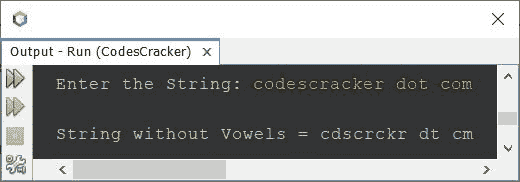

# Java 程序：从字符串中删除元音

> 原文：<https://codescracker.com/java/program/java-program-delete-vowels-from-string.htm>

本文涵盖了 Java 中的多个程序，这些程序在程序运行时从用户输入的字符串中删除元音字母。以下是本文涵盖的程序列表:

*   在 Java 中删除字符串中的元音
*   使用用户自定义函数从 Java 字符串中删除元音
*   使用库函数从 Java 字符串中删除元音

如果用户输入的字符串是 **Java 就好玩了。**，那么输出将是 **Jv s Fn。**

## 在 Java 中删除字符串中的元音

问题是，*写一个 Java 程序，去掉一个字符串中的所有元音。该字符串必须由用户在运行时接收。* 下面给出的程序是它的答案:

```
import java.util.Scanner;

public class CodesCracker
{
   public static void main(String[] args)
   {
      String str, strRes, vowels;
      char ch;
      int i, count, k;
      Scanner scan = new Scanner(System.in);

      System.out.print("Enter the String: ");
      str = scan.nextLine();

      strRes="";
      vowels = "aeiouAEIOU";
      for(i=0; i<str.length(); i++)
      {
         count=0;
         ch = str.charAt(i);
         for(k=0; k<vowels.length(); k++)
         {
            if(ch==vowels.charAt(k))
               count++;
         }
         if(count==0)
            strRes = strRes + ch;
      }

      System.out.println("\nString without Vowels = " +strRes);
   }
}
```

下面给出的快照显示了用户输入**codescracker . com**的上述程序的示例运行



### 使用自定义函数在 Java 中删除字符串中的元音

这个程序做的工作和前面的程序一样，但是使用用户定义的函数创建。这个程序将检查当前字符是否是元音的一段代码打包到一个名为 **isVowel** 的用户定义函数中。

```
import java.util.Scanner;

public class CodesCracker
{
   public static void main(String[] args)
   {
      Scanner scan = new Scanner(System.in);

      System.out.print("Enter the String: ");
      String str = scan.nextLine();

      String strRes="";

      for(int i=0; i<str.length(); i++)
      {
         if(!isVowel(str.charAt(i)))
            strRes = strRes + str.charAt(i);
      }

      System.out.println("\nString without Vowels = " +strRes);
   }

   public static boolean isVowel(char c)
   {
      String vowels = "aeiouAEIOU";
      for(int i=0; i<10; i++)
         if(c==vowels.charAt(i))
            return true;
      return false;
   }
}
```

这个程序产生与前一个程序相同的输出。

上述程序中循环块的**，也可以包装在另一个函数中。下面是将 代码块包装到另一个函数中后的程序:**

```
import java.util.Scanner;

public class CodesCracker
{
   public static void main(String[] args)
   {
      Scanner scan = new Scanner(System.in);
      System.out.print("Enter the String: ");
      String str = scan.nextLine();

      String mystr = removeVowels(str);
      System.out.println("\nString without Vowels = " +mystr);
   }
   public static String removeVowels(String s)
   {
      String strRes="";
      for(int i=0; i<s.length(); i++)
      {
         if(!isVowel(s.charAt(i)))
            strRes += s.charAt(i);
      }
      return strRes;
   }
   public static boolean isVowel(char c)
   {
      String vowels = "aeiouAEIOU";
      for(int i=0; i<10; i++)
         if(c==vowels.charAt(i))
            return true;
      return false;
   }
}
```

从上面的程序中，下面两条语句:

```
String mystr = removeVowels(str);
System.out.println("\nString without Vowels = " +mystr);
```

也可以替换为下面给出的一条语句:

```
System.out.println("\nString without Vowels = " +removeVowels(str));
```

如果你想从字符串中去掉元音。也就是说，如果你想在同一个变量 **str** 中存储同一个输入的不带元音的字符串。然后用下面两条语句替换这两条语句:

```
str = removeVowels(str);
System.out.println("\nString without Vowels = " +str);
```

### 使用库函数从 Java 字符串中删除元音

使用预定义或库函数，程序变得太短。这个程序也做同样的工作，从字符串中删除元音，但是使用一个名为 **replaceAll()** 的库函数。

```
import java.util.Scanner;

public class CodesCracker
{
   public static void main(String[] args)
   {
      Scanner scan = new Scanner(System.in);
      System.out.print("Enter the String: ");
      String str = scan.nextLine();

      str = str.replaceAll("[aeiouAEIOU]", "");
      System.out.println("\nString without Vowels = " +str);
   }
}
```

#### 其他语言的相同程序

*   [C 删除元音](/c/program/c-program-delete-vowels-from-string.htm)
*   [C++删除元音](/cpp/program/cpp-program-delete-vowels-from-string.htm)
*   [Python 删除元音](/python/program/python-program-remove-vowels-from-string.htm)

[Java 在线测试](/exam/showtest.php?subid=1)

* * *

* * *