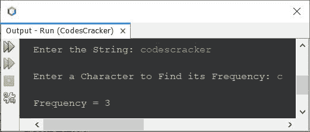
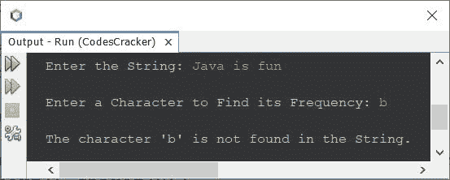

# 查找字符串中给定字符出现频率的 Java 程序

> 原文：<https://codescracker.com/java/program/java-program-find-frequency-of-character.htm>

创建这篇文章是为了介绍一个 Java 程序，它查找并打印给定字符串中给定字符的出现频率或出现次数。例如，如果给定的字符串是 **codescracker** ，字符是 **c** ，那么输出将是 **3** ，因为**‘c’**在字符串“codescracker”中出现了 3 次。

问题是，*写一个 Java 程序，求一个字符在一个字符串中出现的频率。字符和字符串都必须是用户在程序运行时收到的 。*下面给出的程序是这个问题的答案:

```
import java.util.Scanner;

public class CodesCracker
{
   public static void main(String[] args)
   {
      String str;
      char ch, strCh;
      int strLen, i, count=0;
      Scanner s = new Scanner(System.in);

      System.out.print("Enter the String: ");
      str = s.nextLine();
      System.out.print("\nEnter a Character to Find its Frequency: ");
      ch = s.next().charAt(0);

      strLen = str.length();
      for(i=0; i<strLen; i++)
      {
         strCh = str.charAt(i);
         if(ch==strCh)
            count++;
      }

      System.out.println("\nFrequency = " +count);
   }
}
```

下面是它的示例运行，使用用户输入的 **codescracker** 作为字符串，使用 **c** 作为字符来查找它的频率:



上述程序也可以这样创建/编写:

```
import java.util.Scanner;

public class CodesCracker
{
   public static void main(String[] args)
   {
      int strLen, i, count=0;
      Scanner s = new Scanner(System.in);

      System.out.print("Enter the String: ");
      String str = s.nextLine();
      System.out.print("\nEnter a Character to Find its Frequency: ");
      char ch = s.next().charAt(0);

      for(i=0; i<str.length(); i++)
      {
         if(ch==str.charAt(i))
            count++;
      }

      if(count==0)
         System.out.println("\nThe character \'" +ch+ "\' is not found in the String.");
      else
         System.out.println("\nThe Frequency of character \'" +ch+ "\' = " +count);
   }
}
```

下面是它的示例运行，使用用户输入的**codescracker . com**作为字符串，使用 **c** 作为字符来查找它的频率 或出现次数:


下面是另一个例子，用户输入 **Java 是有趣的**字符串和 **b** 字符:



[Java 在线测试](/exam/showtest.php?subid=1)

* * *

* * *