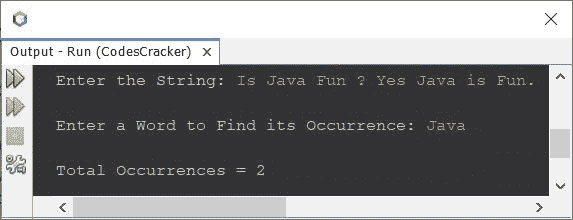
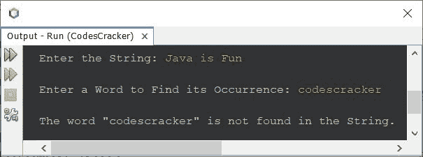
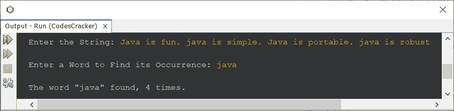

# Java 程序：来查找给定单词在字符串中的出现

> 原文：<https://codescracker.com/java/program/java-find-occurrence-of-word-in-string.htm>

创建这篇文章是为了包含一个 Java 程序，该程序在给定的字符串中查找并打印给定单词的出现。比如给定的字符串是 **Java 是可移植的，不是吗？**而给出的字是**是**。那么输出将是 2， ，因为给定的单词(“is”)在给定的字符串中出现了 2 次。

## 在字符串中查找单词的匹配项- Basic 版本

问题是，*写一个 Java 程序，查找并打印一个单词在字符串中的出现。在程序运行时，用户必须收到单词和字符串的 。*下面给出的程序是它的答案:

```
import java.util.Scanner;

public class CodesCracker
{
   public static void main(String[] args)
   {
      String str, word;
      int wordsLen, i, count=0;
      Scanner s = new Scanner(System.in);

      System.out.print("Enter the String: ");
      str = s.nextLine();
      System.out.print("\nEnter a Word to Find its Occurrence: ");
      word = s.next();

      String words[] = str.split(" ");
      wordsLen = words.length;

      for(i=0; i<wordsLen; i++)
      {
         if(word.equals(words[i]))
            count++;
      }

      System.out.println("\nTotal Occurrences = " +count);
   }
}
```

下面给出的快照显示了上面的 Java 程序在给定字符串中查找给定单词的示例运行，用户输入**Java 有趣吗？是的，Java 很有趣。**为字符串， **Java** 为单词:



## 在字符串完整版本中查找单词的出现

因为上述程序有多种限制。例如:

*   如果用户输入一个小写的单词，而这个单词在 string 中是可用的，但却是大写的，该怎么办？
*   如果用户输入的字符串在任意两个或多个单词之间包含多个空格，该怎么办？
*   如果用户输入一个在字符串中找不到的单词怎么办？

因此，考虑到这些限制，我创建了另一个程序来做与前一个程序相同的工作。此外，这个程序提供的用户体验并不比以前的好。让我们看看下面给出的程序:

```
import java.util.Scanner;

public class CodesCracker
{
   public static void main(String[] args)
   {
      String str, word;
      int wordsLen, i, count=0;
      Scanner s = new Scanner(System.in);

      System.out.print("Enter the String: ");
      str = s.nextLine();
      System.out.print("\nEnter a Word to Find its Occurrence: ");
      word = s.next();

      str = str.toLowerCase();
      word = word.toLowerCase();

      String words[] = str.split("\\s+");
      wordsLen = words.length;

      for(i=0; i<wordsLen; i++)
      {
         if(word.equals(words[i]))
            count++;
      }

      if(count==0)
         System.out.println("\nThe word \"" +word+ "\" is not found in the String.");
      else if(count==1)
         System.out.println("\nThe word \"" +word+ "\" occurs only one time.");
      else
         System.out.println("\nThe word \"" +word+ "\" found, " +count+ " times.");
   }
}
```

下面是它的示例运行，用户输入 **Java 是有趣的**作为字符串，输入 **codescracker** 作为要搜索的单词:



这是另一个使用用户输入运行的例子 **Java 很有趣。java 很简单。Java 是可移植的。java 是健壮的**作为字符串和 **java** 作为单词来查找和打印它的出现:



[Java 在线测试](/exam/showtest.php?subid=1)

* * *

* * *