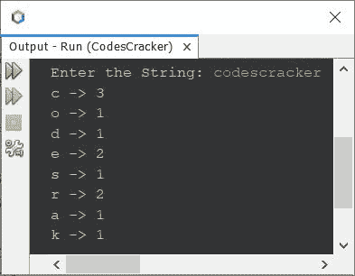
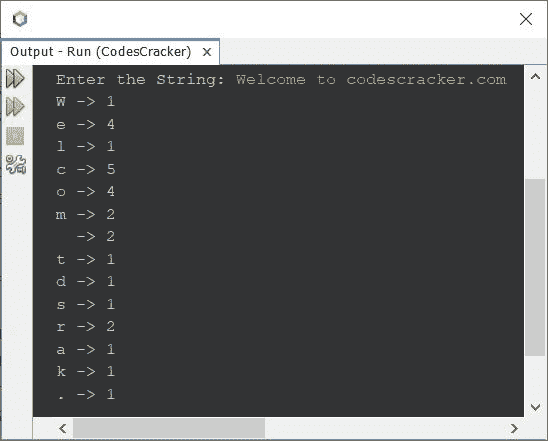

# Java 程序：计算字符串中每个字符出现次数

> 原文：<https://codescracker.com/java/program/java-count-occurrence-of-each-character-in-string.htm>

这篇文章介绍了一个 Java 程序，计算用户在程序运行时输入的字符串中每个字符的出现次数。

问题是，*写一个 Java 程序来计算并打印字符串中每个可用字符的出现次数。用户必须在运行时接收到 字符串。*下面给出的程序是它的答案:

```
import java.util.Scanner;

public class CodesCracker
{
   public static void main(String[] args)
   {
      int len, i, k, count, prevLen, arri=0, arrLen=0;
      String str;
      char ch;
      Scanner s = new Scanner(System.in);

      System.out.print("Enter the String: ");
      str = s.nextLine();

      len = str.length();
      char[][] arr = new char[len][2];

      for(i=0; i<len; i++)
      {
         ch = str.charAt(i);
         count = 0;
         for(k=0; k<arrLen; k++)
         {
            if(ch==arr[k][0])
            {
               prevLen = (arr[k][1]);
               prevLen = prevLen+1;
               arr[k][1] = (char)prevLen;
               count++;
               break;
            }
         }
         if(count==0)
         {
            arr[arri][0] = ch;
            arr[arri][1] = '1';
            arrLen++;
            arri++;
         }
      }
      for(i=0; i<arrLen; i++)
         System.out.println(arr[i][0]+ " -> " +arr[i][1]);
   }
}
```

下面是它的示例运行，将用户输入的 **codescracker** 作为字符串，以计算该 给定字符串中每个可用字符的出现次数:



下面是另一个运行用户输入的示例，**欢迎来到 codescracker.com**:



在上面的示例输出中，在字符 **m** 和 **t** 之间，出现 2 表示空白。

在上面的程序中，我创建了一个二维数组。也就是说，数组中的数组。内部数组的大小为 2。在第一个索引处，我放置了字符，在第二个索引处，我放置了它的出现。和它的出现，被包装在一个外部数组中，其大小等于给定字符串中可用的唯一字符的总数。

**注-** 由于数组 **arr** 是 **char** 数据类型，因此在初始化**prev len**T14【一个 **int** 类型变量】的值之前，我们需要将变量类型转换为 **char** 。所以我已经使用了 **(char)prevLen** 。

用户输入 **codescracker** 的上述程序的试运行如下:

*   初始值， **arri=0** ， **arrLen=0** ， **str="codescracker"** (用户输入)
*   使用语句
    `len = str.length();`
    输入字符串的长度，即 12，将被初始化为 **len** 变量
*   现在声明了一个名为 **arr** 的字符数组，其最大大小为 12。也就是说，数组 **arr** 可以包含 最多 12 个 2 元素数组。只有当用户输入的所有字符都是唯一的时，它才会占据最大的空间。创建这个 数组是为了存储字符及其出现。
*   一旦出现增加，任何字符的大小都会变小。因为，我们不需要存储那个重复的字符，而是需要将那个字符的前一个出现值再加 1。
*   现在开始执行循环的
***   最初 **i=0** ，由于条件 **i < len** 或 **0 < 12** 评估为真。因此 程序流程进入循环内部*   使用语句
    `ch = str.charAt(i);`
    将 **str** 中索引号 **i** 处的字符初始化为 **ch***   因此 **str.charAt(0)** 或**‘c’**将被初始化为 **ch** 。然后使用下一条语句，0 将被初始化为**计数**变量。该变量用于检查当前字符在字符数组 **arr** 中是否可用*   现在开始执行循环的内部***   最初 **k=0** 并且条件 **k < arrLen** 或 **0 < 0** 评估为假。因此程序 流程不会进入该循环*   在这个循环之后，如果将被评估，则**的条件被评估。也就是说，条件**计数==0** 或 **0==0** 评估为真。因此，程序流进入到 **if** 的块中，并对其中可用的所有四条语句 进行求值***   因此， **ch** 或**‘c’**将被初始化为 **arr[arri][0]** 或 **arr[0][0]** 。类似地， **arr[0][1]= ' 1 '**， **arrLen=1** ， **arri=1** (通过递增其值)*   现在， **i** 的值将增加。即 **i=1** 且条件**I<len**(循环的 外**的条件)，或 **1 < 12** 再次评估为真***   因此，程序流再次进入循环*   下一个字符，第二个字符**‘o’**将被初始化为 **ch** 。并且**计数再次=0***   再次开始执行内部循环*   也就是说， **k=0** 和 **k < arrLen** 或 **0 < 1** 评估为真，因此程序流程进入 该循环，并且条件 **ch==arr[k][0]** 或 **'o'==arr[0][0]** 或**' o ' = ' c '**评估为假。 因此程序流程不进入该程序块*   **k** 的值增加，现在 **k=1** 并且条件 **k < arrLen** 或 **1 < 1** 评估 为假，这次*   现在条件(如果 ) **计数==0** 或 **0==0** 评估为真。如果在名为 **arr** 的 **char** 数组中 **str** 的当前字符不可用，则该条件仅评估为 为真*   现在 **arr[arri][0] = ch** ，即 **arr[1][0] = 'o'** 和 **arr[1][1] = '1'** 。类似地 **arrLen=2** 和 T8】arri = 2*   现在， **i** 的值再次增加 1。所以 **i=2***   条件 **i < len** 或 **2 < 12** 再次评估为真，因此程序流程第三次进入 循环*   这个过程继续，直到条件评估为假*   以这种方式，当执行结束时，字符数组 **arr** 保存具有其 出现的唯一字符的数组。其中唯一字符首先被放置，它的出现被放置在该 2D 数组内每个 1D 数组的第二个索引处。****

 **[Java 在线测试](/exam/showtest.php?subid=1)

* * *

* * ***