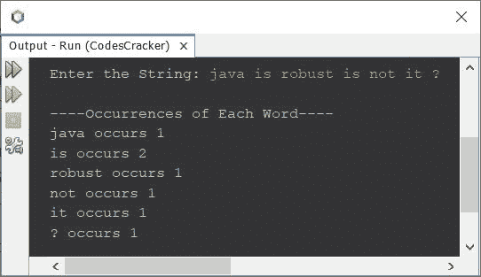
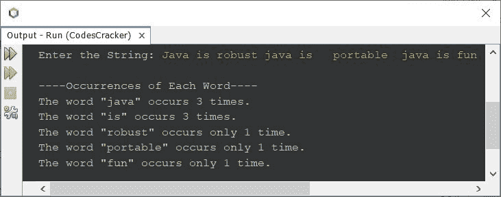

# 计算给定字符串中每个单词出现次数的 Java 程序

> 原文：<https://codescracker.com/java/program/java-count-occurrence-of-each-word-in-string.htm>

本文介绍了一个 Java 程序，该程序查找并打印给定字符串中每个单词的出现次数或频率。

## 计算给定字符串中的每个单词- Basic 版本

问题是，*写一个 Java 程序，找到并打印出一个字符串中每个单词的出现频率。该字符串必须在程序运行时由用户接收 。*这个问题的答案，是下面这个程序给出的:

```
import java.util.Scanner;

public class CodesCracker
{
   public static void main(String[] args)
   {
      String str, word;
      int wordsLen, i, count, j, k;
      Scanner s = new Scanner(System.in);

      System.out.print("Enter the String: ");
      str = s.nextLine();

      String words[] = str.split(" ");
      wordsLen = words.length;

      System.out.println("\n----Occurrences of Each Word----");
      for(i=0; i<wordsLen; i++)
      {
         word = words[i];
         count = 1;
         for(j=(i+1); j<(wordsLen-1); j++)
         {
            if(word.equals(words[j]))
            {
               count++;
               for(k=j; k<(wordsLen-1); k++)
               {
                  words[k] = words[k+1];
               }
               wordsLen--;
               j--;
            }
         }
         System.out.println(word+ " occurs " +count);
         count = 0;
      }
   }
}
```

下面给出的快照显示了上面的 Java 程序在查找和打印给定字符串中每个单词的频率时的示例运行，用户输入 **java 是健壮的，不是吗？**为字符串:



## 计算给定字符串完整版本中的每个单词

由于上面的程序有一些限制，比如同一个单词的小写和大写字符将被视为不同的单词，多个空格是不允许的。输出看起来也很基本。因此我修改了那个程序并创建了一个新的。这是修改上述程序后的程序。

```
import java.util.Scanner;

public class CodesCracker
{
   public static void main(String[] args)
   {
      Scanner s = new Scanner(System.in);

      System.out.print("Enter the String: ");
      String str = s.nextLine();

      str = str.toLowerCase();
      String words[] = str.split("\\s+");
      int wordsLen = words.length;

      System.out.println("\n----Occurrences of Each Word----");
      for(int i=0; i<wordsLen; i++)
      {
         int count = 1;
         for(int j=(i+1); j<(wordsLen-1); j++)
         {
            if(words[i].equals(words[j]))
            {
               count++;
               for(int k=j; k<(wordsLen-1); k++)
                  words[k] = words[k+1];
               wordsLen--;
               j--;
            }
         }
         if(count==1)
            System.out.println("The word \"" +words[i]+ "\" occurs only 1 time.");
         else
            System.out.println("The word \"" +words[i]+ "\" occurs " +count+" times.");
         count = 0;
      }
   }
}
```

下面是用户输入的示例运行 **java 是健壮的 Java 是可移植的 Java 是有趣的**作为字符串查找并打印 其中每个可用单词的出现次数。在单词**和**便携**之间，有 3 个空格。在单词 **portable** 和 **java** 之间有两个空格:**



[Java 在线测试](/exam/showtest.php?subid=1)

* * *

* * *