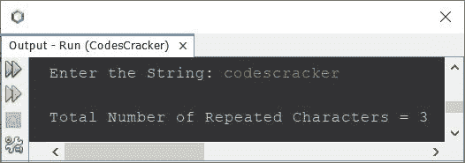
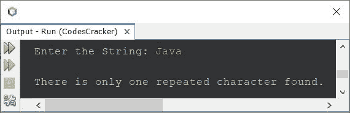
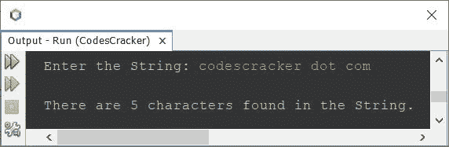

# 计算字符串中重复字符数的 Java 程序

> 原文：<https://codescracker.com/java/program/java-count-repeated-characters-in-string.htm>

创建这篇文章是为了介绍一个 Java 程序，该程序计算并打印给定字符串中重复或重复的字符数。例如，如果给定的字符串是 **Java 编程**，那么输出将是 **4** 。因为 人物 **a** 、 **r** 、 **g** 、 **m** 不止一次可用。

## 计算字符串中重复字符的数量-基本版

问题是，*写一个 Java 程序，统计一个字符串中重复字符的个数。该字符串必须在程序运行时由用户接收 。*下面是它的运行示例:

```
import java.util.Scanner;

public class CodesCracker
{
   public static void main(String[] args)
   {
      String str;
      char ch;
      int strLen, i, count, j, k, repChars=0;
      Scanner s = new Scanner(System.in);

      System.out.print("Enter the String: ");
      str = s.nextLine();

      strLen = str.length();
      char[] arr = new char[strLen];

      for(i=0; i<strLen; i++)
         arr[i] = str.charAt(i);

      for(i=0; i<strLen; i++)
      {
         ch = arr[i];
         count = 0;
         for(j=(i+1); j<strLen; j++)
         {
            if(ch==arr[j])
            {
               count++;
               for(k=j; k<(strLen-1); k++)
                  arr[k] = arr[k+1];
               strLen--;
               j--;
            }
         }
         if(count>0)
            repChars++;
      }

      System.out.println("\nTotal Number of Repeated Characters = " +repChars);
   }
}
```

下面给出的快照显示了上述程序的示例运行，用户输入 **codescracker** 作为字符串来计数， 打印其中可用的重复字符的总数:



也就是说，字符 **c** 、 **e** 、 **r** 是重复次数可用的三个字符。因此 输出为 3。

## 计算字符串完整版本中重复字符的数量

上述程序的问题是，如果用户输入一个包含空格的字符串，那么重复的空格也会被计算在内。因此，让我们修改上面的程序。在下面给出的程序中还做了一些其他的修改:

```
import java.util.Scanner;

public class CodesCracker
{
   public static void main(String[] args)
   {
      int i, count, j, k, repChars=0;
      Scanner s = new Scanner(System.in);

      System.out.print("Enter the String: ");
      String str = s.nextLine();

      str = str.replaceAll("\\s+", "");
      str = str.toLowerCase();
      int strLen = str.length();
      char[] arr = new char[strLen];

      for(i=0; i<strLen; i++)
         arr[i] = str.charAt(i);

      for(i=0; i<strLen; i++)
      {
         count = 0;
         for(j=(i+1); j<strLen; j++)
         {
            if(arr[i]==arr[j])
            {
               count++;
               for(k=j; k<(strLen-1); k++)
                  arr[k] = arr[k+1];
               strLen--;
               j--;
            }
         }
         if(count>0)
            repChars++;
      }

      if(repChars==0)
         System.out.println("\nNo repeated character found.");
      else if(repChars==1)
         System.out.println("\nThere is only one repeated character found.");
      else
         System.out.println("\nThere are " +repChars+ " characters found in the String.");
   }
}
```

下面是它的示例运行，用户输入 **Java** 作为字符串:



这是另一个使用用户输入运行的示例**codescracker . com**:



在上面的程序中，语句:

```
str = str.replaceAll("\\s+", "");
```

用于删除所有空格(单个空格、多个空格(制表符))。和下面的声明:

```
str = str.toLowerCase();
```

用于将整个字符串转换为小写。因为，大写和小写的相同字符被视为不同的字符。

[Java 在线测试](/exam/showtest.php?subid=1)

* * *

* * *