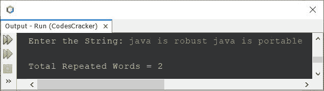
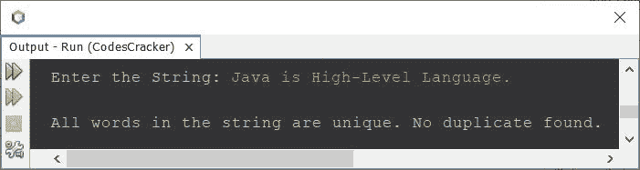
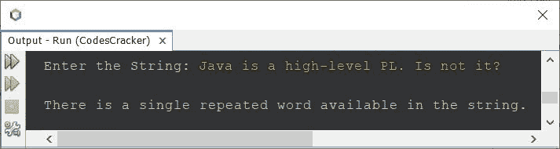

# 计算字符串中重复单词数的 Java 程序

> 原文：<https://codescracker.com/java/program/java-count-repeated-words-in-string.htm>

创建这篇文章是为了介绍一个用 Java 编写的程序，用来计算和打印给定字符串中重复出现的单词数。

例如，如果给定/输入的字符串是 **java 是健壮的 java 是可移植的**，那么输出将是 **2** 。因为 两个词，即**【Java】**和**，在给定的字符串中重复出现。**

 **问题是，*写一个 Java 程序，统计一个字符串中重复单词的个数。该字符串必须由 用户在程序运行时接收。*下面是它的回答:

```
import java.util.Scanner;

public class CodesCracker
{
   public static void main(String[] args)
   {
      String mystr, word;
      int len, i, count, j, k, repeated=0;
      Scanner s = new Scanner(System.in);

      System.out.print("Enter the String: ");
      mystr = s.nextLine();

      String wordArray[] = mystr.split(" ");
      len = wordArray.length;

      for(i=0; i<len; i++)
      {
         word = wordArray[i];
         count = 1;
         for(j=(i+1); j<(len-1); j++)
         {
            if(word.equals(wordArray[j]))
            {
               count++;
               for(k=j; k<(len-1); k++)
               {
                  wordArray[k] = wordArray[k+1];
               }
               len--;
               j--;
            }
         }
         if(count>1)
            repeated++;
         count = 0;
      }

      System.out.println("\nTotal Repeated Words = " +repeated);
   }
}
```

下面是用户输入的示例运行 **java 是健壮的 java 是可移植的**作为字符串查找并打印其中重复的 单词的总数:



上述程序的问题是，如果用户输入一个字符串，其中相同的单词及其大写和小写字符将被视为不同的单词。同样，上述程序不允许多个空格。因此，在修改了上面的程序之后，我创建了另一个程序。也就是说，

```
import java.util.Scanner;

public class CodesCracker
{
   public static void main(String[] args)
   {
      int repeated=0;
      Scanner s = new Scanner(System.in);

      System.out.print("Enter the String: ");
      String mystr = s.nextLine();

      mystr = mystr.toLowerCase();
      String wordArray[] = mystr.split("\\s+");
      int len = wordArray.length;

      for(int i=0; i<len; i++)
      {
         String word = wordArray[i];
         int count = 1;
         for(int j=(i+1); j<(len-1); j++)
         {
            if(word.equals(wordArray[j]))
            {
               count++;
               for(int k=j; k<(len-1); k++)
               {
                  wordArray[k] = wordArray[k+1];
               }
               len--;
               j--;
            }
         }
         if(count>1)
            repeated++;
         count = 0;
      }

      if(repeated==0)
         System.out.println("\nAll words in the string are unique. No duplicate found.");
      else if(repeated==1)
         System.out.println("\nThere is a single repeated word available in the string.");
      else
         System.out.println("\nThere are " +repeated+ " repeated words found in the string.");
   }
}
```

这是它在用户输入下的运行示例。



这里是另一个使用用户输入运行的示例， **Java 是一个高级 PL。不是吗？**



那个重复的单词是**是**，因为出现不止一次。第一个是**“是”**，第二个 是**“是”**。

[Java 在线测试](/exam/showtest.php?subid=1)

* * *

* * ***