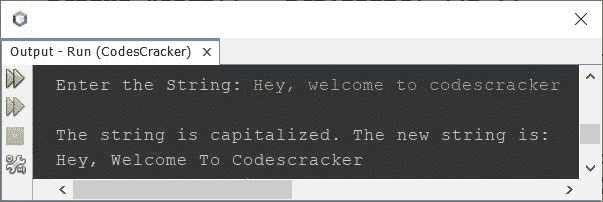
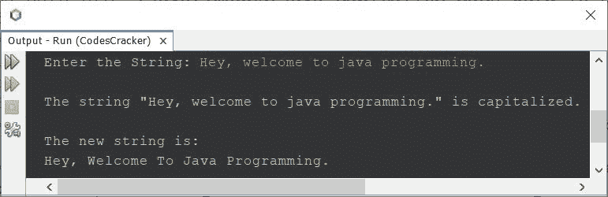

# Java 程序：将字符串中每个单词的第一个字符大写

> 原文：<https://codescracker.com/java/program/java-capitalize-each-word-in-string.htm>

本文介绍了一个 Java 程序，它将字符串中每个单词的第一个字符大写。例如，如果字符串是“我们热爱编程”，那么输出将是“我们热爱编程”。

问题是，写一个 Java 程序来大写字符串中每个单词的第一个字母。该字符串必须在程序运行时由用户接收 。下面给出的程序是这个问题的答案:

```
import java.util.Scanner;

public class CodesCracker
{
   public static void main(String[] args)
   {
      String str, firstCharacter, remainingCharacters, capitalizedWord;
      Scanner s = new Scanner(System.in);

      System.out.print("Enter the String: ");
      str = s.nextLine();

      String words[] = str.split("\\s");

      System.out.println("\nThe string is capitalized. The new string is:");
      for(String word: words)
      {
         firstCharacter = word.substring(0, 1);
         firstCharacter = firstCharacter.toUpperCase();
         remainingCharacters = word.substring(1);
         capitalizedWord = firstCharacter + remainingCharacters;
         System.out.print(capitalizedWord + " ");
      }
   }
}
```

下面给出的快照显示了带有用户输入的示例运行**嘿，欢迎使用 codescracker** 作为字符串:



在上面的程序中，代码:

```
split("\\s")
```

用于将字符串 **str** 分解成单词数组。方法 **substring()** 用于根据作为参数提供的索引对字符串的某个部分 进行切片。

也就是说， **\\s** 匹配字符串中的单个空格。因此，您可以将上面的代码替换为:

```
split(" ")
```

但是我不建议这样做，因为如果在给定的字符串中两个单词之间有多个空格，那么程序会产生错误。所以为了避免与空白相关的错误，我建议您使用**split(" \ \ s+"**)。

在上面的程序中，用户输入的字符串，即存储在名为 **str** 的 **String** 变量中的字符串，实际上并没有将 大写，因为我只是将字符串中每个单词的首字母转换成大写字母，然后一个接一个地打印出那个大写的单词 。这不是我们需要的项目。因此，让我们修改上面的程序来创建另一个程序，实际上 将一个字符串的所有单词大写。

```
import java.util.Scanner;

public class CodesCracker
{
   public static void main(String[] args)
   {
      String str, newstr="", firstchr, remchrs, capwrd;
      Scanner s = new Scanner(System.in);

      System.out.print("Enter the String: ");
      str = s.nextLine();

      String words[] = str.split("\\s+");

      for(String word: words)
      {
         firstchr = word.substring(0, 1);
         firstchr = firstchr.toUpperCase();
         remchrs = word.substring(1);
         newstr = newstr + firstchr + remchrs + " ";
      }

      System.out.println("\nThe string \"" +str+ "\" is capitalized.");
      System.out.println("\nThe new string is:");
      System.out.println(newstr);
   }
}
```

这是它在用户输入下的运行示例**嘿，欢迎来到 java 编程。**:



[Java 在线测试](/exam/showtest.php?subid=1)

* * *

* * *