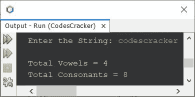
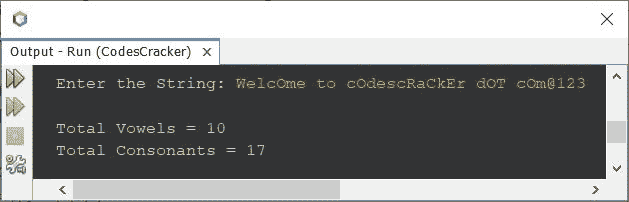

# Java 程序：统计字符串中元音和辅音

> 原文：<https://codescracker.com/java/program/java-count-vowels-consonants-in-string.htm>

这篇文章包含了一个 Java 程序，用来计算和打印一个字符串中元音和辅音的总数。但是在创建实际的程序(完整版本)之前，让我们创建一个简单的基本版本。

## 计算字符串中的元音和辅音-基本版

问题是，*写一个 Java 程序，统计一个字符串中可用的元音和辅音总数。该字符串必须在程序运行时由用户接收 。*下面是它的回答。我的意思是下面给出的程序是它的答案:

```
import java.util.Scanner;

public class CodesCracker
{
   public static void main(String[] args)
   {
      String str;
      char ch;
      int len, i, vowel=0, consonant=0;
      Scanner s = new Scanner(System.in);

      System.out.print("Enter the String: ");
      str = s.nextLine();

      len = str.length();
      for(i=0; i<len; i++)
      {
         ch = str.charAt(i);
         if(ch=='a'||ch=='e'||ch=='i'||ch=='o'||ch=='u')
            vowel++;
         else
            consonant++;
      }

      System.out.println("\nTotal Vowels = " +vowel);
      System.out.println("Total Consonants = " +consonant);
   }
}
```

下面是用户输入的示例运行 **codescracker** :



现在的问题是，如果用户输入一个包含数字或特殊字符的字符串呢？
还有，如果用户输入一个包含大写元音的字符串呢？
在那些情况下，上面的程序会得到未能产生的正确输出。因此，让我们修改上面的程序， 创建一个新的。

## 在字符串中计算元音和辅音-完整版

因为上面的程序有一些限制。因此，创建这个程序是为了消除这些限制。

```
import java.util.Scanner;

public class CodesCracker
{
   public static void main(String[] args)
   {
      String str;
      char ch;
      int len, i, vowel=0, consonant=0;
      Scanner s = new Scanner(System.in);

      System.out.print("Enter the String: ");
      str = s.nextLine();

      len = str.length();
      for(i=0; i<len; i++)
      {
         ch = str.charAt(i);
         if(ch=='a'||ch=='e'||ch=='i'||ch=='o'||ch=='u')
            vowel++;
         else if(ch=='A'||ch=='E'||ch=='I'||ch=='O'||ch=='U')
            vowel++;
         else
         {
            int ascii = ch;
            if((ascii>=65 && ascii<=90) || (ascii>=97 && ascii<=122))
               consonant++;
         }
      }

      System.out.println("\nTotal Vowels = " +vowel);
      System.out.println("Total Consonants = " +consonant);
   }
}
```

以下是用户输入的示例运行**欢迎使用 cOdescRaCkEr . cOm @ 123**作为字符串来计算其中可用的元音 和辅音的总数:



在字符串**WelcOme to cOdescRaCkEr . cOm @ 123**中，字母表是**WelcOmetocOdescRaCkErdOTcOm**。其中 元音为 **eOeoOeaEOo** ，辅音为 **WlcmtcdscRCkrdTcm** 。也就是 **10** 元音和 **17** 辅音。

在上面的程序中，我使用了字母的 ASCII 值进行匹配。a-z 的 ASCII 值是 65-90，其中 A-Z 的 ASCII 值是 97-122。

从上面的程序中，下面的一组语句:

```
if(ch=='a'||ch=='e'||ch=='i'||ch=='o'||ch=='u')
   vowel++;
else if(ch=='A'||ch=='E'||ch=='I'||ch=='O'||ch=='U')
   vowel++;
```

可以替换为下面给出的一组语句:

```
if(ch=='a'||ch=='e'||ch=='i'||ch=='o'||ch=='u'||ch=='A'||ch=='E'||ch=='I'||ch=='O'||ch=='U')
   vowel++;
```

我没有选择这个来避免冗长的单行代码。但是你可以，如果你想的话。

[Java 在线测试](/exam/showtest.php?subid=1)

* * *

* * *