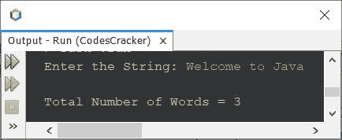
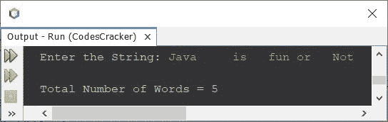

# 计算字符串中单词数的 Java 程序

> 原文：<https://codescracker.com/java/program/java-program-count-words-in-sentence.htm>

这篇文章介绍了一个 Java 程序，用来计算用户输入的字符串中的单词总数。

## 计算字符串中的单词数-基本版

问题是，*写一个 Java 程序，统计一个字符串的字数。该字符串必须由用户在程序运行时 输入。*下面给出的程序就是答案:

```
import java.util.Scanner;

public class CodesCracker
{
   public static void main(String[] args)
   {
      String str;
      int totalWords;
      Scanner s = new Scanner(System.in);

      System.out.print("Enter the String: ");
      str = s.nextLine();

      String words[] = str.split(" ");
      totalWords = words.length;
      System.out.println("\nTotal Number of Words = " +totalWords);
   }
}
```

下面是它在用户输入下运行的示例， **Welcome to Java** 作为字符串计算其中可用的总字数:



在上面的程序中，下面的语句:

```
String words[] = str.split(" ");
```

用于通过空格分割字符串 **str** 。上述声明也可以替换为下面给出的声明 :

```
String words[] = str.split("\\s");
```

## 计算字符串中的单词-完整版本

以前的程序的问题是，如果用户输入一个字符串，其中有一个或多个单词用一个以上的空格分隔。因此，在这种情况下，我们需要将上面的语句替换为:

```
String words[] = str.split("\\s+");
```

以下是该程序的完整版本:

```
import java.util.Scanner;

public class CodesCracker
{
   public static void main(String[] args)
   {
      Scanner s = new Scanner(System.in);

      System.out.print("Enter the String: ");
      String str = s.nextLine();

      String words[] = str.split("\\s+");
      System.out.println("\nTotal Number of Words = " +words.length);
   }
}
```

下面给出的快照显示了带有字符串输入的示例运行，该字符串输入包含一些用多个空格分隔的单词:



计算给定字符串中单词总数的同样工作也可以使用下面的程序来完成:

```
import java.util.Scanner;

public class CodesCracker
{
   public static void main(String[] args)
   {
      String str;
      int i, strLen, count=1;
      Scanner s = new Scanner(System.in);

      System.out.print("Enter the String: ");
      str = s.nextLine();

      strLen = str.length();
      for(i=0; i<=(strLen-1); i++)
      {
         if(str.charAt(i) == ' ' && str.charAt(i+1)!=' ')
            count++;
      }

      System.out.println("\nTotal Number of Words = " +count);
   }
}
```

您将获得与上一个程序相同的输出。

[Java 在线测试](/exam/showtest.php?subid=1)

* * *

* * *