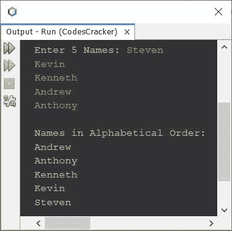

# Java 程序：按字母顺序排列字符串

> 原文：<https://codescracker.com/java/program/java-program-sort-string.htm>

本文介绍了一个 Java 程序，它按照字母顺序对用户在程序运行时输入的字符串进行排序。

问题是，*写一个 Java 程序，把字符串或名字按字母顺序排序。字符串必须由 用户在运行时接收。*下面给出的程序是它的答案:

```
import java.util.Scanner;

public class CodesCracker
{
   public static void main(String[] args)
   {
      String[] names = new String[5];
      String temp;
      int i, j;
      Scanner scan = new Scanner(System.in);

      System.out.print("Enter 5 Names: ");
      for(i=0; i<5; i++)
         names[i] = scan.nextLine();

      // sorting names in alphabetical order
      for(i=0; i<5; i++)
      {
         for(j=1; j<5; j++)
         {
            if(names[j-1].compareTo(names[j])>0)
            {
               temp=names[j-1];
               names[j-1]=names[j];
               names[j]=temp;
            }
         }
      }

      System.out.println("\nNames in Alphabetical Order:");
      for(i=0;i<5;i++)
         System.out.println(names[i]);
   }
}
```

下面给出的快照显示了上面程序的示例运行，用户输入**史蒂文**、**凯文**、 T4】肯尼斯、**安德鲁**和**安东尼**作为五个名字，按字母顺序排序并打印名字:



#### 其他语言的相同程序

*   [C 对字符串进行排序](/c/program/c-program-sort-string.htm)
*   [C++ 排序一个字符串](/cpp/program/cpp-program-sort-string.htm)
*   [Python 对字符串进行排序](/python/program/python-program-sort-string-in-alphabetical-order.htm)

[Java 在线测试](/exam/showtest.php?subid=1)

* * *

* * *