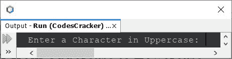
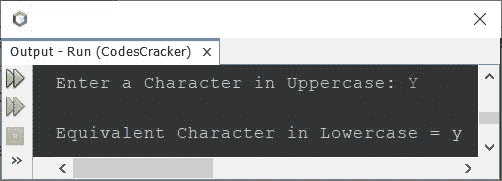
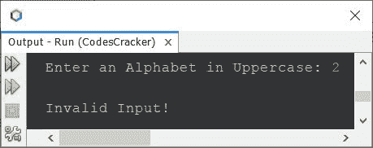
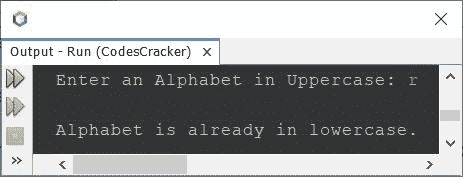
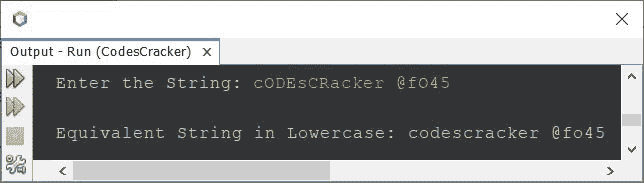

# 将大写字母转换成小写字母的 Java 程序

> 原文：<https://codescracker.com/java/program/java-program-convert-uppercase-to-lowercase.htm>

本文将介绍一个 Java 程序，该程序使用和不使用字符串函数将大写字符或字符串转换成相应的小写形式。下面是本文涉及的程序列表:

*   使用 ASCII - Basic 版本将大写字符转换为小写字符
*   使用 ASCII 将大写字符转换为小写字符-完整版本
*   不使用字符串函数将大写字符串转换为小写
*   使用字符串函数将大写字符串转换为小写

我说的字符串函数是 **toLowerCase()** 。

**注-****A-Z**的 ASCII 值为 **65-90** 。并且 **a-z** 的 ASCII 值为 **97-122** 。

**注-****‘A’**的 ASCII 值为 **97** ，而**‘A’**的 ASCII 值为 **65** 。意味着小写字符的 ASCII 值要比它的等价大写字符多 32 位。因此，将 32 加到大写 字符的 ASCII 值上，就成了其等价小写字符的 ASCII 值。

## 使用 ASCII 将 Java 中的大写字符转换为小写字符

问题是，*写一个 Java 程序，用字符的 ASCII 值把一个大写字符转换成它的等价小写字符。用户必须在程序运行时接收到该字符。*下面给出的程序是它的 答案:

```
import java.util.Scanner;

public class CodesCracker
{
   public static void main(String[] args)
   {
      char chUpper, chLower;
      int ascii;
      Scanner scan = new Scanner(System.in);

      System.out.print("Enter a Character in Uppercase: ");
      chUpper = scan.next().charAt(0);

      ascii = chUpper;
      ascii = ascii + 32;
      chLower = (char)ascii;

      System.out.println("\nEquivalent Character in Lowercase = " +chLower);
   }
}
```

下面给出的快照显示了上述 Java 程序产生的示例输出。这是初始/第一个输出:



现在输入一个大写的字符，比如说 **Y** ，按`ENTER`键转换并在输出屏幕上打印相同的字符 ，但是是小写的，如下图所示:



上述程序中的主要代码块是以下三条语句:

```
ascii = chUpper;
ascii = ascii + 32;
chLower = (char)ascii;
```

使用第一条语句，存储在变量 **chUpper** 中的字符的 ASCII 值被初始化为 **ascii 码**。 这是因为， **chUpper** 属于 **char** 类型，而 **ascii** 属于 **int** 类型。在 从较低的数据类型转换到较高的数据类型时，我们不需要进行强制转换，因为[有 Java 类型提升规则](/java/java-type-promotion-rules.htm)、 ，但是在第三条语句中，我们需要进行强制转换，将 **int** 转换为 **char** ，或者将 ASCII 转换为它的等效字符。

## Java 中大写字符到小写字符-完整版本

由于之前的程序产生错误的输出，当用户输入一个字符已经在小写或任何字符以外的字母。因此，我修改了那个程序。以下是先前程序的修改版本:

```
import java.util.Scanner;

public class CodesCracker
{
   public static void main(String[] args)
   {
      Scanner scan = new Scanner(System.in);

      System.out.print("Enter an Alphabet in Uppercase: ");
      char chUpper = scan.next().charAt(0);

      int ascii = chUpper;
      if(ascii>=65 && ascii<=90)
      {
         ascii = ascii + 32;
         char chLower = (char)ascii;
         System.out.println("\nEquivalent Character in Lowercase = " +chLower);
      }
      else if(ascii>=97 && ascii<=122)
         System.out.println("\nAlphabet is already in lowercase.");
      else
         System.out.println("\nInvalid Input!");
   }
}
```

下面给出的快照显示了上述 Java 程序的示例运行，带有用户输入 **2**



这是另一个带有用户输入的示例运行



## 不使用字符串函数在 Java 中将大写字符串转换为小写

这个程序将字符串从大写转换成小写，不使用 string 函数。我已经使用 ASCII 值来做这项工作，以类似的方式，同时在大写字符转换为小写字符，如前一个程序。

```
import java.util.Scanner;

public class CodesCracker
{
   public static void main(String[] args)
   {
      String strUpper;
      int i, ascii;
      char ch;
      Scanner scan = new Scanner(System.in);

      System.out.print("Enter the String: ");
      strUpper = scan.nextLine();

      int len = strUpper.length();
      char[] strUpperChars = new char[len];
      char[] strLowerChars = new char[len];
      for(i=0; i<len; i++)
         strUpperChars[i] = strUpper.charAt(i);

      for(i=0; i<len; i++)
      {
         ch = strUpperChars[i];
         ascii = ch;
         if(ascii>=65 && ascii<=90)
         {
            ascii = ascii + 32;
            ch = (char)ascii;
            strLowerChars[i] = ch;
         }
         else
            strLowerChars[i] = ch;
      }

      System.out.print("\nString in Lowercase: ");
      for(i=0; i<len; i++)
         System.out.print(strLowerChars[i]);
   }
}
```

## 使用字符串函数在 Java 中将字符串从大写转换为小写

这是本文的最后一个程序，使用一个名为 **toLowerCase()** 的字符串函数创建，它将 整个字符串转换成小写。

```
import java.util.Scanner;

public class CodesCracker
{
   public static void main(String[] args)
   {
      Scanner scan = new Scanner(System.in);

      System.out.print("Enter the String: ");
      String strUpper = scan.nextLine();

      String strLower = strUpper.toLowerCase();
      System.out.println("\nEquivalent String in Lowercase: " +strLower);
   }
}
```

下面给出的快照显示了上述 Java 程序的示例运行，其中用户输入 **cODEsCRacker @fO45** 作为字符串 ，以小写形式转换并打印其等效字符串:



看看用了一个名为 **toLowerCase()** 的库函数后，短程序变成什么样。为了使它更简短， 同样的程序也可以写成:

```
import java.util.Scanner;

public class CodesCracker
{
   public static void main(String[] args)
   {
      Scanner scan = new Scanner(System.in);
      System.out.print("Enter the String: ");
      String str = scan.nextLine();
      System.out.println("\nEquivalent in Lowercase: " +str.toLowerCase());
   }
}
```

您将获得与上一个程序相同的输出。

#### 其他语言的相同程序

*   [C 将大写字母转换成小写字母](/c/program/c-program-convert-uppercase-into-lowercase.htm)
*   [C++将大写字母转换成小写字母](/cpp/program/cpp-program-convert-uppercase-into-lowercase.htm)
*   [Python 将大写转换成小写](/python/program/python-program-convert-uppercase-to-lowercase.htm)

[Java 在线测试](/exam/showtest.php?subid=1)

* * *

* * *