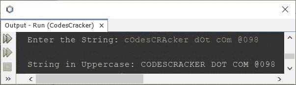

# 将小写转换成大写的 Java 程序

> 原文：<https://codescracker.com/java/program/java-program-convert-lowercase-to-uppercase.htm>

这篇文章讲述了一个用 Java 编写的程序，这个程序可以使用或不使用字符串函数将小写字符或字符串转换成大写字符或字符串。为了完成这个任务，我们可以使用 ASCII 值或者一个名为 **toUpperCase()** 的字符串函数。

## 使用 ASCII 将 Java 中的小写字符转换为大写字符

问题是，*写一个 Java 程序，用 ASCII 值把一个小写字符转换成大写。字符 必须在程序运行时被用户接收。*下面给出的程序是它的答案:

“ **A** 的 ASCII 值为 65，“ **a** 的 ASCII 值为 97。即 97-65 = 32，表示小写 字符的 ASCII 值比等价大写字符的 ASCII 值多 32。因此，要将字符从小写转换成大写，只需用 ASCII 码减去 32，如下面给出的程序所示。

```
import java.util.Scanner;

public class CodesCracker
{
   public static void main(String[] args)
   {
      char ch;
      int ascii;
      Scanner scan = new Scanner(System.in);

      System.out.print("Enter a Character in Lowercase: ");
      ch = scan.next().charAt(0);

      ascii = ch;
      ascii = ascii - 32;
      ch = (char)ascii;

      System.out.println("\nEquivalent Character in Uppercase = " +ch);
   }
}
```

下面给出的快照显示了上述 Java 程序的示例运行，将用户输入的 **c** 作为字符，将其转换为 大写:


由于 **A-Z** 的 ASCII 值为 **65-90** 。而 **a-z** 的 ASCII 值为 **97-122** 。因此 如前所述，在 **A** 和 **a** 或 **B** 和 **b** 之间有一个 **32** 的差值，以此类推。那 就是，要从 A 转换到 A，我们需要减去 32。

在上面的程序中，语句:

```
ascii = ch;
```

表示 **ch** 的值被初始化为 **ascii 码**。因为 **ascii** 属于 **int** 类型，所以 不是初始化字符本身，而是初始化它的 ascii 值。也就是说， **‘c’**的 ascii 值(99)将被初始化为 **ascii 码**。现在使用语句:

```
ascii = ascii - 32;
```

**99-32** 或 **67** 将被初始化为 **ascii 码**。再次使用语句:

```
ch = (char)ascii;
```

在上面的语句中，代码 **(char)67** 被赋值为 ASCII 值 **67** 对应的字符，即 **C** 将被初始化为 **ch** 。

**注意-** 在初始化为 char 类型的 变量之前，我已经使用 **char** 将 ASCII 值转换为它的等价字符，以避免**将 int 转换为 char** 。但是在 **char** 到 **int** 的情况下，我们不需要手动转换 ，因为 Java 中有[类型提升规则。](/java/java-type-promotion-rules.htm)

上面的程序也可以这样创建:

```
import java.util.Scanner;

public class CodesCracker
{
   public static void main(String[] args)
   {
      Scanner scan = new Scanner(System.in);

      System.out.print("Enter a Character in Lowercase: ");
      char ch = scan.next().charAt(0);

      System.out.println("\nEquivalent Character in Uppercase = " +(char)(ch-32));
   }
}
```

您将获得与上一个程序相同的输出。

## Java 中小写字符到大写字符-完整版本

因为上面给出的程序有局限性。这个限制是，当用户输入一个已经是大写的字符时，程序也是这样，得到它的 ASCII 值并减去 32，然后输出结果，作为大写的等价字符，这看起来很奇怪，也不是一个正确的程序。因此，程序需要修改。下面是上述程序的修改版本:

```
import java.util.Scanner;

public class CodesCracker
{
   public static void main(String[] args)
   {
      Scanner scan = new Scanner(System.in);

      System.out.print("Enter an Alphabet: ");
      char ch = scan.next().charAt(0);

      int ascii = ch;
      if(ascii>=97 && ascii<=122)
      {
         ascii = ascii - 32;
         ch = (char)ascii;
         System.out.println("\nEquivalent Character in Uppercase = " +ch);
      }
      else if(ascii>=65 && ascii<=90)
         System.out.println("\nThe alphabet is already in Uppercase");
      else
         System.out.println("\nIt is not an alphabet");

   }
}
```

用户输入 **R** 的上述程序的示例运行:


下面是另一个使用用户输入 **$** (不是字母输入)运行的示例:


## 在 Java 中不使用字符串函数将小写字符串转换为大写

这个程序在不使用字符串函数 **toUpperCase()** 的情况下将小写字符串转换成大写字符串。

```
import java.util.Scanner;

public class CodesCracker
{
   public static void main(String[] args)
   {
      String str;
      int len, i, ascii;
      char ch;
      Scanner scan = new Scanner(System.in);

      System.out.print("Enter the String: ");
      str = scan.nextLine();

      len = str.length();
      char[] strChars = new char[len];
      char[] strUpperChars = new char[len];
      for(i=0; i<len; i++)
         strChars[i] = str.charAt(i);

      for(i=0; i<len; i++)
      {
         ch = strChars[i];
         ascii = ch;
         if(ascii>=97 && ascii<=122)
         {
            ascii = ascii - 32;
            ch = (char)ascii;
            strUpperChars[i] = ch;
         }
         else
            strUpperChars[i] = ch;
      }

      System.out.print("\nString in Uppercase: ");
      for(i=0; i<len; i++)
         System.out.print(strUpperChars[i]);
   }
}
```

下面是它的示例运行，用户输入的字符串为**cOdesCRAcker . cOm @ 098**。我提供了小写和大写的 字母表以及一些其他字符:



在上面的程序中，存储在 **str** 中的输入字符串，以逐字符 的方式被初始化为字符数组 **strChars** 。此外，这个字符数组的每个小写字母都被大写，并被初始化为另一个名为 **strUpperChars** 的 字符数组。最后，我已经逐字符打印出了**strup chars**的值。

## 在 Java 中使用字符串函数将小写字符串转换为大写

这是这篇文章的最后一个程序，使用字符串函数将小写字符串直接转换为大写。

```
import java.util.Scanner;

public class CodesCracker
{
   public static void main(String[] args)
   {
      String str;
      Scanner scan = new Scanner(System.in);

      System.out.print("Enter the String: ");
      str = scan.nextLine();

      str = str.toUpperCase();
      System.out.println("\nEquivalent String in Uppercase = " +str);
   }
}
```

用户输入**CodesCracker . cOm 100**作为字符串的上述程序的示例运行:


#### 其他语言的相同程序

*   [C 将小写转换成大写](/c/program/c-program-convert-lowercase-into-uppercase.htm)
*   [C++将小写转换成大写](/cpp/program/cpp-program-convert-lowercase-into-uppercase.htm)
*   [Python 将小写转换成大写](/python/program/python-program-convert-lowercase-to-uppercase.htm)

[Java 在线测试](/exam/showtest.php?subid=1)

* * *

* * *