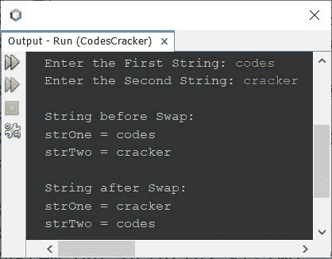

# Java 程序：交换两个字符串

> 原文：<https://codescracker.com/java/program/java-program-swap-two-strings.htm>

本文介绍了一个 Java 程序，它交换用户在程序运行时输入的两个字符串。

## 在 Java 中交换两个字符串

问题是，*写一个 Java 程序交换两个字符串。用户必须在运行时接收这两个字符串。* 下面给出的程序是它的答案:

```
import java.util.Scanner;

public class CodesCracker
{
   public static void main(String[] args)
   {
      String strOne, strTwo, strTemp;
      Scanner scan = new Scanner(System.in);

      System.out.print("Enter the First String: ");
      strOne = scan.nextLine();
      System.out.print("Enter the Second String: ");
      strTwo = scan.nextLine();

      System.out.println("\nString before Swap:");
      System.out.println("strOne = " +strOne);
      System.out.println("strTwo = " +strTwo);

      strTemp = strOne;
      strOne = strTwo;
      strTwo = strTemp;

      System.out.println("\nString after Swap:");
      System.out.println("strOne = " +strOne);
      System.out.println("strTwo = " +strTwo);
   }
}
```

下面给出的快照显示了上述程序的示例运行，用户输入的**代码**和**破解程序**作为第一个和第二个要交换的 字符串:



#### 其他语言的相同程序

*   [C 交换两个字符串](/c/program/c-program-swap-two-strings.htm)
*   [C++ 交换两个字符串](/cpp/program/cpp-program-swap-two-strings.htm)
*   [Python 交换两个字符串](/python/program/python-program-swap-two-strings.htm)

[Java 在线测试](/exam/showtest.php?subid=1)

* * *

* * *