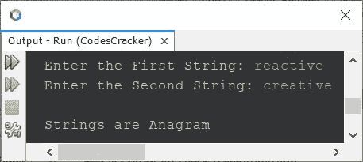
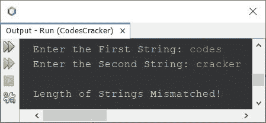

# Java 程序：检查是否为变位词

> 原文：<https://codescracker.com/java/program/java-program-check-anagram.htm>

本文介绍一个 Java 程序，它检查用户在程序运行时输入的两个字符串是否是变位词。

两个字符串是变位词，如果一个字符串可以重新排列形成另一个。比如**听**和**沉默**都是 的变位串。因为**听**可以重新排列形成**无声**反之亦然。

现在的问题是，*写一个 Java 程序，检查字符串是不是变位词。*下面给出的节目是它的 回答:

```
import java.util.Scanner;

public class CodesCracker
{
   public static void main(String[] args)
   {
       String strOne, strTwo;
       int lenOne, lenTwo, i, j, found=0, not_found=0;
       Scanner scan = new Scanner(System.in);

       System.out.print("Enter the First String: ");
       strOne = scan.nextLine();
       System.out.print("Enter the Second String: ");
       strTwo = scan.nextLine();

       lenOne = strOne.length();
       lenTwo = strTwo.length();

       if(lenOne == lenTwo)
       {
           for(i=0; i<lenOne; i++)
           {
               found = 0;
               for(j=0; j<lenOne; j++)
               {
                   if(strOne.charAt(i) == strTwo.charAt(j))
                   {
                       found = 1;
                       break;
                   }
               }
               if(found == 0)
               {
                   not_found = 1;
                   break;
               }
           }
           if(not_found == 1)
               System.out.println("\nStrings are not Anagram");
           else
               System.out.println("\nStrings are Anagram");
       }

       else
           System.out.println("\nLength of Strings Mismatched!");
   }
}
```

下面是它的示例运行，用户输入**反应**作为第一个字符串，**创意**作为第二个字符串:



下面是另一个运行示例，用户输入的**代码**和**破解**是两个字符串:



在上面的程序中，我首先检查了两个字符串的长度。如果长度相等，则继续，否则打印长度不等的消息。

现在将第一个字符串的第一个字符与第二个字符串的所有字符逐一进行比较。然后将第一个字符串中的第二个字符与第二个字符串中的所有字符逐一进行比较，以此类推。

在比较时，如果第一个字符串的任何字符与第二个字符串的字符匹配，那么 1 被初始化为找到的的**，并使用 **break** 从循环中退出。并且如果没有找到匹配，那么 1 将不会被初始化为找到的**。因此，在退出内部循环后，我检查并打印了消息，不管 字符串是否是变位词。****

 **#### 其他语言的相同程序

*   [C 检查是否为变位词](/c/program/c-anagram-program.htm)
*   [C++ 检查是否为变位词](/cpp/program/cpp-anagram-program.htm)

[Java 在线测试](/exam/showtest.php?subid=1)

* * *

* * ***