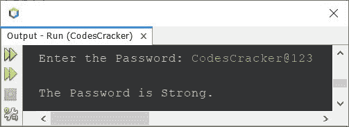
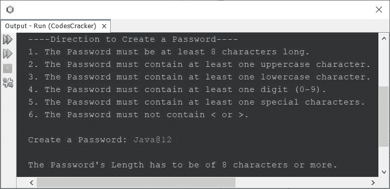
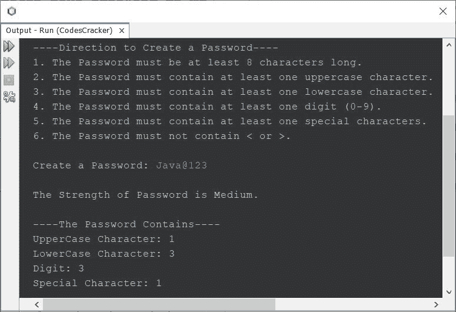
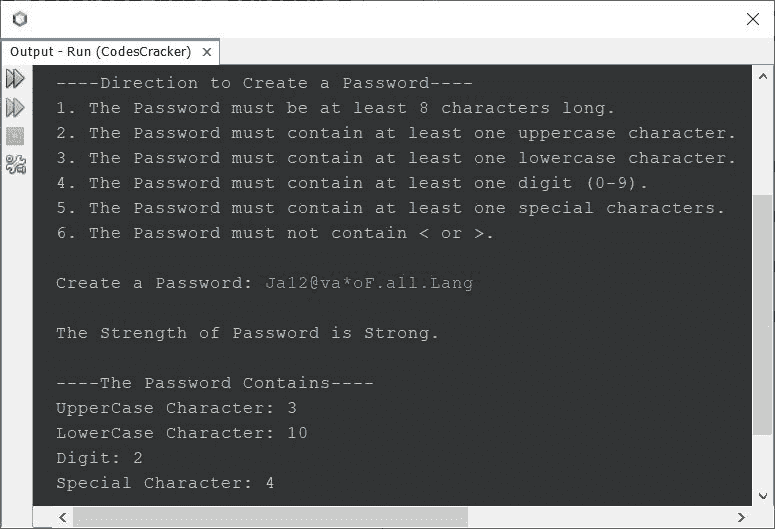

# Java 程序：检查密码强度

> 原文：<https://codescracker.com/java/program/java-check-password-strength.htm>

本文介绍了 Java 中的一个重要程序，即检查密码的强度是否强。这是一个重要的话题，因为在许多应用程序中，我们需要允许用户注册。

要注册，用户需要创建一个密码以及其他细节。因此，在创建密码时，开发人员的工作是创建一些代码来检查输入的密码是否强。因此，我用 Java 编写了一个程序，帮助检查用户创建的密码的强度。

## 在 Java 中检查密码的强度

问题是，*写一个 Java 程序，检查密码是否有效。如果它是有效的，那么它的力量 是否强大。用户必须在程序运行时收到密码。*下面给出的程序是这个问题的答案 :

在这个程序中，密码分为三类，无效、弱和强。如果密码长度少于 8 个字符，则密码无效。如果密码不包含至少一个大写字符、一个小写字符、一个数字和一个特殊字符，则属于弱类别。如果密码包含所有这些字符，则属于强类别。

```
import java.util.Scanner;

public class CodesCracker
{
   public static void main(String[] args)
   {
      int passwordLength=8, upChars=0, lowChars=0;
      int special=0, digits=0;
      char ch;
      Scanner s = new Scanner(System.in);

      System.out.print("Enter the Password: ");
      String password = s.nextLine();

      int total = password.length();
      if(total<passwordLength)
      {
         System.out.println("\nThe Password is invalid!");
         return;
      }
      else
      {
         for(int i=0; i<total; i++)
         {
            ch = password.charAt(i);
            if(Character.isUpperCase(ch))
               upChars = 1;
            else if(Character.isLowerCase(ch))
               lowChars = 1;
            else if(Character.isDigit(ch))
               digits = 1;
            else
               special = 1;
         }
      }
      if(upChars==1 && lowChars==1 && digits==1 && special==1)
         System.out.println("\nThe Password is Strong.");
      else
         System.out.println("\nThe Password is Weak.");
   }
}
```

下面给出的快照显示了由上述 Java 程序生成的示例运行，用户输入 **CodesCracker@123** 作为 密码来检查其强度:



上面的程序是检查密码强度的基本版本。因为该程序没有提供良好的用户体验，因此我们需要修改上述程序。现在，我不认为，8 个字符长的密码是安全的。是的，它是安全的，如果你非常聪明地使用字符的组合，但是尝试创建至少 12 个字符长的密码。因此，我将长度为 8-12 个字符的密码归类为中等强度，而长度超过 12 个字符的密码归类为强强度。你可以根据你的需要修改。

```
import java.util.Scanner;

public class CodesCracker
{
   public static void main(String[] args)
   {
      int passwordLength=8, upChars=0, lowChars=0;
      int special=0, digits=0;
      char ch;
      Scanner s = new Scanner(System.in);

      System.out.println("----Direction to Create a Password----");
      System.out.println("1\. The Password must be at least 8 characters long.");
      System.out.println("2\. The Password must contain at least one uppercase character.");
      System.out.println("3\. The Password must contain at least one lowercase character.");
      System.out.println("4\. The Password must contain at least one digit (0-9).");
      System.out.println("5\. The Password must contain at least one special characters.");
      System.out.println("6\. The Password must not contain < or >.");

      System.out.print("\nCreate a Password: ");
      String password = s.nextLine();

      int total = password.length();
      if(total<passwordLength)
      {
         System.out.println("\nThe Password's Length has to be of 8 characters or more.");
         return;
      }
      else
      {
         for(int i=0; i<total; i++)
         {
            ch = password.charAt(i);
            if(Character.isUpperCase(ch))
               upChars++;
            else if(Character.isLowerCase(ch))
               lowChars++;
            else if(Character.isDigit(ch))
               digits++;
            else
            {
               if(ch=='<' || ch=='>')
               {
                  System.out.println("\nThe Password is Malicious!");
                  return;
               }
               else
                  special++;
            }
         }
      }
      if(upChars!=0 && lowChars!=0 && digits!=0 && special!=0)
      {
         if(total>=12)
         {
            System.out.println("\nThe Strength of Password is Strong.");
         }
         else
         {
            System.out.println("\nThe Strength of Password is Medium.");
         }
         System.out.println("\n----The Password Contains----");
         System.out.println("UpperCase Character: " +upChars);
         System.out.println("LowerCase Character: " +lowChars);
         System.out.println("Digit: " +digits);
         System.out.println("Special Character: " +special);
      }
      else
      {
         if(upChars==0)
            System.out.println("\nThe Password must contain at least one uppercase character.");
         if(lowChars==0)
            System.out.println("\nThe Password must contain at least one lowercase character.");
         if(digits==0)
            System.out.println("\nThe Password must contain at least one digit.");
         if(special==0)
            System.out.println("\nThe Password must contain at least one special character.");
      }
   }
}
```

下面是使用用户输入 **Java@12** 作为密码来检查其强度的示例运行:



下面是另一个使用用户输入运行的示例:



下面给出的快照显示了使用用户输入 **Ja12@va*oF.all.Lang** 运行的另一个示例:



上面给出的用 Java 检查输入密码强度的代码只是一个演示版本，展示了如何完成这项工作。但是你可以根据自己的需要进行修改，并在你的 Java 应用程序中使用用户需要创建帐户的代码。

[Java 在线测试](/exam/showtest.php?subid=1)

* * *

* * *