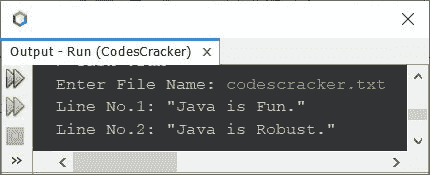

# 读取文件的 Java 程序

> 原文：<https://codescracker.com/java/program/java-program-read-file.htm>

本文介绍了一个 Java 程序，它读取用户在程序运行时输入的文件。

## 用 Java 逐行读取文件

问题是，*写一个 Java 程序读取一个文件，用扫描器*一行一行。下面给出的节目是 它的回答:

```
import java.util.Scanner;
import java.io.*;

public class CodesCracker
{
   public static void main(String[] args)
   {
      String myfile, myline;
      Scanner scan = new Scanner(System.in);

      System.out.print("Enter File Name: ");
      myfile = scan.nextLine();

      try
      {
         FileReader fileReader = new FileReader(myfile);
         BufferedReader bufread = new BufferedReader(fileReader);

         // reading the file, line by line
         while((myline = bufread.readLine()) != null)
            System.out.println(myline);

         bufread.close();
      }
      catch(IOException e)
      {
         System.out.println("Exception: " +e);
      }
   }
}
```

下面给出的快照显示了上述程序的示例运行，用户输入 **codescracker.txt** 作为要读取的 文件的名称


在上面的程序中，如果您更改下面的代码块:

```
while((myline = bufread.readLine()) != null)
   System.out.println(myline);
```

下面给出了代码块:

```
int line_no = 1;
while((myline = bufread.readLine()) != null)
{
   System.out.println("Line No." +line_no+ ": \"" +myline+ "\"");
   line_no++;
}
```

那么输出将是:



回路中的**，也可以用**代替**。这里是同一个 块的**循环版本的**，使用**而**创建:**

```
int line_no = 1;
for(myline=bufread.readLine(); myline!=null; myline=bufread.readLine())
{
   System.out.println("Line No." +line_no+ ": \"" +myline+ "\"");
   line_no++;
}
```

文件 **codescracker.txt** 已经存在于当前目录中。Java 应用程序源代码上面的 保存的目录。

#### 其他语言的相同程序

*   [C 读取文件](/c/program/c-program-read-file.htm)
*   [C++读取文件](/cpp/program/cpp-program-read-file.htm)
*   [Python 读取文件](/python/program/python-program-read-file.htm)

[Java 在线测试](/exam/showtest.php?subid=1)

* * *

* * *