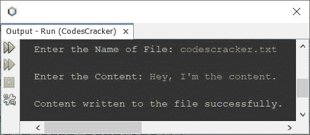
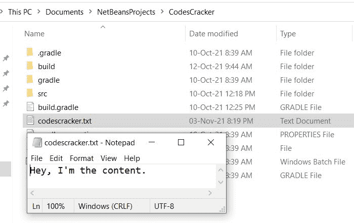

# 写入文件的 Java 程序

> 原文：<https://codescracker.com/java/program/java-program-write-to-file.htm>

本文介绍了一个 Java 程序，该程序将用户在程序运行时输入的一些内容写入到用户输入的文件中。

## 用 Java 写文件

问题是，*写一个 Java 程序把一些文本写到一个给定的文件里。*下面给出的程序是它的答案:

```
import java.util.Scanner;
import java.io.*;

public class CodesCracker
{
   public static void main(String[] args)
   {
      String myfile, content;
      Scanner scan = new Scanner(System.in);

      System.out.print("Enter the Name of File: ");
      myfile = scan.nextLine();

      try
      {
         FileWriter fw = new FileWriter(myfile);
         System.out.print("\nEnter the Content: ");
         content = scan.nextLine();
         fw.write(content);
         fw.close();
         System.out.println("\nContent written to the file successfully.");
      }
      catch(IOException ioe)
      {
         System.out.println("\nException: " +ioe);
      }
   }
}
```

下面给出的快照显示了上述程序的示例运行，用户输入 **codescracker.txt** 作为文件名 ，而**嘿，我是内容。**作为内容将其写入给定文件:



如果文件 **codescracker.txt** 已经存在于你当前的目录中，则是保存上述 源代码的目录。然后内容被覆盖到这个文件。否则会创建一个同名文件 并写入内容。以下是执行上述程序后，当前目录的快照，以及打开的文件 **codescracker.txt** :



## 用 Java 逐行写入文件

这个程序允许用户在一个文件中写入多行文本。也就是说，这个程序是基于逐行将内容写入文件的。

```
import java.util.Scanner;
import java.io.*;

public class CodesCracker
{
   public static void main(String[] args)
   {
      String fileName, text;
      int noOfLines, i;
      Scanner scan = new Scanner(System.in);

      System.out.print("Enter File's Name: ");
      fileName = scan.nextLine();
      try
      {
         FileWriter fw = new FileWriter(fileName);
         BufferedWriter bw = new BufferedWriter(fw);

         System.out.print("How many lines of content to write ? ");
         noOfLines = scan.nextInt();
         System.out.print("Enter " +noOfLines+ " lines of text: ");
         for(i=0; i<noOfLines+1; i++)
         {
            text = scan.nextLine();
            text = text + "\n";
            bw.write(text);
         }
         System.out.println("\nContent written to the file successfully.");
         bw.close();
      }
      catch(IOException ex)
      {
         System.out.println("Error writing to file named '" +fileName+ "' ..!!");
      }
   }
}
```

#### 其他语言的相同程序

*   [C 写入文件](/c/program/c-program-write-file.htm)
*   [C++写入文件](/cpp/program/cpp-program-write-file.htm)
*   [Python 写文件](/python/program/python-program-write-to-file.htm)

[Java 在线测试](/exam/showtest.php?subid=1)

* * *

* * *