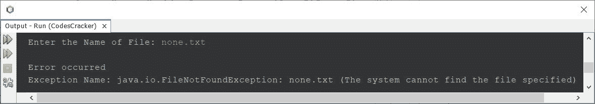

# Java 程序：读取文件并显示其内容

> 原文：<https://codescracker.com/java/program/java-program-read-and-display-file.htm>

这篇文章讲述了一个用 Java 编写的程序，它读取一个文件并显示其内容。

## 用 Java 读取并显示文件内容

问题是，*写一个 Java 程序，读取并显示给定文件的内容。在程序运行时，用户必须收到文件名 。*下面给出的程序是这个问题的答案:

```
import java.util.Scanner;
import java.io.*;

public class CodesCracker
{
    public static void main(String[] args)
    {
        String fname;
        Scanner scan = new Scanner(System.in);

        // enter filename along with its extension
        System.out.print("Enter the Name of File: ");
        fname = scan.nextLine();

        String line = null;
        try
        {
            FileReader fileReader = new FileReader(fname);

            // always wrap the FileReader in BufferedReader
            BufferedReader bufferedReader = new BufferedReader(fileReader);

            while((line = bufferedReader.readLine()) != null)
            {
                System.out.println(line);
            }

            // always close the file after its use
            bufferedReader.close();
        }
        catch(IOException ex)
        {
            System.out.println("\nError occurred");
            System.out.println("Exception Name: " +ex);
        }
    }
}
```

下面给出的快照显示了上述程序的示例运行，用户输入 **codescracker.txt** 作为要读取的文件 的名称，并在输出屏幕上打印其内容:


因为，我已经在当前目录中创建了名为 **codescracker.txt** 的文件。因此，上面的程序 显示了那个文件的内容。现在让我用一个不存在于当前目录中的文件名来试试:



也就是抛出的异常是，*Java . io . file not found exception:none . txt(系统找不到指定的文件)*， 表示输入的名为 **none.txt** 的文件在当前目录下不存在。

当前目录是指保存上述源代码(Java 程序以上)的目录。在我的例子中，这是当前目录的快照，以及打开的文件 **codescracker.txt** :


上面的程序也可以这样创建:

```
import java.util.Scanner;
import java.io.*;

public class CodesCracker
{
    public static void main(String[] args)
    {
        Scanner scan = new Scanner(System.in);

        System.out.print("Enter the Name of File: ");
        String fileName = scan.nextLine();

        String myline = null;
        try
        {
            FileReader fr = new FileReader(fileName);
            BufferedReader br = new BufferedReader(fr);

            System.out.println("\n----The content of File----");
            myline = br.readLine();
            while(myline != null)
            {
                System.out.println(myline);
                myline = br.readLine();
            }
            br.close();
        }
        catch(IOException ex)
        {
            System.out.println("\nError occurred");
            System.out.println("Exception Name: " +ex);
        }
    }
}
```

以下是其示例运行，用户输入与第一次示例运行时相同:


#### 其他语言的相同程序

*   [C 读取&显示文件内容](/c/program/c-program-read-and-display-file.htm)
*   [C++读取&显示文件内容](/cpp/program/cpp-program-read-and-display-file.htm)

[Java 在线测试](/exam/showtest.php?subid=1)

* * *

* * *