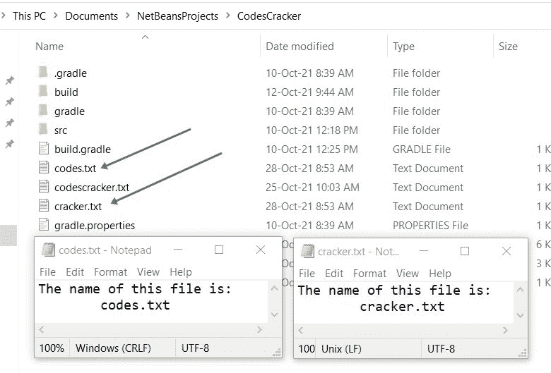
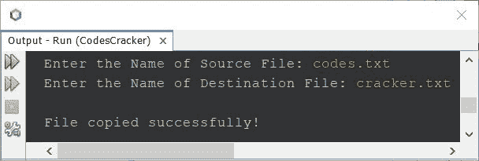
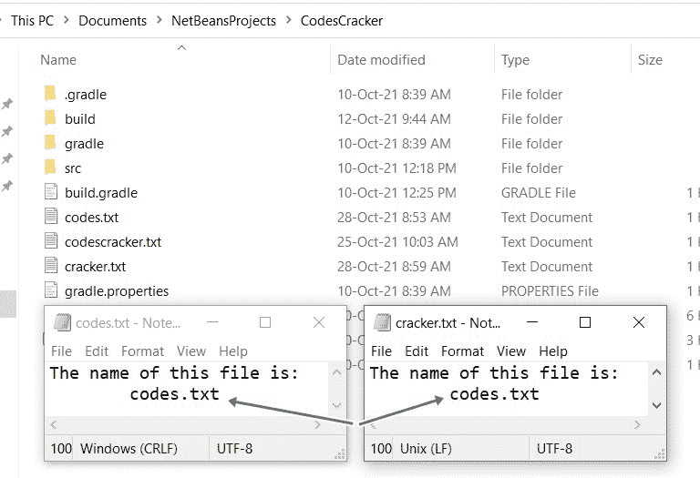
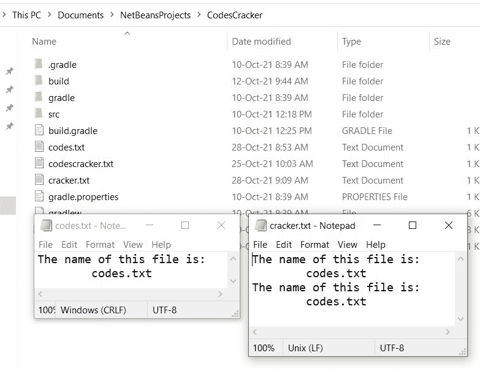

# Java 程序：将一个文件的内容复制到另一个文件

> 原文：<https://codescracker.com/java/program/java-program-copy-file.htm>

本文介绍了一个用 Java 编写的程序，它将一个文件的内容复制到另一个文件中。有两种方法，我们可以创建程序:

1.  复制文件-覆盖内容
2.  复制文件-附加内容

也就是说，使用第一种方式创建的程序将一个(源)文件的内容复制到另一个(目标)文件，删除目标文件的先前内容。

而使用第二种方式创建的程序将一个文件的内容复制到另一个文件，而不删除以前的内容。

#### 计划前要做的事情

因为下面给出的程序用于将一个文件的内容复制到另一个文件。也就是说，我们要处理两个文件。因此，这两个文件必须在当前目录中可用，以便交叉检查程序。

当前目录是保存复制文件的 Java 源代码的目录。在我的例子中，这是当前目录的快照。该快照还包括两个新创建文件以及不同的内容。



现在让我们使用下面给出的 Java 程序将 **codes.txt** 文件的内容复制到 **cracker.txt** 文件中。

## 用 Java 复制文件-覆盖内容

问题是，*写一个 Java 程序，把一个文件的内容复制到另一个文件。两个文件的名字都必须是用户在程序运行时收到的 。*下面给出的程序就是它的答案。源文件的内容被复制到目标文件。

```
import java.util.Scanner;
import java.io.*;

public class CodesCracker
{
   public static void main(String[] args)
   {
      String sourceFile, destFile, line, content="";
      Scanner scan = new Scanner(System.in);

      System.out.print("Enter the Name of Source File: ");
      sourceFile = scan.nextLine();
      try
      {
         FileReader fr = new FileReader(sourceFile);
         BufferedReader br = new BufferedReader(fr);

         for(line=br.readLine(); line!=null; line=br.readLine())
            content = content + line + "\n";

         br.close();

         System.out.print("Enter the Name of Destination File: ");
         destFile = scan.nextLine();

         try
         {
            FileWriter fw = new FileWriter(destFile);
            fw.write(content);
            fw.close();
            System.out.println("\nFile copied successfully!");
         }
         catch(IOException ioe)
         {
            System.out.println("\nSomething went wrong!");
            System.out.println("Exception: " +ioe);
         }
      }
      catch(IOException ioe)
      {
         System.out.println("\nSomething went wrong!");
         System.out.print("Exception: " +ioe);
      }
   }
}
```

下面给出的快照显示了上述程序 Java 程序在将一个文件的内容复制到另一个文件时的示例运行，将用户输入的 **codes.txt** 作为源文件，将 **cracker.txt** 作为目标文件。



现在如果你看到这些文件，那么 **cracker.txt** 文件的内容与 **codes.txt** 文件的内容相同。这里的 是执行上述程序后，当前目录以及这两个文件的新快照:



## 用 Java 复制文件-附加内容

要将一个文件的内容复制到另一个文件中，并且不删除以前的内容，那么只需要修改上面程序中的一条语句。也就是说，替换上述程序中的以下语句:

```
FileWriter fw = new FileWriter(destFile);
```

下面给出了声明:

```
FileWriter fw = new FileWriter(destFile, true);
```

就是这样。现在，如果您在更改这条语句后执行相同的程序，源文件的内容将被复制到目标文件，而不会删除目标文件以前的内容。

您将获得与之前程序相同的样本运行。也就是说，在复制了 file 的内容后，程序会打印出**File copy successful！**。但是在执行程序之后，这一次， 的两个文件的内容将会在当前目录的新快照中显示，同时还有那两个打开的文件:



**注意-** 读取文件，参见 [读取&显示文件的内容](/java/program/java-program-read-and-display-file.htm)

将一个文件的内容复制到另一个文件的相同程序，也可以写成:

```
import java.util.Scanner;
import java.io.*;

public class CodesCracker
{
   public static void main(String[] args)
   {
      String sourceFile, destFile;
      Scanner scan = new Scanner(System.in);

      System.out.print("Enter Source File: ");
      sourceFile = scan.nextLine();
      System.out.print("Enter Destination File: ");
      destFile = scan.nextLine();

      InputStream inStream = null;
      OutputStream outStream = null;

      try
      {
         File FileSrc = new File(sourceFile);
         File FileDst = new File(destFile);

         inStream = new FileInputStream(FileSrc);
         outStream = new FileOutputStream(FileDst, true);

         byte[] buffer = new byte[1024];
         int length;

         while((length = inStream.read(buffer)) > 0)
            outStream.write(buffer, 0, length);

         if(inStream != null)
            inStream.close();
         if(outStream != null)
            outStream.close();

         System.out.println("\nFile Copied successfully!");
      }
      catch(IOException e)
      {
         System.out.println("\nError occurred!");
         System.out.println("Exception: " +e);
      }
   }
}
```

#### 其他语言的相同程序

*   [C 复制文件](/c/program/c-program-copy-file.htm)
*   [C++复制文件](/cpp/program/cpp-program-copy-file.htm)
*   [Python 复制文件](/python/program/python-program-copy-files.htm)

[Java 在线测试](/exam/showtest.php?subid=1)

* * *

* * *