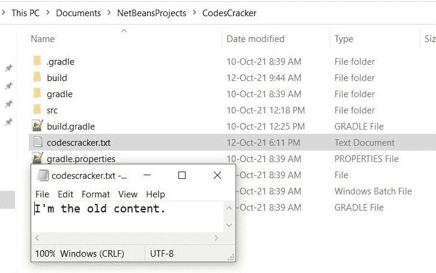
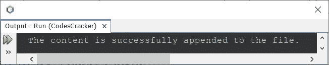
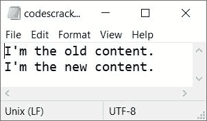
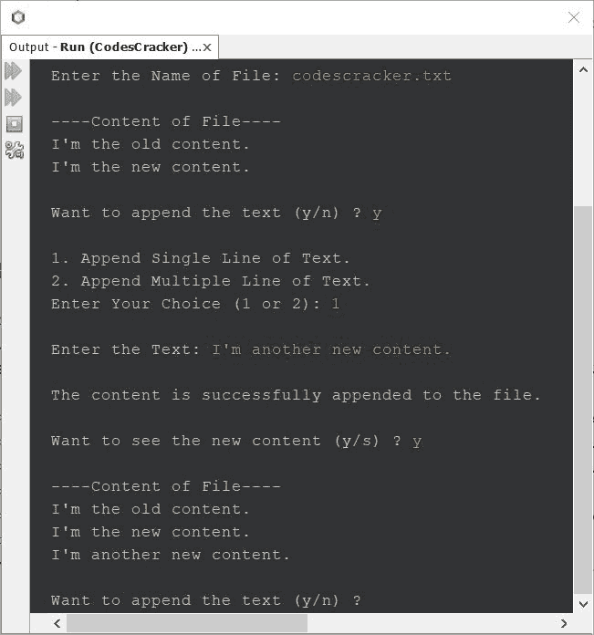

# 将文本追加到现有文件的 Java 程序

> 原文：<https://codescracker.com/java/program/java-append-text-to-file.htm>

我创建这篇文章是为了介绍一些用 Java 编写的程序，这些程序向现有文件添加一些文本或字符串。让我们从最基本的开始。

#### 编程前要做什么？

由于下面给出的程序用于向现有文件添加一些新文本，因此我们必须在当前目录中有一个文件，比如 **codescracker.txt** 。因此，我将创建一个包含一些文本的文件。

现在我已经创建了名为 **codescracker.txt** 的文件，其文本为**我是旧内容。**并将文件 保存在当前目录下(保存 Java 程序或源代码的目录)。下面是打开的 文件的快照:



现在让我们继续，创建一个 Java 程序，向这个新创建的文件添加一些新的文本。

## 在 Java 中将文本附加到文件中

问题是，*写一个 Java 程序把文本追加到一个已有的文件中。下面给出的程序是对 这个问题的回答。这是这个程序最基本的版本。*

```
import java.io.*;

public class CodesCracker
{
   public static void main(String[] args)
   {
      try
      {
         FileWriter fw = new FileWriter("codescracker.txt", true);
         fw.write("\nI'm the new content.");
         fw.close();
         System.out.println("The content is successfully appended to the file.");
      }
      catch(IOException ioe)
      {
         System.out.print("\nSomething went wrong!");
      }
   }
}
```

如果您运行或执行上述程序，下面是您将在输出屏幕上看到的示例输出:



并且在执行上述程序后，如果你打开并看到文件 **codescracker.txt** ，那么你会看到文本 说**我是新内容。**将在文件中可用而不删除先前的。这是同一个 文件的新快照:



在上面的程序中，我在将要追加的文本前使用了 **\n** ，以便从新行追加文本。而 **真**作为**文件写入器**的第二个参数，用于启用追加模式。如果我们删除第二个参数，那么 文件之前的文本将被删除，新的文本将被写入，而不是追加。

以下声明:

```
FileWriter fw = new FileWriter("codescracker.txt", true);
```

包含在 **try** 块中，用于捕捉某些情况下出现的错误或异常，如文件不存在、 写操作不被允许等。其余的事情都是我自己可以理解的事情。现在让我们继续修改上面的 程序。

## Java 将文本附加到文件-完整版本

这是 Java 中文件追加操作的完整版本。该程序允许用户根据他/她的要求执行操作。多行文本也可以用这个程序添加到文件中。一定要把注意力集中在这个节目上，以获得一些关于这个话题的额外知识。

```
import java.io.*;
import java.util.Scanner;

public class CodesCracker
{
   public static void main(String[] args)
   {
      String filename, line="", content="";
      char ch;
      int totLine, i;
      Scanner scan = new Scanner(System.in);

      System.out.print("Enter the Name of File: ");
      filename = scan.nextLine();

      while(true)
      {
         try
         {
            FileReader fr = new FileReader(filename);
            BufferedReader br = new BufferedReader(fr);
            System.out.println("\n----Content of File----");
            while((line = br.readLine()) != null)
            {
               System.out.println(line);
            }
            br.close();
            System.out.print("\nWant to append the text (y/n) ? ");
            ch = scan.next().charAt(0);
            if(ch=='y')
            {
               System.out.println("\n1\. Append Single Line of Text.");
               System.out.println("2\. Append Multiple Line of Text.");
               System.out.print("Enter Your Choice (1 or 2): ");
               ch = scan.next().charAt(0);
               if(ch=='1')
               {
                  Scanner s = new Scanner(System.in);
                  System.out.print("\nEnter the Text: ");
                  line = s.nextLine();
                  try
                  {
                     FileWriter fw = new FileWriter(filename, true);
                     fw.write("\n");
                     fw.write(line);
                     fw.close();
                     System.out.println("\nThe content is successfully appended to the file.");
                  }
                  catch(IOException ioe)
                  {
                     System.out.print("\nSomething went wrong!");
                  }
               }
               else if(ch=='2')
               {
                  Scanner s = new Scanner(System.in);
                  System.out.print("\nHow many lines to write ? ");
                  totLine = s.nextInt();
                  System.out.print("Enter " +totLine+ " lines of text: ");
                  for(i=0; i<(totLine+1); i++)
                  {
                     line = s.nextLine();
                     if((i+1)<(totLine+1))
                        line = line + '\n';
                     content = content + line;
                  }
                  try
                  {
                     FileWriter fw = new FileWriter(filename, true);
                     fw.write(content);
                     fw.close();
                     System.out.println("\nThe content is successfully appended to the file.");
                  }
                  catch(IOException ioe)
                  {
                     System.out.print("\nSomething went wrong!");
                  }
               }
               else
               {
                  System.out.println("\nInvaid Choice!");
                  break;
               }
               System.out.print("\nWant to see the new content (y/s) ? ");
               ch = scan.next().charAt(0);
               if(ch!='y')
                  break;
            }
            else
            {
               break;
            }
         }
         catch(IOException ioe)
         {
            System.out.println("\nFile Not Found!");
         }
      }
   }
}
```

以下是用户输入的运行示例:

*   **codescracker.txt** 作为要操作的文件名
*   **y** 作为选择来查看这个文件的内容
*   **1** 作为向文件追加单行文本的选择
*   **我是另一个新内容。**作为文本追加
*   **y** 为选择查看同一文件的新内容

下面给出的快照显示了使用这些输入运行的示例:



因为整个程序的主要部分被包含在一个**而**循环中，其条件**为真**。因此 程序继续执行，直到你输入 **n** 或除了 **y** 之外的任何东西退出循环。 以下是使用一些其他输入继续运行的示例:


由于我已经提供了 **n** (不是‘y’)作为选择，不再向文件追加文本，因此程序执行 中止。

[Java 在线测试](/exam/showtest.php?subid=1)

* * *

* * *