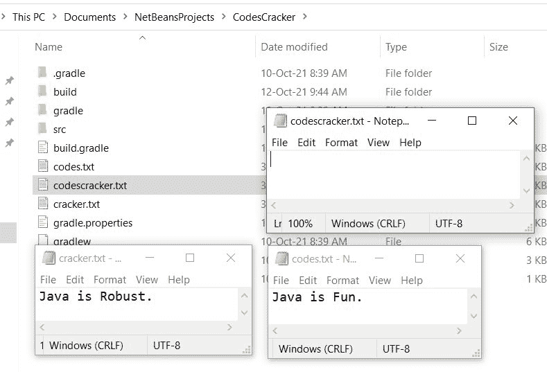
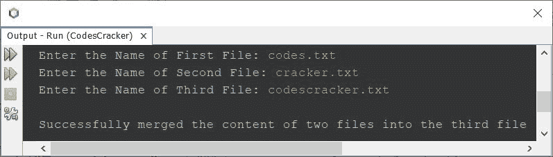
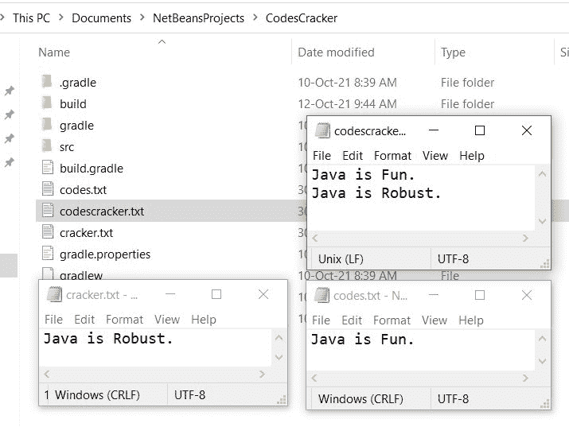

# Java 程序：合并两个文件

> 原文：<https://codescracker.com/java/program/java-program-merge-two-files.htm>

本文介绍了一个 Java 程序，它将两个文件的内容合并成第三个文件，由用户在程序运行时输入。

#### 编程前要做什么？

因为下面给出的程序将两个文件的内容合并到第三个文件中。因此，我们需要创建两个包含一些内容的文件，使用 Java 程序将这两个文件的内容合并到第三个文件中。

如果合并内容将要写入的第三个文件在当前目录中不可用。然后，将创建一个新文件，其名称作为第三个文件的名称。如果文件已经可用，那么合并的内容将被追加到文件中。这里是当前目录的快照，在我的例子中包括三个打开的文件:



使用下面给出的程序运行示例， **codes.txt** 和 **cracker.txt** 文件的内容将被合并 到 **codescracker.txt** 文件中，因为我将提供这些文件的名称。

## 用 Java 将两个文件的内容合并到第三个文件中

问题是，*写一个 Java 程序，把两个文件的内容合并成第三个文件。所有三个文件的名字 必须在程序运行时由用户接收。*下面给出的程序是它的答案:

```
import java.io.*;
import java.util.Scanner;

public class CodesCracker
{
   public static void main(String[] args)
   {
      String fileOne, fileTwo, fileThree, line, content="";
      Scanner scan = new Scanner(System.in);

      System.out.print("Enter the Name of First File: ");
      fileOne = scan.nextLine();
      System.out.print("Enter the Name of Second File: ");
      fileTwo = scan.nextLine();
      System.out.print("Enter the Name of Third File: ");
      fileThree = scan.nextLine();
      try
      {
         FileReader frOne = new FileReader(fileOne);
         BufferedReader brOne = new BufferedReader(frOne);
         FileReader frTwo = new FileReader(fileTwo);
         BufferedReader brTwo = new BufferedReader(frTwo);

         for(line=brOne.readLine(); line!=null; line=brOne.readLine())
            content = content + line + "\n";
         brOne.close();

         for(line=brTwo.readLine(); line!=null; line=brTwo.readLine())
            content = content + line + "\n";
         brTwo.close();

         try
         {
            FileWriter fw = new FileWriter(fileThree, true);
            fw.write(content);
            fw.close();
            System.out.println("\nSuccessfully merged the content of two files into the third file");
         }
         catch(IOException ioe)
         {
            System.out.println("\nSomething went wrong!");
            System.out.println("Exception: " +ioe);
         }
      }
      catch(IOException ioe)
      {
         System.out.println("\nSomething went wrong!");
         System.out.print("Exception: " +ioe);
      }
   }
}
```

下面给出的快照显示了上述程序的示例运行，用户输入 **codes.txt** 作为第一个文件名， **cracker.txt** 作为第二个文件名， **codescracker.txt** 作为第三个文件名，将前两个 文件的内容合并到 **codescracker.txt** 文件中:



现在如果你打开文件 **codescracker.txt** ，那么这个文件包含了第一个和第二个文件的内容。下面是同一目录的 新快照，包含所有三个文件:



将两个文件合并成第三个文件的程序，在 Java 中，也可以写成:

```
import java.io.*;
import java.util.Scanner;

public class CodesCracker
{
   public static void main(String[] args)
   {
      String fileOne, fileTwo, merge;
      Scanner scan = new Scanner(System.in);

      System.out.print("Enter the Name of First File: ");
      fileOne = scan.nextLine();
      System.out.print("Enter the Name of Second File: ");
      fileTwo = scan.nextLine();

      System.out.print("Enter the Name of Third File: ");
      merge = scan.nextLine();

      File[] files = new File[2];
      files[0] = new File(fileOne);
      files[1] = new File(fileTwo);
      File mergedFile = new File(merge);

      mergeFiles(files, mergedFile);
   }
   public static void mergeFiles(File[] files, File mergedFile)
   { 
      FileWriter fstream = null;
      BufferedWriter out = null;
      try
      {
         fstream = new FileWriter(mergedFile, true);
         out = new BufferedWriter(fstream);
      }
      catch(IOException e1)
      {
         System.out.println("Exception: " +e1);
      }
      System.out.println("\nMerging the file...");
      for(File f: files)
      {
         FileInputStream fis;
         try
         {
            fis = new FileInputStream(f);
            BufferedReader in = new BufferedReader(new InputStreamReader(fis));
            String aLine;
            while((aLine = in.readLine()) != null)
            {
               out.write(aLine);
               out.newLine();
            }
            in.close();
         }
         catch(IOException e)
         {
            e.printStackTrace();
         }
      }
      System.out.println("\nMerged Successfully!");
      try
      {
         out.close();
      }
      catch(IOException e)
      {
         System.out.println("Exception: " +e);
      }
   }
}
```

#### 其他语言的相同程序

*   [C 合并两个文件](/c/program/c-program-merge-two-files.htm)
*   [C++ 合并两个文件](/cpp/program/cpp-program-merge-two-files.htm)
*   [Python 合并两个文件](/python/program/python-program-merge-two-files.htm)

[Java 在线测试](/exam/showtest.php?subid=1)

* * *

* * *