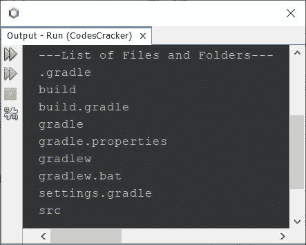
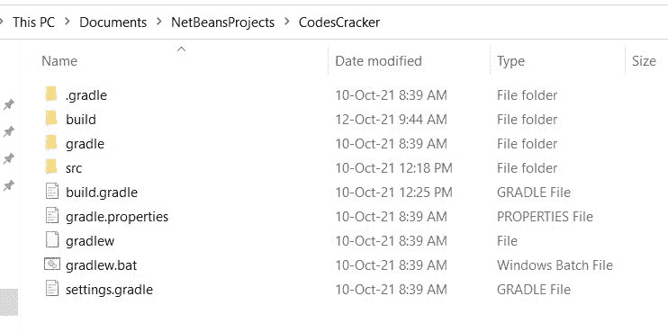
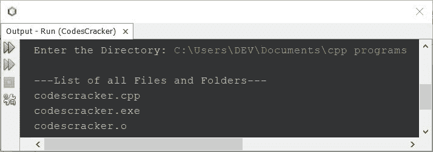
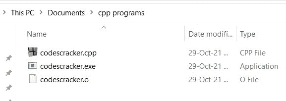
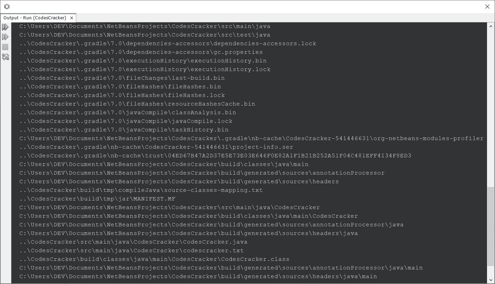

# Java 程序：列出目录中文件和文件夹

> 原文：<https://codescracker.com/java/program/java-program-list-files-in-directory.htm>

本文介绍了一个 Java 程序，它列出并打印一个目录中所有可用的文件和文件夹。

## Java 获取目录中的文件和文件夹

问题是，*写一个 Java 程序，打印一个目录下所有可用的文件和文件夹。*下面给出的节目 就是它的答案:

```
import java.io.File;

public class CodesCracker
{
   public static void main(String[] args)
   {
      String directory = "C:\\Users\\DEV\\Documents\\NetBeansProjects\\CodesCracker";
      File fileObject = new File(directory);

      String[] filesFolders = fileObject.list();

      System.out.println("---List of Files and Folders---");
      for(String ff: filesFolders)
         System.out.println(ff);
   }
}
```

下面给出的快照显示了上述 Java 程序产生的示例输出。该输出显示了给定给变量**目录**的目录中所有可用的文件和文件夹:



在上面的输出中，所有的文件和文件夹都以有组织的方式打印出来。有组织意味着，文件和文件夹都是按字母顺序排列的。下面是给上述程序的目录快照:



## Java 获取给定目录中的所有文件和文件夹

这是前一个程序的修改版本。该程序允许用户输入目录，他/她希望找到并打印其中的所有文件和文件夹:

```
import java.util.*;
import java.io.*;

public class CodesCracker
{
   public static void main(String[] args)
   {
      String directory;
      Scanner scan = new Scanner(System.in);

      System.out.print("Enter the Directory: ");
      directory = scan.nextLine();

      File fileObject = new File(directory);

      String[] filesFolders = fileObject.list();

      System.out.println("\n---List of all Files and Folders---");
      for(String ff: filesFolders)
         System.out.println(ff);
   } 
}
```

下面给出的快照显示了上述程序的示例运行，其中用户输入**C:\ Users \ DEV \ Documents \ CPP programs** 作为目录，以打印该目录中所有可用的文件和文件夹:



这里是目录**C:\ Users \ DEV \ Documents \ CPP programs**的快照:



## Java 获取目录和子目录中的所有文件和文件夹

要获取并打印当前目录及其子目录中的所有文件和文件夹，请使用下面给出的程序:

```
import java.util.*;
import java.io.*;

public class CodesCracker
{
   public static void main(String[] args)
   {
      if(args.length == 0)
         args = new String[] {".."};
      List<String> nextDir = new ArrayList<String>();
      nextDir.add(args[0]);
      try
      {
         while(nextDir.size() > 0)
         {
            File pathName = new File(nextDir.get(0)); // gets the element at the index of List
            String[] fileNames = pathName.list();     // lists all the files in the directory
            for(int i=0; i<fileNames.length; i++)
            {
               // getPath converts abstract path to path in String,
               // constructor creates a new File object with fileName name
               File f = new File(pathName.getPath(), fileNames[i]);   
               if(f.isDirectory())
               {
                  System.out.println(f.getCanonicalPath());
                  nextDir.add(f.getPath());
               }
               else
                  System.out.println(f);
            }
            nextDir.remove(0);
         }
      } 
      catch(IOException ioe)
      {
         System.out.println("\nException: " +ioe);
      }
   } 
}
```

这个程序产生的输出将是当前目录及其子目录中所有可用文件和文件夹的列表。文件和文件夹都列出了完整的路径，以了解，文件或文件夹是哪个目录。下面给出的快照显示了上述程序产生的示例输出的一部分。



在我的例子中，当前目录中有很多文件和文件夹，因此不可能在单个快照中显示完整的输出。但事实是，你会得到相似的输出。

#### 其他语言的相同程序

*   [C 列出目录](/c/program/c-program-list-files-in-directory.htm)中的文件
*   [C++ 列出目录](/cpp/program/cpp-program-list-files-in-directory.htm)中的文件
*   [Python 目录下的列表文件](/python/program/python-program-list-files-in-directory.htm)

[Java 在线测试](/exam/showtest.php?subid=1)

* * *

* * *