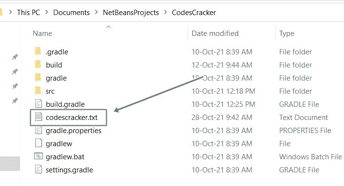

# Java 程序：删除文件

> 原文：<https://codescracker.com/java/program/java-program-delete-file.htm>

本文介绍了一个 Java 程序，它在程序运行时删除用户输入的文件。

## 用 Java 删除文件

问题是，*写一个 Java 程序删除一个文件。用户必须在运行时收到文件名。*下面给出的 节目就是它的答案。但是在程序之前，这里是当前目录的快照，在执行下面给出的 程序之前:



见文件， **codescracker.txt** 。我将用下面给出的程序删除这个文件:

```
import java.util.Scanner;
import java.io.*;

public class CodesCracker
{
   public static void main(String[] args)
   {
      String filename;
      Scanner scan = new Scanner(System.in);

      System.out.print("Enter the Name of File to Delete: ");
      filename = scan.nextLine();

      File myfile = new File(filename);

      if(myfile.delete())
         System.out.println("\nThe file is deleted successfully!");
      else
         System.out.println("\nSomething went wrong!");
   }
}
```

下面给出的快照显示了上述程序的示例运行，用户输入 **codescracker.txt** 作为要删除的文件 的名称:


现在，如果你再次打开当前目录，那么文件 **codescracker.txt** 将被删除。下面是执行上述程序后，目录的新快照 :


**重要** -使用上述程序将要删除的文件，让<u>永久删除</u>。也就是说，被删除的文件 **codescracker.txt** ，在**回收站**里面是不存在的。因此，一定要删除垃圾或不需要的 文件。最好创建一个新的空文件，并使用上述程序删除该文件。

#### 其他语言的相同程序

*   [C 删除文件](/c/program/c-program-delete-file.htm)
*   [C++删除文件](/cpp/program/cpp-program-delete-file.htm)
*   [Python 删除文件](/python/program/python-program-delete-files.htm)

[Java 在线测试](/exam/showtest.php?subid=1)

* * *

* * *