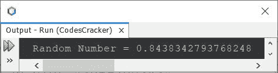
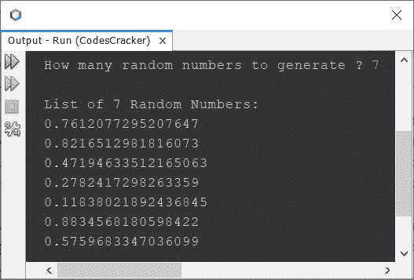
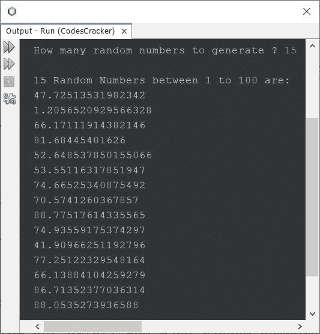
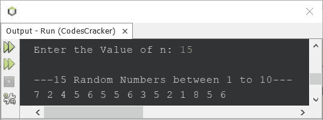
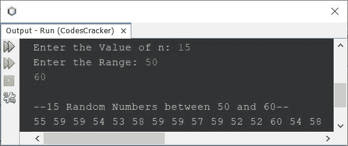

# Java 程序：生成随机数

> 原文：<https://codescracker.com/java/program/java-program-generate-random-numbers.htm>

本文涵盖了 Java 中生成和打印随机数的多个程序。下面是本文涉及的程序列表:

*   使用 **Math.random()** 在 Java 中生成并打印一个随机数
*   用 Java 生成并打印 **n** 个随机数
*   用 Java 生成并打印 1 到 100 之间的 n 个随机数
*   用 Java 生成并打印给定范围内的 **n** 个随机数
*   使用 **Random** 类在 Java 中生成并打印随机数

## 用 Java 生成并打印一个随机数

问题是，*写一个 Java 程序生成一个随机数。*下面给出的程序是它的答案:

```
import java.lang.Math;

public class CodesCracker
{
   public static void main(String[] args)
   {
      double num = Math.random();
      System.out.println("Random Number = " +num);
   }
}
```

下面给出的快照显示了上述 Java 程序产生的示例输出:



每次你执行上面的程序，都会产生一个不同的随机数。

**注-** 由于 **Math.random()** 返回的随机数是 **double** 类型的，所以我将 返回的随机数存储在一个 **double** 类型的变量中。你可以使用其他类似**的 float** ，但是你需要对 进行类型转换，以避免*从 double 到 float* 的 loosy 转换。

## 用 Java 生成并打印 n 个随机数

因为以前程序一次只生成和打印一个随机数。因此，让我们允许用户定义要生成的随机数的数量，然后使用下面给出的程序进行打印:

```
import java.util.Scanner;
import java.lang.Math;

public class CodesCracker
{
   public static void main(String[] args)
   {
      Scanner scan = new Scanner(System.in);

      System.out.print("How many random numbers to generate ? ");
      int n = scan.nextInt();

      System.out.println("\nList of " +n+ " Random Numbers:");
      for(int i=0; i<n; i++)
         System.out.println(Math.random());
   }
}
```

用户输入 **7** 的示例运行显示在下面给出的快照中:



## 用 Java 生成 1 到 100 之间的随机数

如果你没有注意到，那么让我告诉你， **Math.random()** 正在生成 0 到 1 之间的随机数。 因此要生成 1 到 100 之间的随机数，我们需要使用下面给出的程序。

```
import java.util.Scanner;
import java.lang.Math;

public class CodesCracker
{
   public static void main(String[] args)
   {
      Scanner scan = new Scanner(System.in);

      System.out.print("How many random numbers to generate ? ");
      int n = scan.nextInt();

      System.out.println("\n" +n+ " Random Numbers between 1 to 100 are:");
      for(int i=0; i<n; i++)
      {
         double num = Math.random()*(100);
         System.out.println(num);
      }
   }
}
```

具有用户输入 **15** 的上述程序的示例运行显示在下面给出的快照中:



### 生成 1 到 10 之间的随机数-整数

因为之前的程序生成的随机数是双类型的**。因此要生成 **int** 类型的随机数，一个整数，那么使用下面的程序:**

```
import java.util.Scanner;
import java.lang.Math;

public class CodesCracker
{
   public static void main(String[] args)
   {
      Scanner scan = new Scanner(System.in);

      System.out.print("Enter the Value of n: ");
      int n = scan.nextInt();

      System.out.println("\n---" +n+ " Random Numbers between 1 to 10---");
      for(int i=0; i<n; i++)
      {
         double num = Math.random()*(10);
         int wholeNum = (int)num;
         System.out.print(wholeNum+ " ");
      }
   }
}
```

下面是它的示例运行，用户输入与前面的程序相同:



## 在 Java 中生成给定范围内的随机数

这个程序在给定的范围内产生 **n** 个随机数。 **n** 的值和范围都由 用户在程序运行时接收；

```
import java.util.Scanner;
import java.lang.Math;

public class CodesCracker
{
   public static void main(String[] args)
   {
      Scanner scan = new Scanner(System.in);

      System.out.print("Enter the Value of n: ");
      int n = scan.nextInt();

      System.out.print("Enter the Range: ");
      int start = scan.nextInt();
      int end = scan.nextInt();

      System.out.println("\n--"+n+" Random Numbers between "+start+" and "+end+"--");
      for(int i=0; i<n; i++)
      {
         double num = Math.random()*(end-start+1)+start;
         int wholeNum = (int)num;
         System.out.print(wholeNum+ " ");
      }
   }
}
```

下面给出的快照显示了上述程序的示例运行，用户输入 **15** 作为大小， **50** 作为起始 数， **60** 作为结束数，生成 50 到 60 之间的 15 个随机数:



## 使用 Random 类在 Java 中生成随机数

这是本文的最后一个程序，使用 **Random** 类生成随机数，而不是 **Math.random()**

```
import java.util.Random;

public class CodesCracker
{
   public static void main(String[] args)
   {
      Random r = new Random();
      System.out.println("10 Random Numbers from 0 to 4");
      for(int i=0; i<10; i++)
         System.out.println(r.nextInt(5));
   }
}
```

上面的 Java 程序产生的输出是:

```
10 Random Numbers from 0 to 4
3
3
1
2
3
4
4
1
0
1
```

#### 其他语言的相同程序

*   [C 生成随机数](/c/program/c-program-generate-random-numbers.htm)
*   [C++生成随机数](/cpp/program/cpp-program-generate-random-numbers.htm)
*   [Python 生成随机数](/python/program/python-program-generate-random-numbers.htm)

[Java 在线测试](/exam/showtest.php?subid=1)

* * *

* * *