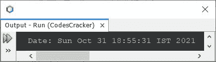
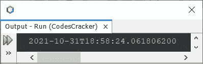
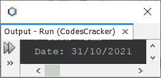
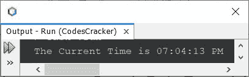
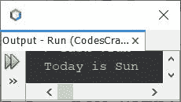
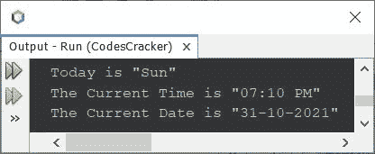

# Java 程序：打印日期和时间

> 原文：<https://codescracker.com/java/program/java-program-print-time-date.htm>

本文介绍了用 Java 编写的打印当前日期和时间的多个程序。下面是本文涉及的程序列表:

*   获取并以默认格式打印完整的当前日期
*   以指定的格式获取并打印当前日期
*   以指定的格式获取并打印当前时间
*   打印今天的日期
*   以指定格式打印时间、星期和日期

## 用 Java 获取并打印当前日期

问题是，*写一个 Java 程序打印当前日期。*下面给出的程序就是它的答案。这个 程序以默认格式打印完整的当前日期。

```
import java.util.Date;

public class CodesCracker
{
   public static void main(String[] args)
   {
      Date d = new Date();
      System.out.println("Date: " +d);
   }
}
```

下面给出的快照显示了上述程序在打印当前日期时产生的示例输出:



这里是另一种用 Java 创建一个程序的方法，它使用 **now()** 完成与前面的程序相同的工作。

```
import java.time.LocalDateTime;

public class CodesCracker
{
   public static void main(String[] args)
   {
      System.out.println(LocalDateTime.now());
   }
}
```

#### 上一个程序的输出示例



## 在 Java 中只打印指定格式的日期

这个程序只打印当前日期，当然是以指定的格式。我使用了格式 **/** 来分隔日、月和年。您可以使用任何其他字符来格式化日期，如**破折号(-)** 、**逗号(，)** 等。

```
import java.util.*;
import java.text.*;

public class CodesCracker
{
   public static void main(String[] args)
   {
      Date d = new Date();
      SimpleDateFormat a = new SimpleDateFormat("dd/MM/yyyy");
      System.out.println("Date: " +a.format(d));
   }
}
```

#### 上一个程序的输出示例



## 在 Java 中只打印指定格式的时间

这个程序只打印当前时间，以指定的格式。

```
import java.util.*;
import java.text.*;

public class CodesCracker
{
   public static void main(String[] args)
   {
      Date d = new Date();
      SimpleDateFormat a = new SimpleDateFormat("hh:mm:ss a");
      System.out.println("The Current Time is " +a.format(d));
   }
}
```

#### 上一个程序的输出示例



## 用 Java 打印今天的日期

这个程序用 Java 打印今天的日期。

```
import java.util.*;
import java.text.*;

public class CodesCracker
{
   public static void main(String[] args)
   {
      Date d = new Date();
      SimpleDateFormat a = new SimpleDateFormat("E");
      System.out.println("Today is " +a.format(d));
   }
}
```

#### 上一个程序的输出示例



## 用 Java 打印当前时间、星期和日期

这是本文的最后一个程序，它是在结合了前面三个程序之后创建的，用于查找和打印当前的时间、日期。

```
import java.util.*;
import java.text.*;

public class CodesCracker
{
   public static void main(String[] args)
   {
      Date d = new Date();

      SimpleDateFormat a = new SimpleDateFormat("E");
      SimpleDateFormat b = new SimpleDateFormat("hh:mm a");
      SimpleDateFormat c = new SimpleDateFormat("dd-MM-yyyy");

      System.out.println("Today is \"" +a.format(d)+ "\"");
      System.out.println("The Current Time is \"" +b.format(d)+ "\"");
      System.out.println("The Current Date is \"" +c.format(d)+ "\"");
   }
}
```

#### 上一个程序的输出示例



#### 其他语言的相同程序

*   [C 打印日期](/c/program/c-program-print-date.htm)
*   [C++打印日期](/cpp/program/cpp-program-print-date.htm)
*   [Python 打印日期](/python/program/python-program-print-date-time.htm)

[Java 在线测试](/exam/showtest.php?subid=1)

* * *

* * *