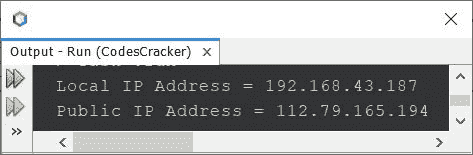

# Java 程序：获取 IP 地址

> 原文：<https://codescracker.com/java/program/java-program-get-ip-address.htm>

本文介绍了用 Java 编写的多个查找和打印 IP 地址的程序。以下是本文涵盖的程序列表:

*   使用 Java 查找并打印本地 IP 地址
*   使用 Java 查找并打印公共 IP 地址
*   使用 Java 查找并打印本地和公共(外部)IP 地址

## 用 Java 查找并打印本地 IP 地址

问题是，*写一个 Java 程序打印一个计算机系统的本地 IP 地址。*下面给出的节目是 它的回答:

```
import java.net.InetAddress;

public class CodesCracker
{
   public static void main(String[] args)
   {
      try
      {
         InetAddress ip = InetAddress.getLocalHost();
         System.out.println("IP Address = " +ip.getHostAddress());
      }
      catch(Exception e)
      {
         System.out.println("Exception: " +e);
      }
   }
}
```

下面给出的快照显示了上述 Java 程序产生的示例输出:


在本地系统上执行的代码将打印本地 IP。但是不用担心，也可以使用其他选项来查找公共 IP。在下面的部分，让我们来看看是如何做到的。

## 用 Java 查找并打印公共 IP 地址

要检查您的公共 IP 地址，您需要访问显示您系统的公共 IP 地址的任何网站。例如， *amazonaws* 显示你电脑系统的 IP 地址。当然，这将是你的公共 IP 地址。要看，打开你的浏览器 ，输入【checkip.amazonaws.com**。您将获得您的公共 IPv4 地址。**

有很多网站，从那里你可以找到你的公共 IP，但因为亚马逊是值得信赖的，所以我用了他们的网址。

现在，我将在我的 Java 程序中使用这个网址来获取这个 URL 为我的系统生成的值。该值将打印在输出中，以显示公共 IPv4 地址:

```
import java.net.*;
import java.io.*;

public class CodesCracker
{
   public static void main(String[] args)
   {
      try
      {
         URL ip = new URL("https://checkip.amazonaws.com");
         BufferedReader br = new BufferedReader(new InputStreamReader(ip.openStream()));
         String pip = br.readLine();
         System.out.println("Public/External IP Address = " +pip);
      }
      catch(Exception e)
      {
         System.out.println("Exception: " +e);
      }
   }
}
```

下面是它的示例输出:


在您的情况下，输出会有所不同。

## 使用 Java 查找本地和公共 IP 地址

这是前一个程序的组合版本。这个程序打印计算机系统的本地和公共 IP 地址。

```
import java.net.*;
import java.io.*;

public class CodesCracker
{
   public static void main(String[] args)
   {
      try
      {
         InetAddress localhost = InetAddress.getLocalHost();
         System.out.println("Local IP Address = " +localhost.getHostAddress());
      }
      catch(Exception e)
      {
         System.out.println("Exception: " +e);
      }
      try
      {
         URL ipfinder = new URL("https://checkip.amazonaws.com");
         BufferedReader br = new BufferedReader(new InputStreamReader(ipfinder.openStream()));
         String publicIP = br.readLine();
         System.out.println("Public IP Address = " +publicIP);
      }
      catch(Exception e)
      {
         System.out.println("Exception: " +e);
      }
   }
}
```

上面的程序产生的示例输出显示在下面给出的快照中:



#### 其他语言的相同程序

*   [C 获取 IP 地址](/c/program/c-program-get-ip-address.htm)
*   [C++ 获取 IP 地址](/cpp/program/cpp-program-get-ip-address.htm)
*   [Python 获取 IP 地址](/python/program/python-program-get-ip-address.htm)

[Java 在线测试](/exam/showtest.php?subid=1)

* * *

* * *