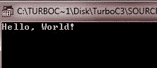

# c 程序结构

> 原文：<https://codescracker.com/c/c-program-structure.htm>

一个简单的 C 程序的程序结构包含头文件，main()函数，然后是程序代码。你会发现理解任何简单 C 程序的程序结构都很容易。让我们从打印 Hello World 的 C Hello World 程序开始吧！在输出屏幕上。

## c 程序结构示例

下面是一个示例程序，显示了一个简单 C 程序的一般结构:

```
/* C Program Structure - This is the simplest
 * C program, prints Hello World! on the screen
 */

#include<stdio.h>
#include<conio.h>
void main()
{
   // This is single-line comment
   clrscr();
   /* This is a multi-line comment
    * This will print Hello World!
    */
   printf("Hello, World! \n");
   getch();
}
```

下面是这个 C 程序的输出:



## 上面的例子解释了

下面是上述程序的每一行的解释(仔细阅读所有的行):

*   **多行注释-** 前三行是多行注释，编译器会忽略。
*   **预处理命令-**C 程序#的下一行包含<stdio . h>；是一个预处理器命令，它告诉 C 编译器在 进入实际编译之前包含 stdio.h 文件，以处理标准的输入和输出函数，如 printf()、scanf()等 类函数。printf()用于将消息放在程序员给出的输出屏幕上，scanf()用于扫描获取用户输入的材料。
*   **预处理器命令-**C 程序#include 的第二行< conio.h >也是一个预处理器命令，它告诉 C 编译器在进入实际编译之前，先包含< conio.h >文件 ，以处理 getch()和 clrscr()等类似函数。
*   **函数-** 下一行 void main()是程序开始执行的函数。void 告诉程序不要 返回任何值，主要是程序开始执行的地方。
*   **单行注释-** 下一行是从//开始的单行注释。
*   **函数-** 下一行 clrscr()是一个用于清除输出屏幕的函数，因为有时在 turboC++这样的编译器中，已经在输出屏幕上显示了他们的消息或 由编译器开发人员设置的其他内容，有时我们第二次运行我们的程序或 第二个程序，然后先前的输出仍保留在屏幕上，这会造成一些混乱，所以最好的做法是首先清除 输出屏幕以避免混乱。
*   **多行注释-** 下一行也是多行注释，从/*开始，以*/结束，这被 C 编译器忽略，它已被放到 程序中添加附加注释。所以这样的行在程序中被称为注释。
*   **功能-** 下一行 printf(...)是 C 语言中另一个导致消息“Hello，World！”显示在屏幕 上，因为它的工作是根据编程器将信息显示在输出屏幕上。
*   **函数-** 下一行 getch()；getch()用于在 turboC++类编译器中保持输出屏幕。如果你在程序的最后不使用这个函数 ，那么在按下运行按钮后，你的输出屏幕在几秒钟内出现并关闭，你 将无法看到你的输出。当你使用 getch()函数时，在所有编程任务完成后，你的输出屏幕将保持 ，直到你按下任何字符，在按下任何字符后，你的输出将关闭并回到你的程序。

## 编译和执行 C 程序

要编译运行上述 C 程序，只需下载名为 TurboC++的 C 编译器即可。下面是下载这个编译器的链接
[下载 TurboC++](http://liquidtelecom.dl.sourceforge.net/project/turbocforwindows-9/Turbo%20C%2B%2B%204.0%20Windows%207%20Windows%208%2064Bit%20Version.exe)
现在安装这个编译器，然后打开编译器，在上面输入上面的代码。做完这些，只需按`F9`编译你的 程序，按`Ctrl+F9`运行你的程序。你也可以使用这个编译器来编译和运行你的 C++程序。

## 更多示例

这里有更多 C 语言程序，你可以试试:

*   [C 程序](/c/program/c-programming-examples.htm)
*   [打印 Hello World](/c/program/c-program-print-hello-world.htm)
*   [是否勾选闰年](/c/program/c-program-check-leap-year.htm)
*   [检查回文与否](/c/program/c-program-palindrome-number.htm)
*   [检查阿姆斯特朗与否](/c/program/c-program-find-armstrong-number.htm)
*   [求数字](/c/program/c-program-find-factorial.htm)的阶乘
*   [找到 HCF 和 LCM](/c/program/c-program-find-hcf-lcm.htm)
*   [打印弗洛伊德三角形](/c/program/c-program-print-floyd-triangle.htm)
*   [打印帕斯卡三角形](/c/program/c-program-print-pascal-triangle.htm)

[C 在线测试](/exam/showtest.php?subid=2)

* * *

* * *