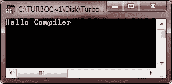
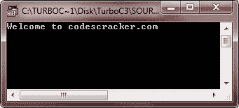
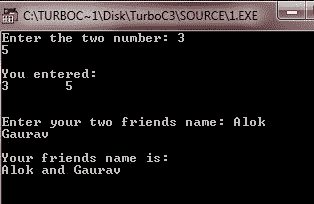

# C 基本语法

> 原文：<https://codescracker.com/c/c-basic-syntax.htm>

一个简单的 [C 程序的基本语法](/c/program/c-programming-examples.htm)包含头文件，main() [函数](/c/c-functions.htm)然后是程序代码。下面是一个简单的 和最小的 C 程序的基本语法:

```
header files
return_type main()
{
   program codes
}
```

每个 C 程序都必须包含一个名为 main()的函数，因为程序的执行是从 main()开始的。例如，下面是一个简单最小的 C 程序，它会在输出屏幕上显示“Hello Compiler ”:

```
#include<stdio.h>
#include<conio.h>
void main()
{
   clrscr();
   printf("Hello Compiler");
   getch();
}
```

以下是上述 C 程序的示例输出:



从上面的程序中，可以筛选出这样的内容:

```
#include<stdio.h>
#include<conio.h>
```

降级到

```
header files
```

和

```
void main()
```

降级到

```
return_type main()
```

然后

```
clrscr();
printf("Hello Compiler");
getch();
```

降级到

```
program code
```

## C 语言中的标记

在 C 语言中，一个令牌可以是一个关键字、一个常量、一个字符串常量、一个符号或者一个标识符。 而一个 C 程序由各种令牌组成，取决于，程序有多长。让我们看看下面的例子，这里的语句 总共由五个标记组成:

```
printf("Hello Compiler");
```

这里，上述语句中的各个标记是:

```
printf
(
"Hello Compiler"
)
;
```

## C 语言中的分号

在 C 编程中，分号用于终止语句。C #中的分号也称为语句结束符，因为每个单独的语句都必须以语句结束符或分号结束。这告诉编译器这条语句已经完成。它表示一个逻辑实体或语句的结束。如果分号没有放在任何语句的末尾，那么程序将不会编译，编译时会生成错误消息。让我们看下面的例子，这里有两个不同的语句，每个都以分号结束:

```
printf("Hello Compiler");
getch();
```

## C 语言中的注释

在 C 编程中，注释就像是 C 程序中的帮助文本。编译器会忽略它们。注释在审查代码时非常有用。因为在审查代码的时候，给定的注释对程序员帮助很大。作为注释，程序员可以添加有用的信息或关于某行代码的提示，或出于其他目的。

在 C 语言中，有以下两种类型的注释:

*   单行注释-从//开始到行尾
*   多行注释-从/*开始，以*/结束

下面是一个示例程序，演示了单行注释和多行注释:

```
/* C Basic Syntax - This program demonstrates
 * single-line comments and multi-line comments
 * This is a multi-line comments
 */

#include<stdio.h>
#include<conio.h>
void main()
{
   clrscr();  // to clear the screen. This is a single-line comment

   printf("Welcome to codescracker.com");

   /* The above statement prints
    * Welcome to codescracker.com
    * on the output screen. And this is
    * also a multi-line comments 
    */

   /* This is another multi-line comment.
      As you can see, from the output screen
      all the comments are ignored by the compiler */

   getch();   // holds output screen until user press a key
}
```

这是这个 C 程序的输出样本。您将看到，在输出屏幕上只会打印出“欢迎使用 codescracker.com”。如前所述，所有的注释都会被编译器忽略。因为注释只能由程序员阅读。



## C #中的标识符

在 C 编程中，标识符是用来标识变量、函数或任何其他用户定义的术语的名称。标识符可以以字母(A 到 Z)或(A 到 Z)或下划线(_)开头，后跟零个或多个字母、下划线和数字(0 到 9)

c #不允许在标识符中使用标点符号(特殊字符)，如@、$和%。因为 C 编程是一种区分大小写的编程语言。因此，total 和 Total 是 c 中两个不同的标识符，下表列出了一些有效的标识符:

| 总和 | 总数 | 平均 | 滤液（percolate 的简写） | _cal |
| 潜艇用热中子反应堆（submarine thermal reactor 的缩写） | c_523 | angelo23 | _lee | findsym |
| c23g5 | 数字 | 表示留数 | 小卡 | 计算面积 |

下面是一个示例程序。专心做这件事。这个程序还说明了 num 和 Num 或者 name 和 Name 是不同的——不同的标识符:

```
#include<stdio.h>
#include<conio.h>
void main()
{
   int num, Num;
   char name[20], Name[20];
   clrscr();

   printf("Enter the two number: ");
   scanf("%d%d", &num, &Num);
   printf("\nYou entered:\n");
   printf("%d\t%d\n\n", num, Num);

   fflush(stdin);
   printf("\nEnter your two friends name: ");
   gets(name);
   gets(Name);
   printf("\nYour friends name is:\n");
   printf("%s and %s", name, Name);

   getch();
}
```

下面是上述 C 程序的运行示例:



## 关键词

关键字是具有特殊含义的保留字。下表列出了 C 关键字:

| 汽车 | 两倍 | （同 Internationalorganizations）国际组织 | 结构体 |
| 破裂 | 其他 | 转换 | 长的 |
| 情况 | 列举型别 | 注册 | typedef |
| 走读生 | 茶 | 返回 | 联盟 |
| 常数 | 漂浮物 | 短的 | 无符号的 |
| 继续 | 为 | 签名 | 空的 |
| 系统默认值 | 尺寸 | 转到 | 不稳定的 |
| 做 | 如果 | 静电 | 在…期间 |

## C 中的空格

在 C 编程中，任何只包含空格的行，比如带注释的，都被称为空行，C 编译器完全忽略它。空白是 C 编程中使用的一个术语，用来描述空格、制表符、换行符和注释。空格将语句的一部分与另一部分分开，它使编译器能够识别语句中一个元素(如 int)的结束位置和下一个元素的开始位置。这里声明:

```
int sum;
```

int(数据类型)和 sum(变量)之间必须至少有一个空白字符(通常是一个空格),这样编译器才能区分它们。如果你不在它们之间插入空格，那么它将变成 intsum，并被当作一个标识符。

### 例子

以下是一些你可以尝试的例子:

*   [打印 Hello World](/c/program/c-program-print-hello-world.htm)
*   [接受用户的输入](/c/program/c-program-receive-input.htm)
*   [打印斐波那契数列](/c/program/c-program-print-fabonacci-series.htm)
*   [检查回文与否](/c/program/c-program-palindrome-number.htm)
*   [检查阿姆斯特朗与否](/c/program/c-program-find-armstrong-number.htm)
*   [生成阿姆斯特朗数字](/c/program/c-program-generate-armstrong-number.htm)

[C 在线测试](/exam/showtest.php?subid=2)

* * *

* * *