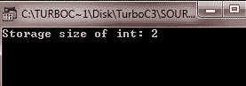

# c 数据类型

> 原文：<https://codescracker.com/c/c-data-types.htm>

数据类型只是用来声明[变量](/c/c-variables.htm)或[函数](/c/c-functions.htm)。 变量类型指定它将在 存储器中占据多少空间，以及如何解释存储的位模式。c 定义了以下五种基本数据类型:

*   使用 char 声明的字符
*   整数-使用 int 声明
*   浮点-使用 float 声明
*   双浮点——使用 double 声明
*   无值-使用 void 声明

除了 void 类型之外，基本数据类型前面可能有各种修饰符。类型修饰符更改基类型的含义，以更精确地满足特定的需要。以下是修改器列表:

*   签名
*   无符号的
*   长的
*   短的

int 基本类型可以用有符号、短、长和无符号来修改。字符类型可以通过有符号和无符号来修改。您也可以将 long 应用于 double。

## c 具有大小及其范围的数据类型

下表列出了所有数据类型及其大小和范围:

| 类型 | 存储大小(字节) | 最小范围 |
| 茶 | one | -127 到 127 |
| 无符号字符 | one | 0 到 255 |
| 有符号字符 | one | -127 到 127 |
| （同 Internationalorganizations）国际组织 | 2 或 4 | -32767 至 32767 |
| 无符号整数 | 2 或 4 | 0 到 65，535 |
| 有符号整数 | 2 或 4 | -32767 至 32767 |
| 短整型 | Two | -32767 至 32767 |
| 无符号短整型 | Two | 0 到 65，535 |
| 有符号短整型 | Two | -32767 至 32767 |
| 长整型 | four | -2147483647 至 2147483647 |
| 长整型 | eight | -(2 <sup>63</sup> -1)至 2 <sup>63</sup> -1 |
| 带符号长整型 | four | -2147483647 至 2147483647 |
| 无符号长整型 | four | 0 到 4，294，967，295 |
| 无符号长整型 | eight | 2 <sup>64</sup> -1 |
| 漂浮物 | four | 1E-37 至 1E+37(六位精度) |
| 两倍 | eight | 1E-37 至 1E+37(十位精度) |
| 长双份 | Ten | 1E-37 至 1E+37(十位精度) |

有符号整数对许多算法都很重要，但它们的绝对数量只有无符号整数的一半。例如，这里二进制的 32，767 是:

```
0 1 1 1 1 1 1 1   1 1 1 1 1 1 1 1
```

当类型修饰符不在基本类型之前时，则假定为 int。让我们看看下表:

| 明确说明 | 与相同 |
| 签名 | 有符号整数 |
| 无符号的 | 无符号整数 |
| 长的 | 长整型 |
| 短的 | 短整型 |

## 获取 C 中任何数据类型的精确大小

由于 int 数据类型在不同的平台上具有不同的大小，因此要获得特定平台上 int 类型或 int 类型变量的确切或实际大小，请使用 size of 运算符。表达式 sizeof(type)即 sizeof(int)以字节表示对象或类型的存储大小。以下示例显示了如何在任何平台上获取 int 类型的确切大小:

```
#include<stdio.h>
#include<conio.h>

void main()
{
   clrscr();

   printf("Storage size of int: %d\n", sizeof(int));

   getch();
}
```

以下是上述 C 程序的示例输出:



[C 在线测试](/exam/showtest.php?subid=2)

* * *

* * *