# c 存储类别

> 原文：<https://codescracker.com/c/c-storage-classes.htm>

在 C 语言中，存储类说明符定义了程序中[变量](/c/c-variables.htm) 或[函数](/c/c-functions.htm)的[范围](/c/c-scope-rules.htm)和生命期。这些指定只是告诉 编译器如何存储后续变量。c 支持以下四种存储类说明符:

*   汽车
*   静电
*   注册
*   走读生

下面是声明变量的一般形式，从上面开始使用:

```
storage_specifier type var_name;
```

现在让我们详细讨论一下 C 的所有四个存储类。

## c 自动存储类

在 C #中，自动存储类是所有局部变量的默认存储类。这里有一个例子:

```
int num;
auto int i;
```

这用相同的存储类定义了两个变量，因为 auto 是所有局部变量的缺省值。因此，没有任何说明符的变量被认为是自动的。让我们举一个例子。

```
/* C Storage Class - The auto Storage Class */

#include<stdio.h>
#include<conio.h>
void main()
{
   int num;
   auto int i;
   clrscr();

   printf("Enter a number: ");
   scanf("%d", &num);
   printf("\n");
   for(i=0; i<5; i++)
   {
      printf("%d", num);
      printf("\n");
   }

   getch();
}
```

下面是上述 C 程序的运行示例:

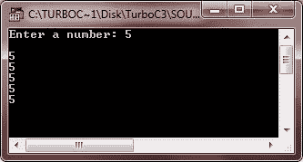

现在让我们看另一个例子:

```
/* C Storage Class - The auto Storage Class */

#include<stdio.h>
#include<conio.h>
void main()
{
   int num;
   auto int i;
   auto int c;
   clrscr();

   printf("Enter a number: ");
   scanf("%d", &num);
   printf("\n");
   for(i=0; i<5; i++)
   {
      printf("%d", num);
      printf("\n");
   }
   printf("\n\n");

   printf("Enter 2: ");
   scanf("%d", &num);
   printf("\n");
   if(num == 2)
   {
      c = 10;
      for(i=0; i<5; i++)
      {
         printf("%d", c);
         printf("\n");
      }
   }

   getch();
}
```

下面是上述 C 程序的输出示例:

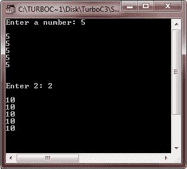
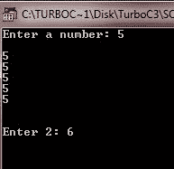

这里再举一个例子来完整理解 c 语言的自动存储类。

```
/* C Storage Class - The auto Storage Class */

#include<stdio.h>
#include<conio.h>
#include<stdlib.h>
void main()
{
   int num1, num2, check;
   clrscr();

   num1 = rand();
   num2 = rand();
   printf("\tCaptcha\n");
   printf("%d + %d = ", num1, num2);
   scanf("%d", &check);
   if(check == num1+num2)
   {
      auto int a, b, i;
      printf("Enter any two number: ");
      scanf("%d%d", &a, &b);
      printf("\n");
      for(i=0; i<5; i++)
      {
         printf("%d + %d = %d\tand\t%d - %d = %d", a, b, a+b, a, b, a-b);
         printf("\n");
         a++;
         b++;
      }
   }

   getch();
}
```

下面是这个 C 程序的运行示例:

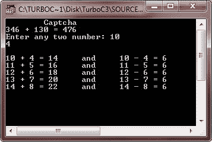

当您输入错误的验证码时，将不会显示任何内容。

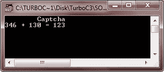

如果您在 they 块之外使用变量 a、b 或 I，则会发生错误。换句话说，变量 a、b 和 I 在定义它们的程序块之外是未知的。

## c 静态存储类

静态存储类用于在程序中创建一个永久变量。换句话说，静态存储类只是告诉编译器在程序的生命周期中保持局部变量的存在。也就是说，当您将 static 修饰符应用于变量时，编译器会为此变量创建一个永久存储。

使用静态变量创建独立函数是很重要的，因为几种类型的例程必须在调用之间保留一个值。让我们举一些例子来演示 c 语言中静态存储类的概念。第一个不使用静态变量或者第一个程序没有静态变量。而第二个程序是用静态变量来理解静态存储类在程序中的用途。

```
/* C Storage Classes - The static Storage Class */

#include<stdio.h>
#include<conio.h>
void main()
{
   int i, j;
   clrscr();

   for(i=0; i<5; i++)
   {
      for(j=0; j<5; j++)
      {
         int num = 5;
         printf("%d\t", num);
         num++;
      }
      printf("\n");
   }

   getch();
}
```

下面是这个 C 程序的示例输出:

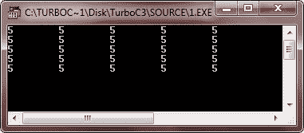

这里还有一个例子。这个程序实际上使用了静态变量。

```
/* C Storage Classes - The static Storage Class */

#include<stdio.h>
#include<conio.h>
void main()
{
   int i, j;
   clrscr();

   for(i=0; i<5; i++)
   {
      for(j=0; j<5; j++)
      {
         static int num = 5;
         printf("%d\t", num);
         num++;
      }
      printf("\n");
   }

   getch();
}
```

以下是上述 C 程序的示例输出:

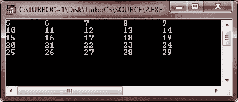

我们再举一个例子。

```
/* C Storage Classes - The static Storage Class */

#include<stdio.h>
#include<conio.h>
void main()
{
   int j, check;
   clrscr();

   printf("Enter 2: ");
   scanf("%d", &check);
   if(check == 2)
   {
      static int num;
      printf("Enter any number: ");
      scanf("%d", &num);
      printf("\nThe next 10 numbers are:\n");
      num++;
      for(j=0; j<10; j++)
      {
         printf("%d\n", num);
         num++;
      }
   }

   getch();
}
```

下面是这个 C 程序的运行示例:

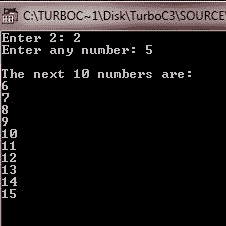

让我们看看，如果你输入 2 以外的任何数字，会发生什么。

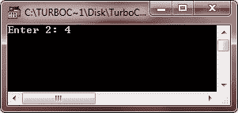

这里还有一个例子。

```
/* C Storage Class - The static Storage Class */

#include<stdio.h>
#include<conio.h>

void func(void);
static int count = 10;

void main()
{
   clrscr();

   while(count--)
   {
      func();
   }

   getch();
}

void func(void)
{
   static int num = 10;
   num++;

   printf("num is %d and count is %d\n", num, count);
}
```

下面是上述 C 程序的运行示例:

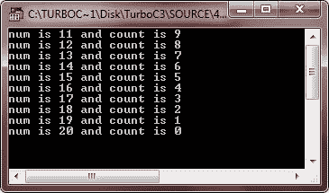

## c 寄存器存储类

在讨论寄存器存储类之前。首先让我们知道，寄存器存储说明符最初只适用于 int、char 或指针类型的变量。

编译器请求寄存器说明符将变量的值保存在 CPU 的寄存器中，而不是保存在内存(存储普通变量的地方)中，以便立即访问该变量。换句话说，寄存器变量用于更快地访问该变量的值。这意味着对一个寄存器变量的操作要比没有一个普通变量的操作快得多，因为正如前面所说的，寄存器变量实际上保存在 CPU 中，不需要访问内存来确定或修改它的值。

寄存器变量用于尽可能快地访问它们的值。让我们举一个使用寄存器变量的例子。

```
int int_pow(register int num, register int e)
{
   register int temp;
   temp = 1;

   for(; e; e--)
   {
      temp = temp * num;
   }

   return temp;
}
```

这里，在上面的例子中，变量 num、e 和 temp 被声明为寄存器变量，因为它们都在循环中使用。寄存器变量针对速度进行了优化。下面是一个完整的程序，可以让你完全理解 C 语言中的寄存器存储类:

```
/* C Storage Class - The register Storage Class */

#include<stdio.h>
#include<conio.h>

int int_pow(int, int);

void main()
{

   int num, e, i;
   clrscr();

   printf("Enter a number and exponent: ");
   scanf("%d%d", &num, &e);
   printf("\n");
   for(i=1; i<=e; i++)
   {
      if(i==e)
      {
         printf("%d", num);
      }
      else
      {
         printf("%d * ", num);
      }
   }

   printf(" = %d", int_pow(num, e));

   getch();
}

int int_pow(register int num, register int e)
{
   register int temp;
   temp = 1;

   for(; e; e--)
   {
      temp = temp * num;
   }
   return temp;
}
```

下面是上述 C 程序的两个运行示例。

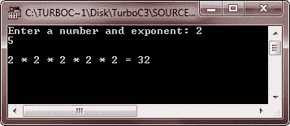
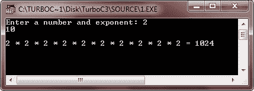

**注意** -寄存器变量的最大大小等于寄存器大小。

**注**——当达到极限 时，编译器自动将寄存器变量转换为非寄存器变量或普通变量。

## c 外部存储类

extern 存储类只是用来引用一个对所有程序文件可见的全局变量。下面是一个简单的程序，演示了 c 语言中的外部存储类。

```
/* C Storage Class - The extern Storage Class */

#include<stdio.h>
#include<conio.h>
void main()
{
   extern int num1, num2;     // global variables
   clrscr();

   printf("%d\t%d", num1, num2);

   getch();
}

// global variables definition of num1 and num2
int num1 = 10, num2 = 20;
```

以下是上述 C 程序的示例输出:

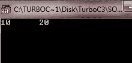

[C 在线测试](/exam/showtest.php?subid=2)

* * *

* * *