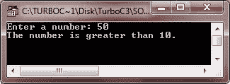
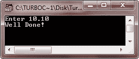

# 决策

> 原文：<https://codescracker.com/c/c-decision-making.htm>

c 支持以下两种类型的决策语句:

*   [if 语句](/c/c-if-statement.htm)
*   [开关语句](/c/c-switch-statement.htm)

您可以将上述两个语句进一步分为以下几个部分:

*   [if 语句](/c/c-if-statement.htm)
*   [if-else 语句](/c/c-if-statement.htm)
*   [嵌套的 ifs 语句](/c/c-if-statement.htm)
*   [开关语句](/c/c-switch-statement.htm)
*   [嵌套开关语句](/c/c-switch-statement.htm)

## 决策陈述示例

下面是一个例子，演示了如何在 C 编程中使用决策语句来控制程序。

```
/* C Decision Making Example */

#include<stdio.h>
#include<conio.h>
void main()
{
   int num;
   clrscr();
   printf("Enter a number: ");
   scanf("%d", &num);
   if(num>10)
   {
      printf("The number is greater than 10.");
   }
   else
   {
      printf("The number is less than 10.");
   }
   getch();
}
```

下面是上述 C 决策程序的两个运行示例:




让我们来看另一个关于 c 语言中决策或选择语句的程序。

```
/* C Decision Making Program */

#include<stdio.h>
#include<conio.h>
void main()
{
   int num;
   clrscr();
   printf("Enter 10.");
   scanf("%d", &num);
   if(num == 10)
      printf("Well Done!");
   else
      printf("Oops!");
   getch();
}
```

下面是用 c 语言运行上述选择语句程序的两个示例。




这里是另一个例子，也演示了 C 语言中的决策语句

```
/* C Decision Making */

#include<stdio.h>
#include<conio.h>
void main()
{
   int mark;
   clrscr();
   printf("Enter marks obtained: ");
   scanf("%d", &mark);
   if(mark>80)
      printf("You are passed!");
   else
      printf("You are failed!");
   getch();
}
```

下面是上述 C 决策程序的两个运行示例:


### 更多示例

以下是一些你可以尝试的例子:

*   [检查偶数或奇数](/c/program/c-program-check-even-odd.htm)
*   [检查是否灌注](/c/program/c-program-check-prime.htm)
*   [是否检查字母](/c/program/c-program-check-alphabet.htm)
*   [是否检查元音](/c/program/c-program-check-vowel.htm)
*   [是否勾选闰年](/c/program/c-program-check-leap-year.htm)
*   [检查回文与否](/c/program/c-program-palindrome-number.htm)
*   [检查阿姆斯特朗与否](/c/program/c-program-find-armstrong-number.htm)
*   [线性搜索](/c/program/c-program-linear-search.htm)
*   [二分搜索法](/c/program/c-program-binary-search.htm)
*   [在数组中插入元素](/c/program/c-program-insert-element-in-array.htm)
*   [从数组中删除元素](/c/program/c-program-delete-element-from-array.htm)
*   [是否检查字谜](/c/program/c-anagram-program.htm)

[C 在线测试](/exam/showtest.php?subid=2)

* * *

* * *