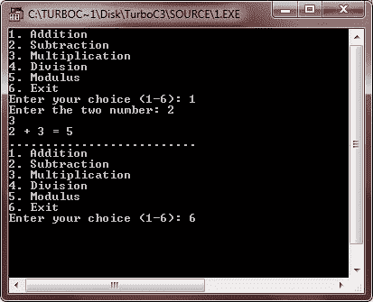

# C switch 语句

> 原文：<https://codescracker.com/c/c-switch-statement.htm>

C 语言中的 switch 语句是一个多分支选择语句，它根据字符或整数常量列表连续测试表达式的值。在此选择中，当找到匹配项时，将执行与此匹配常数相关联的语句。下面是 switch 语句的语法:

```
switch(expression)
{
   case constant1 : statement sequence;
      break;
   case constant2 : statement sequence;
      break;
   case constant3 : statement sequence;
      break;
   .
   .
   .
   default : statement sequence;
}
```

这里，如果发现与任一**常量**匹配，则执行与该**事例**关联的**语句序列**，直到到达 **break** 语句或 **switch** 语句的结尾，否则将执行 **默认**的**语句序列**。让我们看看下面的例子。

### C switch 语句示例

下面是用 C 语言演示 switch 语句的示例程序:

```
#include<stdio.h>
#include<conio.h>
#include<stdlib.h>
void main()
{
   int num1, num2, res;
   char choice;
   clrscr();

   do
   {
      printf("1\. Addition\n");
      printf("2\. Subtraction\n");
      printf("3\. Multiplication\n");
      printf("4\. Division\n");
      printf("5\. Modulus\n");
      printf("6\. Exit\n");

      printf("Enter your choice (1-6): ");
      scanf("%c", &choice);

      switch(choice)
      {
         case '1' :
            printf("Enter the two number: ");
            scanf("%d%d", &num1, &num2);
            res = num1 + num2;
            printf("%d + %d = %d",num1, num2, res);
            break;

         case '2' :
            printf("Enter the two number: ");
            scanf("%d%d", &num1, &num2);
            res = num1 - num2;
            printf("%d - %d = %d",num1, num2, res);
            break;

         case '3' :
            printf("Enter the two number: ");
            scanf("%d%d", &num1, &num2);
            res = num1 * num2;
            printf("%d * %d = %d",num1, num2, res);
            break;

         case '4' :
            printf("Enter the two number: ");
            scanf("%d%d", &num1, &num2);
            res = num1/num2;
            printf("%d / %d = %d",num1, num2, res);
            break;

         case '5' :
            printf("Enter the two number: ");
            scanf("%d%d", &num1, &num2);
            res = num1%num2;
            printf("%d %% %d = %d",num1, num2, res);
            break;

         case '6' : exit(0);
            break;

         default : printf("Wrong choice..!!\n");
      }
      printf("\n..........................\n");

   }while(choice!=6 && choice!=getchar());

   getch();
}
```

下面是上述 C 程序的运行示例:



## C 嵌套 switch 语句

你也可以有一个**开关**作为外部**开关**的语句序列的一部分。如果内外**开关**的**盒**常数 包含相同的值，则不会产生冲突。下面是一个嵌套 switch 语句的示例:

```
switch(x)
{
   case 1 : switch(y)
      {
         case 0 : printf("Divide by zero error..!!\n");
            break;

         case 1 : process(x, y);
            break;
      }
      break;

   case 2 : 
   .
   .
   .
}
```

### 更多示例

以下是一些你可以尝试的例子:

*   [制作计算器](/c/program/c-program-make-calculator.htm)
*   [线性搜索](/c/program/c-program-linear-search.htm)
*   [二分搜索法](/c/program/c-program-binary-search.htm)
*   [在数组中插入元素](/c/program/c-program-insert-element-in-array.htm)
*   [从数组中删除元素](/c/program/c-program-delete-element-from-array.htm)
*   [是否检查字谜](/c/program/c-anagram-program.htm)

[C 在线测试](/exam/showtest.php?subid=2)

* * *

* * *