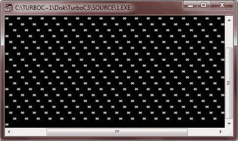

# C 循环

> 原文：<https://codescracker.com/c/c-loops.htm>

在 [C](/c/index.htm) 中，loops 允许一组指令重复执行 ，直到达到某个条件。然而，条件可能是 预先确定的(如 for 循环)或开放式的(如 while 和 do-while 循环)。

## 循环的类型

c 允许以下三种类型的循环:

*   [为循环](/c/c-for-loop.htm)
*   [while 循环](/c/c-while-loop.htm)
*   [do-while 循环](/c/c-do-while-loop.htm)

## C 无限循环

在 C 中，可以使用任何循环语句来创建无限循环。

这是一个用 c 语言编写的无限循环的示例程序。

```
/* C Loops - The infinite loop */

#include<stdio.h>
#include<conio.h>
void main()
{
   clrscr();

   for(;;)
   {
      printf("*  ");
   }

   getch();
}
```

如您所见，当条件表达式不存在时，则假设它为真。

下面是这个 C 程序的运行示例。星号(*)的印刷将永远继续下去。



## C 循环控制语句

在 C 语言中，有三种类型的语句控制循环，它们是:

*   [转到](/c/c-goto-statement.htm)
*   [突破](/c/c-break-statement.htm)
*   [继续](/c/c-continue-statement.htm)

### 更多示例

这里有更多的例子供你参考:

*   [制作简单的计算器](/c/program/c-program-make-calculator.htm)
*   [打印号码表](/c/program/c-program-print-table-of-number.htm)
*   [打印质数](/c/program/c-program-print-prime-numbers.htm)
*   [将 n 个数字相加](/c/program/c-program-add-n-numbers.htm)
*   [求数字](/c/program/c-program-find-factorial.htm)的阶乘
*   [找到 HCF 和 LCM](/c/program/c-program-find-hcf-lcm.htm)
*   [生成阿姆斯特朗数字](/c/program/c-program-generate-armstrong-number.htm)
*   [图案打印程序](/c/program/c-program-print-star-pyramid-patterns.htm)
*   [打印菱形图案](/c/program/c-program-print-diamond-pattern.htm)
*   [打印弗洛伊德三角形](/c/program/c-program-print-floyd-triangle.htm)
*   [打印帕斯卡三角形](/c/program/c-program-print-pascal-triangle.htm)
*   [线性搜索](/c/program/c-program-linear-search.htm)
*   [二分搜索法](/c/program/c-program-binary-search.htm)
*   [反向排列](/c/program/c-program-reverse-array.htm)
*   [合并两个数组](/c/program/c-program-merge-two-arrays.htm)
*   [冒泡排序](/c/program/c-program-bubble-sort.htm)
*   [选择排序](/c/program/c-program-selection-sort.htm)
*   [插入排序](/c/program/c-program-Insertion-sort.htm)

[C 在线测试](/exam/showtest.php?subid=2)

* * *

* * *