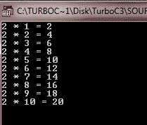
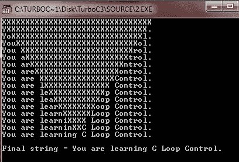
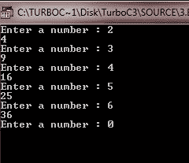

# C for 循环

> 原文：<https://codescracker.com/c/c-for-loop.htm>

下面是 [C 语言](/c/index.htm)中 for 循环的一般形式。

```
for(initialization; condition; increment)
{
   statements;
}
```

这里初始化首先发生，但只发生一次，然后检查条件，如果条件为真，则循环控制语句将被执行，否则不执行。然后，循环变量将递增或递减，然后再次检查条件，如果条件为真，则再次执行循环控制语句，否则不执行。这个动作一直持续到条件变为假。现在专注于下面的示例程序。

## C for 循环示例

下面是一些示例程序来说明 C for 循环。

```
/* C for Loop example
 * This program illustrates the concepts
 * of C for loop
 */

#include<stdio.h>
#include<conio.h>
void main()
{
   int num = 2;
   int i;
   clrscr();

   for(i=1; i<=10; i++)
   {
      printf("%d * %d = %d", num, i, num*i);
      printf("\n");
   }

   getch();
}
```

下面是这个 C 程序的示例输出，它打印了 2:



这是一个演示 C 编程中 for 循环的例子。

```
/* C for Loop Example Program
 * This program illustrates multiple loop
 * control variables
 */

#include<stdio.h>
#include<conio.h>
#include<string.h>

void conv(char *targ, char *src);

void main()
{
   char target[80] = "XXXXXXXXXXXXXXXXXXXXXXXXXXXXXXXX";
   clrscr();

   conv(target, "You are learning C Loop Control.");
   printf("\nFinal string = %s\n", target);

   getch();
}
/* this function copies one string into another string.
 * It copies characters to both the ends,
 * converging at the middle
 */
void conv(char *targ, char *src)
{
   int i, j;
   printf("%s\n", targ);
   for(i=0, j=strlen(src)-1; i<=j; i++, j--)
   {
      targ[i] = src[i];
      targ[j] = src[j];
      printf("%s\n", targ);
   }
}
```

下面是这个 C 程序的运行示例:



这是另一个例子程序，也说明了 C 语言中的 for 循环。

```
/* C for loop example program
 * To quit this program, just enter 0
 */

#include<stdio.h>
#include<conio.h>

int sqrnum(int);
int readnum(void);
void prompt(void);

void main()
{
   int t;
   clrscr();

   for(prompt(); t=readnum(); prompt())
   {
      sqrnum(t);
   }

   getch();
}
void prompt(void)
{
   printf("Enter a number : ");  // to quit, enter 0
   return 0;
}
int readnum(void)
{
   int num;
   scanf("%d", &num);
   return num;
}
int sqrnum(int num)
{
   printf("%d\n", num*num);
   return num*num;
}
```

这是这个 C 程序的输出样本，按 0 退出程序。



### 更多示例

这里有更多的例子供你参考:

*   [制作简单的计算器](/c/program/c-program-make-calculator.htm)
*   [打印质数](/c/program/c-program-print-prime-numbers.htm)
*   [求数字](/c/program/c-program-find-factorial.htm)的阶乘
*   [找到 HCF 和 LCM](/c/program/c-program-find-hcf-lcm.htm)
*   [打印斐波那契数列](/c/program/c-program-print-fabonacci-series.htm)
*   [检查回文与否](/c/program/c-program-palindrome-number.htm)
*   [检查阿姆斯特朗与否](/c/program/c-program-find-armstrong-number.htm)
*   [图案打印程序](/c/program/c-program-print-star-pyramid-patterns.htm)
*   [线性搜索](/c/program/c-program-linear-search.htm)
*   [二分搜索法](/c/program/c-program-binary-search.htm)
*   [冒泡排序](/c/program/c-program-bubble-sort.htm)
*   [选择排序](/c/program/c-program-selection-sort.htm)
*   [插入排序](/c/program/c-program-Insertion-sort.htm)

[C 在线测试](/exam/showtest.php?subid=2)

* * *

* * *