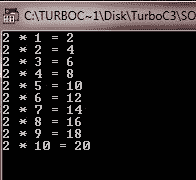
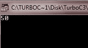

# C while 循环

> 原文：<https://codescracker.com/c/c-while-loop.htm>

下面是 [C](/c/index.htm) 中 while 循环的一般形式。

```
while(condition)
{
   statements;
}
```

如您所见，当条件为真时，将执行 while 循环的语句，否则不执行。现在来看一下下面的例子，它展示了 while 循环。

## C while 循环示例

下面是 C 编程中的 while 循环示例程序。

```
/* C while loop example program */

#include<stdio.h>
#include<conio.h>
void main()
{
   int num = 2;
   int i=1;
   clrscr();

   while(i<=10)
   {
      printf("%d * %d = %d\n", num, i, num*i);
      i++;
   }

   getch();
}
```

这里这个程序也打印 2 的表，但是使用了 while 循环，下面是这个 C 程序的示例输出。



下面是另一个示例程序，它说明了 C 编程中 while 循环的概念。

```
/* C while Loop Example 
 * This program illustrates the concept
 * of while loop in C programming
 */

#include<stdio.h>
#include<string.h>
#include<conio.h>

void pad(char *str, int len);

void main()
{
   char str[80];
   clrscr();

   strcpy(str, "this is a test");
   pad(str, 50);
   printf("%d", strlen(str));

   getch();
}
/* adding spaces to the end of the string
 * to fill the string to a predefined length
 */
void pad(char *str, int len)
{
   int l;
   l=strlen(str);
   while(l<len)
   {
      str[l] = ' ';
      l++;
   }
   str[l] = '\0';
}
```

下面是这个程序的运行示例



[C 在线测试](/exam/showtest.php?subid=2)

* * *

* * *