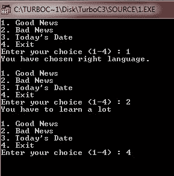
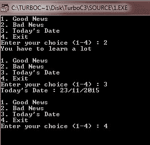

# C do-`while`循环

> 原文：<https://codescracker.com/c/c-do-while-loop.htm>

与和 [`while`循环](/c/c-while-loop.htm)的[不同， 在](/c/c-for-loop.htm)[循环](/c/c-loops.htm)的顶部测试循环条件，但是 [C 编程](/c/index.htm)中的 do-`while`循环在循环底部检查其条件。

对于上面的语句，这意味着 do-`while`循环总是至少执行一次，不像其他两个循环。

因此，do-`while`循环通常用于菜单驱动程序，如[计算器程序](/c/program/c-program-make-calculator.htm)，它向 用户提供选项，告诉他/她是否需要加法、减法、乘法等。相应地执行所需的 动作。下面的例子说明了 do-`while`循环的概念。

## C do-`while`循环示例

下面是一个基于 C 编程中 do-`while`循环的示例程序。

```
/* C do-while Loop Example
 * This program illustrates the
 * concept of do-while loop in C
 */

#include<stdio.h>
#include<dos.h>
#include<conio.h>
void main()
{
   char choice;
   struct date d;
   getdate(&d);
   clrscr();

   do
   {
      printf("1\. Good News\n");
      printf("2\. Bad News\n");
      printf("3\. Today's Date\n");
      printf("4\. Exit\n");
      printf("Enter your choice (1-4) : ");
      scanf("%c", &choice);
      switch(choice)
      {
         case '1' :
            printf("You have chosen right language.");
            break;
         case '2' :
            printf("You have to learn a lot");
            break;
         case '3' :
            printf("Today's Date : %d/%d/%d", d.da_day, d.da_mon, d.da_year);
            break;
         case '4' :
            exit(1);
         default :
            printf("Wrong choice..!!\n");

      }
      printf("\n\n");
   }while(choice!=4 && choice!=getchar());

   getch();
}
```

下面是这个 do-`while`循环示例程序在 c 语言中的两个示例运行。




用 C 语言打印文字日期，参考[打印文字日期](/c/program/c-program-print-date.htm)。

[C 在线测试](/exam/showtest.php?subid=2)

* * *

* * *