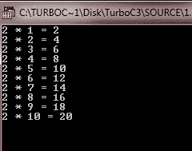

# C goto 语句

> 原文：<https://codescracker.com/c/c-goto-statement.htm>

在 [C 语言](/c/index.htm)中，goto 语句需要一个标签(标签是一个有效的 标识符，后跟一个冒号)来进行操作。此外，标签必须与使用它的 goto 在同一个 函数中，不能在函数之间跳转。

下面是 C 编程中 goto 语句的一般形式:

```
label:
.
.
.
goto label;
```

这里的标签是 goto 之前或之后的任何有效标签。让我们看一下下面的示例程序。

## C goto 语句示例

下面是一个示例程序，它使用 C 编程中的 goto 语句来说明这一点:

```
/* C goto Statement Example
 * This program illustrates the
 * concept of goto statement in C
 */

#include<stdio.h>
#include<conio.h>
void main()
{
   int i = 1;
   int num = 2;
   clrscr();

   tab:
      printf("%d * %d = %d\n", num, i, num*i);
      i++;
      if(i<=10)
         goto tab;

   getch();
}
```

这个程序打印 2 的表格。下面是上述 C 程序的运行示例。



[C 在线测试](/exam/showtest.php?subid=2)

* * *

* * *