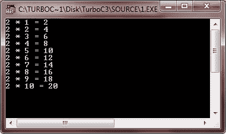

# c 中断语句

> 原文：<https://codescracker.com/c/c-break-statement.htm>

在 [C 编程](/c/index.htm)中，break 语句有以下两种用途:

*   使用 break 语句终止 [switch 语句](/c/c-switch-statement.htm)中的 case
*   使用 break 语句强制立即终止一个[循环](/c/c-loops.htm)， ，绕过正常的循环条件测试

现在让我们来看一下下面的示例程序，它说明了 c 语言中 break 语句的概念。

## C break 语句示例

下面是一个在 C 编程中使用 break 语句的示例程序。

```
/* C break Statement Example
 * This program illustrates
 * the concept of break statement in C
 */

#include<stdio.h>
#include<conio.h>
void main()
{
   int i;
   int num = 2;
   clrscr();

   for(i=1; i<50; i++)
   {
      if(i==11)
         break;
      printf("%d * %d = %d\n", num, i, num*i);
   }

   getch();
}
```

这个程序打印 2 的表格。下面是这个程序的运行示例。



还可以在 switch 语句中使用 break 语句。要了解如何操作，请参考[计算器程序](/c/program/c-program-make-calculator.htm)。

[C 在线测试](/exam/showtest.php?subid=2)

* * *

* * *