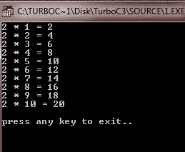

# c 继续语句

> 原文：<https://codescracker.com/c/c-continue-statement.htm>

在 [C 语言](/c/index.htm)中，continue 语句的工作与 [break 语句](/c/c-break-statement.htm)正好相反。也就是说，continue 不是强制终止的 ，而是强制进行[循环](/c/c-loops.htm) 的下一次迭代，跳过 continue 语句后剩余的任何代码。让我们通过下面的 程序来理解 continue 语句。

## C continue 语句示例

下面是在 C 编程中使用 continue 语句的示例程序。

```
/* C continue Statement Example 
 * This program illustrates
 * the concept of break statement in C
 */

#include<stdio.h>
#include<stdlib.h>
#include<conio.h>
void main()
{
   int i;
   int num = 2;
   clrscr();

   for(i=1; i<50; i++)
   {
      printf("%d * %d = %d\n", num, i, num*i);
      if(i>0 && i<10)
         continue;
      else
         printf("\npress any key to exit..\n");
         getch();
         exit(1);
   }

   getch();
}
```

这个程序还打印 2 的表格。下面是上述 C 语言 continue 语句程序的输出示例。



[C 在线测试](/exam/showtest.php?subid=2)

* * *

* * *