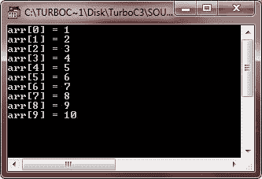
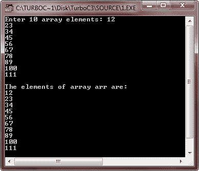
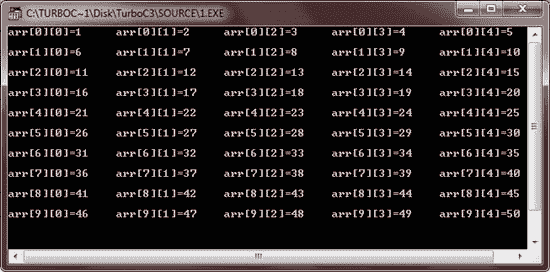
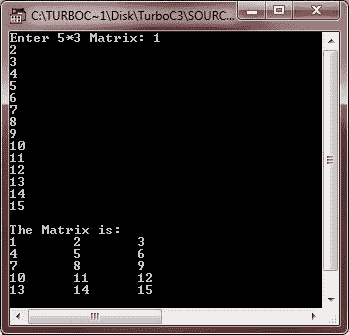
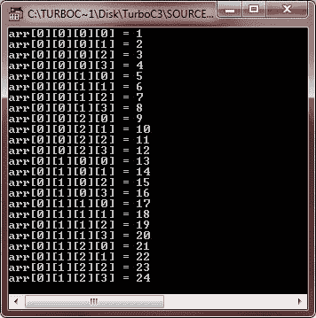

# C 数组

> 原文：<https://codescracker.com/c/c-arrays.htm>

一个数组只是由一个公共名称引用的相同[数据类型](/c/c-data-types.htm) 的[变量](/c/c-variables.htm)的集合。通过索引访问 数组中的特定元素。所有数组由连续的存储位置组成，其中最低地址对应于第一个元素 ，而最高地址对应于最后一个元素。

**注意** -在数组中，索引总是从 0 开始。

## 用 C 语言声明一个数组

下面是用 C 语言声明数组的一般形式:

```
type arr_name[size];
```

这里 type 是任何有效的数据类型，arr_name 是给定数组的名称，size 是数组的大小。换句话说，大小指定了数组可以容纳多少元素。

## 在 C 中初始化数组

这是一个用 c 语言初始化数组的例子。这里我们初始化一个包含 5 个元素的数组:

```
int arr[5] = {1, 2, 3, 4, 5};
```

这里，arr 是包含 5 个元素(即 1、2、3、4 和 5)的 int 类型数组的名称。

### 如果省略数组大小会怎样？

万一，如果你省略了数组大小，那么数组变得足够大，以容纳初始化创建。让我们看看下面的代码片段:

```
int arr[] = {1, 2, 3, 4, 5};
```

这里你将创建一个和上面完全一样的数组，但是你也可以在这个数组中初始化多于或少于 5 个元素。喜欢

```
int arr[] = {1, 2, 3};
```

或者

```
int arr[] = {1, 2, 3, 4, 5, 6, 7, 8, 9, 10};
```

## 访问 C #中的数组元素

通过索引数组名来访问数组元素。这可以通过将该元素的索引号放在数组名称后面的方括号中来实现。让我们来看看这段代码。在这里，我们将从名为 arr 的数组中访问索引号为 3 的值:

```
int val = arr[3];
```

现在，变量 val 的值与数组 arr 的索引号 3 处的值相同。

## 数组的类型

数组可以有一维到多维。但这里我们分为以下三种类型:

*   一维数组
*   二维数组
*   多维数组

现在我们来详细讨论一下一维数组。

## C 语言中的一维数组

可以用上面讨论的相同方式声明一维数组、初始化一维数组和访问一维数组元素。现在我们来举个例子。

```
/* C Arrays - One-dimensional Array Program */

#include<stdio.h>
#include<conio.h>
void main()
{
   int arr[10];   // declares 10-integer array
   int i, j;
   clrscr();

   // load arr with values 1 through 10
   for(i=1, j=0; i<=10; i++, j++)
   {
      arr[j] = i;
   }

   // displaying element with index of arr
   for(i=0; i<10; i++)
   {
      printf("arr[%d] = %d\n", i, arr[i]);
   }

   getch();
}
```

以下是上述 C 程序的示例输出:



下面是一维数组的另一个示例程序:

```
/* C Arrays - One-dimensional Array Program */

#include<stdio.h>
#include<conio.h>
void main()
{
   int arr[10];
   int i;
   clrscr();

   printf("Enter 10 array elements: ");
   for(i=0; i<10; i++)
   {
      scanf("%d", &arr[i]);
   }

   printf("\nThe elements of array arr are: \n");
   for(i=0; i<10; i++)
   {
      printf("%d\n", arr[i]);
   }

   getch();
}
```

下面是这个 C 程序的运行示例:



## C 中的二维数组

c 语言也支持多维数组。二维数组是多维数组的最简单形式。下面是用 C 语言声明二维数组的一般形式:

```
int arr[10][5];
```

你可以把二维数组称为一维数组的一个数组。所以从上面的声明可以说 int arr[10][5]是一维数组(大小 5)的数组(大小 10)。这里第一个索引负责行，第二个索引负责列。所以上面的数组有 10 行 5 列。我们举个例子。

```
/* C Arrays - Two-dimensional Array Program */

#include<stdio.h>
#include<conio.h>
void main()
{
   int arr[10][5];
   int i, j, val=1;
   clrscr();

   // initializing array
   for(i=0; i<10; i++)
   {
      for(j=0; j<5; j++)
      {
         arr[i][j] = val;
         val++;
      }
   }

   // displaying array
   for(i=0; i<10; i++)
   {
      for(j=0; j<5; j++)
      {
         printf("arr[%d][%d]=%d\t", i, j, arr[i][j]);
      }
      printf("\n");
   }

   getch();
}
```

下面是这个 C 程序的示例输出:



让我们再看一个例子:

```
/* C Arrays - Two-dimensional Array Program */

#include<stdio.h>
#include<conio.h>
void main()
{
   int arr[5][3];
   int i, j;
   clrscr();

   printf("Enter 5*3 Matrix: ");
   for(i=0; i<5; i++)
   {
      for(j=0; j<3; j++)
      {
         scanf("%d", &arr[i][j]);
      }
   }

   printf("\nThe Matrix is:\n");
   for(i=0; i<5; i++)
   {
      for(j=0; j<3; j++)
      {
         printf("%d\t", arr[i][j]);
      }
      printf("\n");
   }

   getch();
}
```

下面是上述 C 程序的运行示例:



## C 中的多维数组

c 语言允许二维以上的数组。以下是多维数组声明的一般形式:

```
type array_name[size1][size2][size3]...[sizeN];
```

由于所需的内存量，通常不使用三维以上的数组。例如，一个维数为 10，6，9，4 的四维字符数组需要

```
10*6*9*4
```

或 2160 字节。如果这个数组包含 2 字节的整数，则需要 4，320 字节。如果这个数组是双精度的(假设每个双精度 8 个字节)，那么就需要 17，280 个字节。所需的存储空间随着维数的增加呈指数增长。所以不经常使用三维以上的数组。

下面是一个说明 C 中多维数组的例子:

```
/* C Arrays - Multi-dimensional Array Program */

#include<stdio.h>
#include<conio.h>
void main()
{
   int arr[1][2][3][4];
   int i, j, k, l;
   int val=1;
   clrscr();

   // initializing array
   for(i=0; i<1; i++)
   {
      for(j=0; j<2; j++)
      {
         for(k=0; k<3; k++)
         {
            for(l=0; l<4; l++)
            {
               arr[i][j][k][l] = val;
               val++;
            }
         }
      }
   }

   // displaying array
   for(i=0; i<1; i++)
   {
      for(j=0; j<2; j++)
      {
         for(k=0; k<3; k++)
         {
            for(l=0; l<4; l++)
            {
                printf("arr[%d][%d][%d][%d] = %d\n",i,j,k,l,arr[i][j][k][l]);
            }
         }
      }
   }

   getch();
}
```

以下是上述 C 程序的示例输出:



## C 数组示例

以下是 C 语言中的数组示例程序列表:

*   [一维数组程序](/c/program/c-program-one-dimensional-array.htm)
*   [线性搜索](/c/program/c-program-linear-search.htm)
*   [二分搜索](/c/program/c-program-binary-search.htm)
*   [找到数组中最大的元素](/c/program/c-program-find-largest-element-in-array.htm)
*   [找到数组中最小的元素](/c/program/c-program-find-smallest-element-in-array.htm)
*   [反向排列](/c/program/c-program-reverse-array.htm)
*   [在数组中插入元素](/c/program/c-program-insert-element-in-array.htm)
*   [从数组中删除元素](/c/program/c-program-delete-element-from-array.htm)
*   [合并两个数组](/c/program/c-program-merge-two-arrays.htm)
*   [冒泡排序](/c/program/c-program-bubble-sort.htm)
*   [选择排序](/c/program/c-program-selection-sort.htm)
*   [插入排序](/c/program/c-program-Insertion-sort.htm)
*   [二维数组程序](/c/program/c-program-two-dimensional-array.htm)
*   [相加两个矩阵](/c/program/c-program-add-two-matrices.htm)
*   [减去矩阵](/c/program/c-program-subtract-matrices.htm)
*   [转置矩阵](/c/program/c-program-transpose-matrix.htm)
*   [乘矩阵](/c/program/c-program-multiply-two-matrices.htm)
*   [三维数组程序](/c/program/c-program-three-dimensional-array.htm)

[C 在线测试](/exam/showtest.php?subid=2)

* * *

* * *